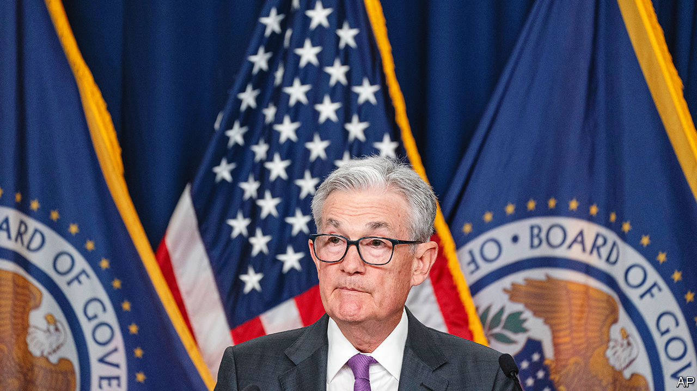

###### Of great interest

# America’s battle with inflation is about to get trickier 

##### Cooling price rises will have counterintuitive consequences for the Federal Reserve 

 

> Jul 26th 2023 

It was never in doubt. In the run-up to the Federal Reserve’s latest meeting, investors assigned a probability of nearly 99% to the central bank raising interest rates once again. On July 26th policymakers duly fulfilled those expectations, with their 11th increase in 12 meetings, together making for America’s sharpest course of monetary tightening in four decades. The central bank’s next steps, however, are clouded by uncertainty.

Some economists are convinced that this will be the Fed’s last rate rise in this cycle. Inflation has come down from its highs in 2022, with consumer prices rising by just 3% year-on-year in June. Core inflation—which strips out volatile food and energy costs—has been a little more stubborn, but even it has started to soften, in a sign that underlying price pressures are easing. This opens a pathway for the Fed to relent, hopefully guiding America to a much-discussed soft landing. Ellen Zentner of Morgan Stanley, a bank, expects an “extended hold” for the Fed, presaging a rate cut at the start of next year. 

 


Others are not so sure. Inflation has consistently wrong-footed optimists over the past couple of years. Were, for instance, energy prices to rally, consumers and businesses could quickly revise up their expectations for inflation, nudging the Fed towards another rate increase. If an incipient rebound in housing prices gathers pace, that would also fuel concerns. Vigour in the labour market adds to the worries, because fast-rising wages feed into inflation. Remarkably, the Fed’s aggressive actions have barely affected American workers thus far: the unemployment rate today is 3.6%, identical to its level in March 2022 when the Fed raised rates for the first time in this cycle (see chart 1). The pace of tightening would normally be expected to drive up unemployment. Instead, the recovery from the covid-19 pandemic, including an increase in the number of willing workers, seems to have cushioned the economy.

Opposing views among economists are mirrored within the Fed itself. For the past two years America’s central bankers have spoken in similar terms about the peril of inflation, and have been nearly unanimous when it comes to big rate moves. In recent months, however, divisions have surfaced. Christopher Waller, a Fed governor, has come to represent the more hawkish voices. This month he warned that the central bank could continue raising rates until there is sustained improvement in inflation, dismissing the over-optimism bred by the weaker-than-expected price figures for June. “One data point does not make a trend,” he warned. At the other end of the spectrum is Raphael Bostic, president of the Fed’s Atlanta branch, who said even before the latest rate increase that the central bank could stop hiking. “Gradual disinflation will continue,” he assured listeners in late June.

Even if the latest rate increase does end up marking the peak for the Fed, Jerome Powell, its chairman, has maintained a hawkish tilt in his pronouncements. “What our eyes are telling us is that policy has not been restrictive enough for long enough,” he told a press conference following the rate rise. Financial conditions have loosened in recent months. The s&amp;p 500, an index of America’s biggest stocks, is up nearly one-fifth from its lows in March, when a handful of regional banks collapsed. With his sterner tone, Mr Powell may want to restrain investors from getting ahead of themselves, which could add to inflationary momentum.

Central bankers wanting to preserve their reputations as inflation-fighters may prefer to err towards toughness. Steven Englander of Standard Chartered, a bank, likens the Fed to a weather forecaster who thinks there is a 30% chance of rain. It still makes sense to highlight the potential for wet weather, because predicting sun but getting rain is perceived as worse than predicting rain and ending up with sun.

In practice, the Fed is sure to be flexible, reacting to economic data. It can look north of the American border for an example of the impossibility of maintaining a fixed policy stance. The Bank of Canada had stopped its rate-rise cycle in January, thinking that inflation had crested. But in June it was forced to resume tightening because economic growth had remained too hot, and inflation too sticky, for comfort.

 


Ultimately, though, there are no risk-free choices for the Fed. What is seen as the more doveish option—holding rates steady for the rest of this year—will in fact take on an increasingly hawkish hue if inflation does continue to recede. Unchanged nominal rates would be ever more restrictive in real terms (assuming that inflationary expectations diminish alongside waning price pressures). In such a scenario central bankers wishing to maintain their current policy stance should therefore think about cutting rates. When inflation was sky-high, the Fed’s task was tough yet its decisions quite straightforward: officials did not really have much choice but to raise rates. From here on, its task looks easier but its decisions more fraught. ■


