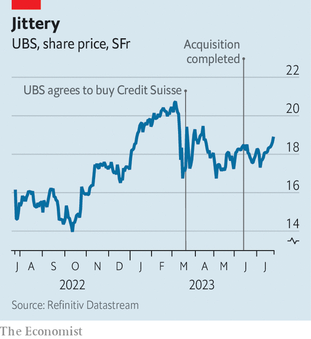

###### A big plus

# Can UBS make the most of finance’s deal of the century? 

##### Europe at last has a challenger for America’s behemoths 

 

> Jul 26th 2023 

“Limited but intensive”. That is how a regulatory filing described, with something approaching wry understatement, the few days of due diligence before ubs announced its deal to rescue Credit Suisse on March 19th. The dramatic acquisition was the first ever tie-up between two “global systemically important banks”, a designation introduced after the financial crisis of 2007-09. Since it was agreed, the pace has barely slowed. In April Sergio Ermotti, a Swiss cost-cutter who ran ubs between 2011 and 2020, returned as the firm’s chief executive. The same month Credit Suisse’s results laid bare the devastating run it had suffered. Combined financial statements followed in May. The fine print of an agreement with Swiss authorities to absorb potential losses emerged in June. Scores of Credit Suisse bankers have rushed for the exit.

ubs finally got the keys to the building on June 12th. The tie-up is the most watched deal in finance: it creates a giant with $5trn of invested assets and a balance-sheet twice the size of the Swiss economy. The acquisition’s outcome will say much about the future of global banking. Regulators are eyeing proceedings closely on account of the new institution’s size. Bank bosses, meanwhile, are watching the difficult strategic decisions faced by management for lessons applicable to their own firms. UBS shareholders, who did not vote for the deal, have traded a staid investment for something much riskier. 

Despite absorbing its risk-taking rival, its bosses hope that the new ubs will be able to emerge as an enlarged version of the old ubs. European banks were slow to recapitalise after the global financial crisis; their profitability largely reflected ailing domestic economies. Amid this inauspicious crowd, ubs stood out. After being rescued in 2008, the bank focused on wealth management. It won enough wallets to be rewarded with one of the highest price-to-book multiples of any European bank, trading at an average of 1.1 times its book value last year. ubs’s focus on managing money will continue, but the shape and scale of its other banking businesses is still the subject of internal debate. Nobody expects a smooth ride in the years ahead.

 


Since the deal was announced, shares in ubs have risen only a little. Yet the acquisition ought to be a boon, at least eventually. ubs bought Credit Suisse at a bargain: it will report an estimated $35bn of “negative goodwill”, the difference between what it paid and the higher book value of Credit Suisse’s equity. Turning this scale into profit hinges on the mammoth task of integrating the two institutions’ operations. All the usual post-merger headaches—combining technology systems, aligning accounting standards, laying off staff and resolving culture clashes—are especially difficult at a bank, let alone a failed one. Compared with ubs, Credit Suisse was appallingly inefficient: it had a higher ratio of costs to income in every one of its businesses. The bank’s collapse was preceded by five consecutive quarters of losses and a brutal evaporation of confidence among clients and counterparties.

When ubs unveils its plans and delayed quarterly results at the end of August, investors will scrutinise any outflow of assets managed by the bank. There is little to suggest a large exodus has taken place. Julius Baer, a Swiss outfit that is likely to benefit from any flight, reported only modest inflows at its quarterly results on July 24th. But investors should also focus on two strategic decisions—ones that will ultimately determine the success of the deal. Both require knife-edge calls and present enormous execution challenges.

Credit Suisse’s domestic business is the first big question mark. Bosses at ubs are debating whether to keep none, some or all of Credit Suisse Schweiz, which was established in 2016 as part of a plan, later shelved, to spin off the business. The Swiss bank was Credit Suisse’s only profitable division during the first quarter of 2023. Last year Schweiz’s equity had a book value of SFr13bn ($14bn). Selling the outfit at a valuation near this figure might now be impossible given the speed with which clients ran for the doors before March. A shaky balance-sheet would frustrate efforts to pick off the most attractive bits of the business, since the rump might struggle to support itself as a standalone operation. 

Swiss knife

With anger over the ubs tie-up still simmering in Switzerland, the fate of Credit Suisse’s domestic business could emerge as something of a political lightning rod. Shedding Schweiz might stave off demands for higher capital requirements in the future by calming worries about the parent bank’s size. According to data from Switzerland’s central bank, last year ubs and Credit Suisse had combined domestic market shares of 26% in loans and deposits. In less hurried circumstances, it would have been possible to imagine the deal falling foul of competition watchdogs.

 


Yet whereas gains from spinning off the business are uncertain, those from keeping it and making cuts are almost guaranteed. Assuming ubs’s shears are sufficiently sharp, and 70% of Credit Suisse Schweiz’s costs can be chopped, separating the whole business would mean forgoing nearly a third of the deal’s total annual cost savings, according to an estimate by Barclays, a bank. Lay-offs affecting Credit Suisse’s 16,700 employees in Switzerland, such as from shutting retail branches, would draw particular ire from politicians and the public. According to Jefferies, an investment bank, around 60% of UBS and Credit Suisse branches are located within a kilometre of each other.

The second question mark concerns Credit Suisse’s investment bank, which accounted for a third of the institution’s costs last year, and will bear the brunt of the cuts. Mr Ermotti, ubs’s returning boss, is no stranger to felling bankers: the number of people employed in the firm’s investment bank declined from about 17,000 in 2011 to 5,000 in 2019, leaving behind a leaner operation to play second fiddle to the bank’s elite wealth-management division. Credit Suisse failed to accomplish similar manoeuvres of its own. Last year ubs therefore generated nearly five times as much revenue per dollar of value at risk.

Winding down these operations will be a slog. Many of Credit Suisse’s investment-banking operations will be shoved into a “non-core” unit, along with some small parts of Credit Suisse’s money-managing businesses. Modern “bad banks” do not contain masses of toxic derivatives, unlike those set up after the global financial crisis. But they are still hard to shutter without incurring significant losses.

Protection against losses from selling some of Credit Suisse’s assets is provided by the Swiss government. As part of the acquisition agreement, the authorities committed themselves to absorbing up to SFr9bn of losses, so long as the first SFr5bn are shouldered by ubs. They are unlikely to have to cough up, however, given the relatively small pool of assets covered by the agreement. As a result, ubs could move to end the agreement before it has wound down the portfolio. The guarantee proved reassuring to investors during in March. Today it carries a lot of political risk for not all that much financial gain.

 


Moreover, the loss guarantee fails to insure against the greatest danger when winding down an investment bank: that revenues plummet faster than costs, creating painful losses. Even excluding the sizeable cost of employees and one-off items, outgoings in Credit Suisse’s investment bank last year amounted to more than 60% of revenue. Many of these costs, such as the technology systems required to run a trading floor, will remain high even as assets are sold off. Consider Credit Suisse’s own wind-down unit, which the bank created as part of its failed restructuring programme. The unit’s assets have fallen by almost half since 2021, to SFr98bn; its costs, at SFr3bn in 2022, have hardly changed.

How quickly ubs is able to shutter this unit will be closely watched. So will what the bank’s bosses do with their remaining investment bank. European investment banks have retreated since the financial crisis, especially in America. Both Barclays and Deutsche Bank have struggled to convince investors their businesses are worth retaining. ubs’s investment bank is profitable, but would need a mighty boost to woo billionaires with its dealmaking advice. The prospect of building an elite, capital-light bank might be appealing in theory, and was the crux of Credit Suisse’s plan to spin out its own investment bank under the moniker of “First Boston”, a famous old firm that it acquired in 1990. But in practice this would require significant turnover among ubs’s own bankers, too. 

Mighty money manager

It is not clear that such bloodletting is required. In time, the success of the merger will be judged by ubs’s price-to-book multiple. Morgan Stanley, which has ridden its wealth-management success to a multiple of more than two, is a worthy target. After the deal, ubs will remain a measly competitor in investment banking, but growth in the money it manages means it will close the gap in wealth management and overtake its rival in asset management. A bigger bank means bigger ambitions. ■


