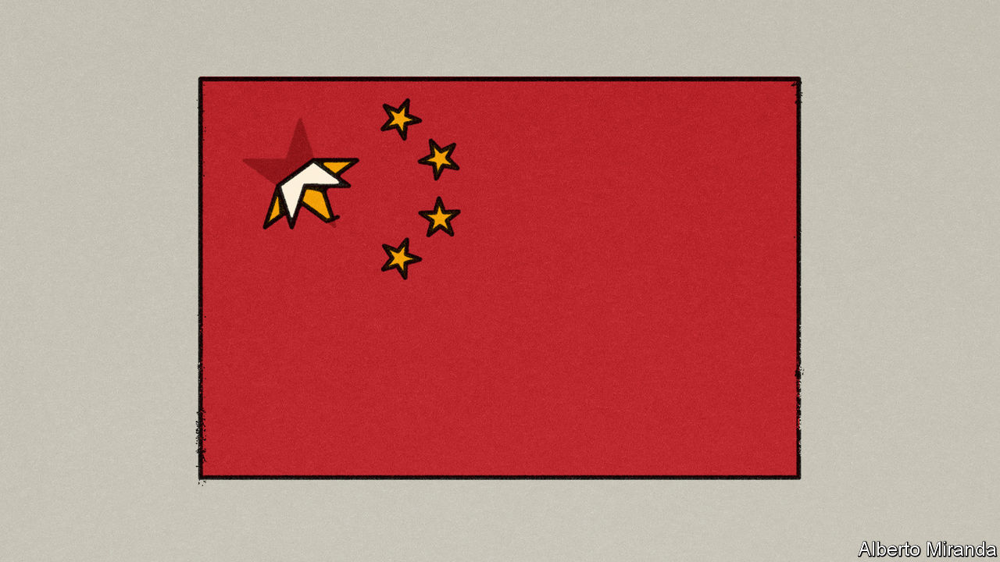

###### Free exchange

# Deflation is delaying China’s rise to economic superiority 

##### The world’s second-biggest economy will become a more distant second this year 

 

> Jul 27th 2023 

China has a new central-bank boss. Pan Gongsheng, who became governor of the People’s Bank of China on July 25th, is a technocrat. His career, which includes a phd in economics, research at Cambridge University and Harvard, and a stint as deputy governor, resembles those of central bankers elsewhere. But he inherits a different problem: too little inflation, not too much.

China’s consumer prices did not rise at all in the year to June. The country’s GDP deflator, a broad measure of the price of goods and services, fell by 1.4% in the second quarter, compared with a year earlier. That is the biggest decline since 2009.

Falling prices pose immediate dangers for the country’s policymakers. They can erode profits, depress confidence and deter borrowing and investment, which will only add to deflationary pressure. The absence of inflation also has a less immediate implication—one of particular interest to those keeping score in the geopolitical race between China and America. Deflation could delay China’s emergence as the world’s biggest economy.

Despite its difficulties, China’s economy is expected to grow by about 5% this year. America’s will probably grow by 2% at best. China would then appear to be gaining ground. But these forecasts exclude inflation and ignore exchange rates. America’s “nominal” growth, before adjusting for inflation, could exceed 6%, according to Goldman Sachs, a bank. The country will produce 2% more stuff, the price of which could rise by about 4%. China’s nominal growth, on the other hand, is forecast to be only 5.5%.

In theory, high inflation in America should weaken the dollar. This would make other economies like China loom larger in dollar terms. In practice, however, America’s currency has been strong. As a result, China’s GDP, converted into dollars, could fall further behind its rival’s in 2023, for the second year in a row. The country’s economy will be 67% the size of America’s in 2023, according to Goldman Sachs, compared with 76% in 2021. Thus the world’s second-biggest economy will be a more distant second.

This trajectory is unexpected. Upstart economies like China’s are not only supposed to grow faster than mature economies, their prices are also supposed to “catch up” with the higher prices that prevail in rich countries. Emerging economies start out poor and cheap, then grow richer and more expensive—either because their prices rise quickly, or because their exchange rates strengthen. In the 1960s, for example, an American visiting Italy or Japan would have found that the dollar stretched further in these countries than back home. Lira and yen prices, when converted into dollars at market exchange rates, were lower than American prices for similar items. Two or three decades later, both Italy and Japan were just as pricey as the United States. 

The classic explanation for this phenomenon was provided by Bela Balassa and Paul Samuelson, two economists, in 1964. In catch-up economies, productivity grows briskly in industries, like manufacturing, that trade goods across borders. Because output per worker rises quickly, firms can afford to pay their workers more without raising their prices, which are pinned down by global competition. Meanwhile, in sectors such as services, which are not much traded across borders, productivity grows more slowly. Service firms must nonetheless compete with manufacturing for the country’s workers. That obliges them to raise their wages to attract recruits. Higher wages, in turn, force these firms to raise prices. These price hikes are required because productivity has not kept up, and possible because services are sheltered from global competition. The hikes also make the country more expensive: the price of haircuts rises in sympathy with the growing wages of increasingly productive manufacturing workers.

China’s prices are now on average only 60% of American prices when comparing like-for-like items, according to the World Bank. Their figure lines up with this newspaper’s Big Mac index, which compares the price of burgers around the world. In China a Big Mac costs 24 yuan, the equivalent of $3.35. That is only 63% of the cost of a similar meaty treat in America. 

The long-term forecasters at Goldman Sachs expect China’s price level to have risen modestly, relative to America’s, by the middle of the next decade. By that point, China’s GDP will have become the biggest in the world, they project. If prices instead remain at their present low level, then China’s GDP may never overtake America’s at all. Capital Economics, a research firm, cleaves to this gloomier view. It thinks China’s growth per worker will slow to roughly the same pace as America’s within the next decade. If China is no longer catching up with America economically, it argues, there is no reason to expect its prices to catch up either.

Catch-up and fries

That conclusion may be too hasty. History provides plenty of cases in which a country’s prices rise, relative to America’s, even as its GDP per head grows no faster. For example, Ireland, Israel and Italy all had spells in the 1980s when GDP per person grew more slowly than America’s, but they nonetheless became less cheap, through faster inflation or a strengthened exchange rate. Figures from the Penn World Table suggest that, all told, 156 countries have had at least one ten-year period of price convergence without economic convergence since 1960.

This pattern is ultimately compatible with Balassa’s and Samuelson’s theory. If a dynamic manufacturing sector was offset by a moribund services sector, a country could grow modestly overall, but still become more expensive. The price of services would rise quickly, pulled along by competition for labour from more productive manufacturing companies. 

Will China’s cheapness persist? That will depend not just on how fast it grows relative to America, but how fast its manufacturing grows relative to homebound industries. To close the GDP gap with America, China will have to narrow the price gap, too. ■


