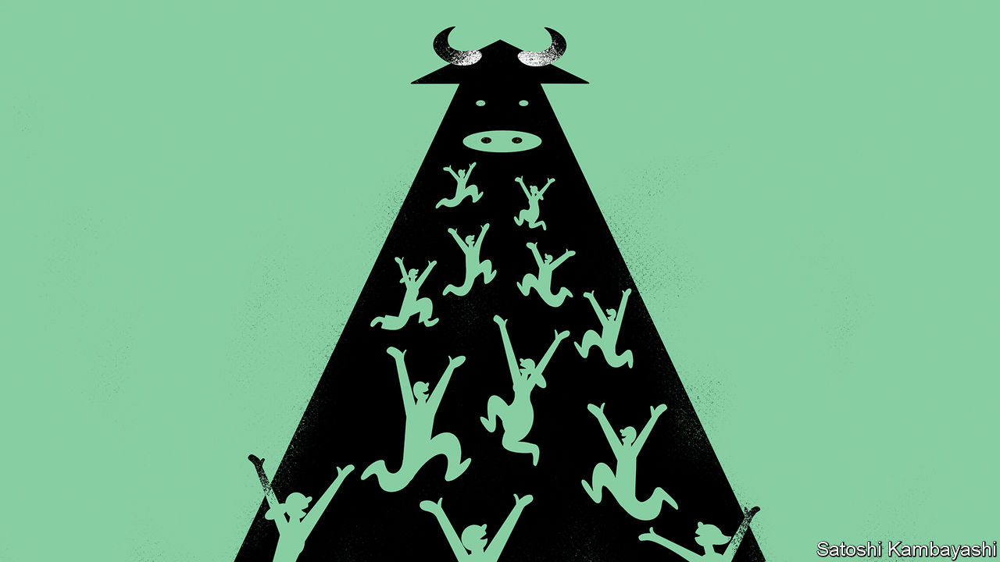

###### Buttonwood

# Investors are seized by optimism. Can the bull market last? 

##### An artificial-intelligence boom has turned into an everything boom 

 

> Jul 25th 2023 

Bull markets, according to John Templeton, “are born on pessimism, grow on scepticism, mature on optimism and die of euphoria”. The legendary Wall Street fund manager put this philosophy into practice in 1939. At a time when others were panicking about Europe’s descent into war, Templeton borrowed money to buy 100 of every share trading below $1 on the New York Stock Exchange. Within a few years he had booked a 400% profit and forged a template for future investors. Even in the 21st century, Templeton’s favoured moments of “maximum pessimism” present the very best buying opportunities. In March 2009 investors despaired over the future of capitalism; in March 2020, over a pandemic and shuttered businesses. Both times, the correct response was to close your eyes and buy stocks.

It now looks like October 2022 should be added to the list. Pessimism was certainly rife. Central banks were raising interest rates at their fastest pace in decades.  was hitting double digits in the euro zone and falling only slowly in America. Recession seemed just about nailed on. War had returned to Europe. China appeared trapped between lockdowns and soaring covid-19 deaths. Across the northern hemisphere, a cold winter threatened to send energy prices soaring again, turning a miserable downturn into a truly dangerous one. America’s s&amp;p 500 index of leading shares was down by nearly one-quarter from its peak; Germany’s dax by more.

True to form, it was an excellent time to buy. The s&amp;p 500 has since risen by 28%. That puts it at its highest level in over a year, and within 5% of the all-time peak it reached at the start of 2022. Moreover, the rally’s progress has been positively Templetonian. Born on despair, it then advanced to the scepticism phase. Investors spent months betting that the Federal Reserve would not raise rates as high as its governors insisted they were prepared to lift them, while economists admonished their foolhardiness from the sidelines. All the time, with frequent reversals, stocks edged nervily upwards.

For a few weeks, as first one then several American regional banks collapsed in the face of rising rates, it looked like the sceptics had won the day. Instead, it was time to proceed to the optimism phase. Hope of an  productivity boom displaced fears about growth and inflation as the main market narrative. Shares in big tech firms—deemed well-placed to capitalise on such a boom—duly rocketed.

Now the party has spilled over into the rest of the market. You can see this by comparing America’s benchmark s&amp;p 500 index (which weights companies by their market value and so is dominated by the biggest seven tech firms) with its “equal-weight” cousin (which treats each stock equally). From March to June, the tech-heavy benchmark index raced ahead while its cousin stagnated. Since June both have climbed, but the broader equal-weight index has done better. And they have both been trounced by the kbw index of bank stocks. What started as a narrowly led climb has broadened into a full-blown bull market.

It is not just in stockmarket indices that the new mood is apparent. Bloomberg, a data provider, collects end-of-year forecasts for the s&amp;p 500 from 23 Wall Street investment firms. Since the start of the year, 14 of these institutions have raised their forecasts; just one has lowered it. Retail investors, surveyed every week by the American Association of Individual Investors, are feeling their most bullish since November 2021. Even the long-moribund market for initial public offerings may be witnessing green shoots. On July 19th Oddity Tech, an ai beauty firm, sold $424m-worth of its shares by listing on the Nasdaq, a tech-focused exchange. Investors had placed orders for more than $10bn. 

If investors are to keep paying more and more for stocks, which they will have to do to keep the run going, they must believe at least one of three things. One is that earnings will rise. Another is that the alternatives, especially the yield on government bonds, will become less attractive. The third is that earnings are so unlikely to disappoint that it is worth coughing up more for stocks and accepting a lower return. This final belief is captured by a squeezed “equity risk premium”, which measures the excess expected return investors require in order to hold risky shares instead of safer bonds. This year it has plunged to its lowest since before the global financial crisis of 2007-09. The market, in other words, appears on the verge of euphoria. What would Templeton think of that?■


