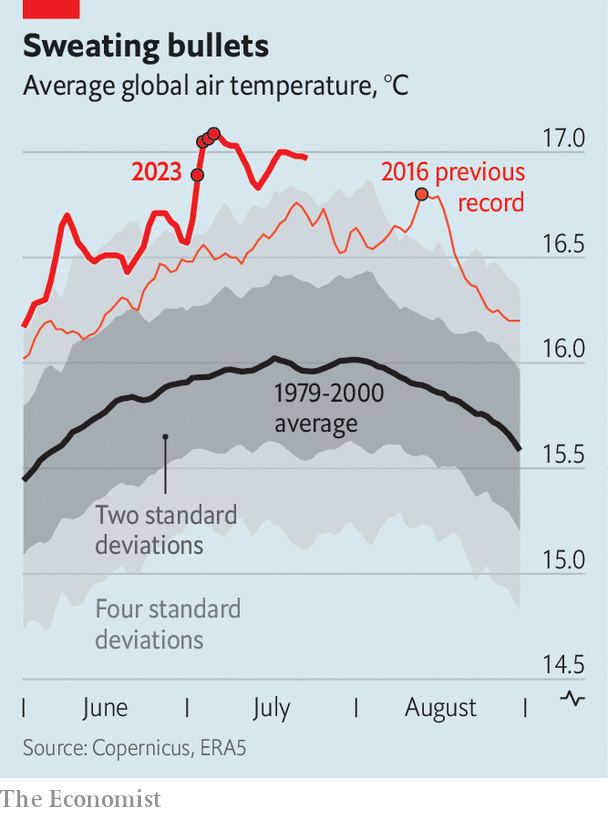

###### Turning up the heat

# Soaring temperatures and food prices threaten violent unrest 

##### Expect a long, hot, uncomfortable summer 

 

> Jul 27th 2023 

Protests have a funny way of kicking off when the mercury soars. The summer of 1967 is best known as “the summer of love”. It was a time when hippies flocked to America’s west coast to protest war, take drugs and peace out. But it was also a time when more than 150 race riots struck everywhere from Atlanta to Boston amid brutal temperatures, earning the period another name: “The long, hot summer.” 

As the world warms, the link between heat and social disturbance is an increasingly important one and, this summer, an especially concerning one. Each upheaval has its own causes, but certain factors make disturbances more likely everywhere. Surging temperatures, rising food prices and cuts to public spending—three of the strongest predictors of turmoil—have driven estimates of the potential for unrest to unprecedented highs in recent months. These estimates will probably rise higher still this summer. Temperatures are unlikely to have peaked. Russia’s exit from the Black Sea Grain Initiative to export supplies from Ukraine and India’s recent ban on rice exports may raise the price of staples. Social unrest is already bubbling in Kenya, India, Israel and South Africa. 

The summer of our discontent

In the first week of July the mean global temperature crossed the 17°C threshold for the first time, reaching a steamy 17.08°C. The average global temperature for the month as a whole is poised to be warmer than the hottest previous single-day average on record. This sort of weather spells trouble. In a study published in , Marshall Burke of Stanford University and Solomon Hsiang and Edward Miguel of the University of California, Berkeley, show that an uptick in temperature of just one standard deviation above the long-term mean—the kind of deviation a statistician expects to observe about once every six days—drives an increase in the frequency of unrest of almost 15%.

 


In the eight weeks since the start of June, the average global temperature has simmered at a consistent four to six standard deviations above levels recorded from 1980 to 2000. Our rough calculations, which extrapolate the relationship indicated in the study, suggest that record temperatures in June and July could have raised the global risk of violent social unrest by somewhere in the region of 50%. The effects of El Niño, a weather pattern that brings warmer temperatures worldwide and recently got under way, are likely to produce a scorching end to the northern summer and start to the southern summer. Indeed, the phenomenon has coincided with more than one-fifth of all civil conflicts that have taken place since 1950. 

Verisk Maplecroft, a risk-intelligence company, maintains a civil-unrest index that forecasts the potential for business disruption caused by social disturbances, including violent upheaval, on a country-by-country basis. According to the firm’s estimates, the risk of global social unrest in the third quarter of 2023 is the highest since the index was created in 2017. That is because of both heat and the higher cost of living, says Jimena Blanco, the firm’s lead analyst. “High rates of food price inflation are a particular risk,” she warns.

Global inflation seems to have passed a peak, and international grain prices are lower than last year’s high. But that does not mean prices paid by consumers have stopped rising. In June annual food-price inflation was 17% in Britain, 14% in the eu and nearing 10% in Canada and Japan. It is higher still in many developing economies, especially those in Africa. Food-price inflation is close to 25% in Nigeria, 30% in Ethiopia and 65% in Egypt (the highest rate in the country’s history).

Bread-and-butter issues

Lower wholesale prices should in time feed through to consumers. But Russia’s choice to scupper the Black Sea Grain Initiative on July 17th, which was followed by four nights of attacks on the Ukrainian ports of Chornomorsk and Odessa in the Black Sea, has disturbed food markets, pushing prices in the opposite direction. Dry conditions elsewhere are also likely to exacerbate difficulties. Yields of Australian barley and wheat are forecast to decline by 34% and 30% this harvest. Stocks of American maize, wheat and sorghum are down by 6%, 17% and 51%. Last year these countries were the world’s two biggest exporters of the cereals by value.

More concerning still are events in India, which produces roughly 40% of global rice exports, and has suffered from debilitating rains this year. On July 20th the government responded by banning exports of all non-Basmati rice from the country. This will reduce global rice exports by about 10%, with almost immediate effect. The United Nations Food and Agriculture Organisation estimates that together maize, rice and wheat provide more than two-fifths of the world’s calorific intake. Among the world’s poorest populations, the figure may rise to four-fifths. If prices do not start to fall soon, people will only get hungrier. And hungrier people are more likely to hit the streets.

Fiscal austerity may further destabilise things. Many governments have committed to raising taxes or cutting expenditures in order to bring debt under control after lavish spending during covid-19. Jacopo Ponticelli of Northwestern University and Hans-Joachim Voth of the University of Zurich investigated almost a century of data from 25 European economies. They discovered that each additional 5% cut in government spending increases the frequency of social unrest by 28%. 

Social upheaval can have a scarring effect on economies, too. Metodij Hadzi-Vaskov, Samuel Pienknagura and Luca Ricci, all of the imf, recently looked at 35 years of quarterly data from 130 countries. They found that even 18 months after a moderate episode of social unrest a country’s gdp remains 0.2% lower. By contrast, 18 months after a major episode of unrest a country’s gdp remains 1% lower. 

Countries beyond the rich world have a more concerning outlook. The damage done by unrest is about twice as large in emerging markets as in advanced economies, according to the imf researchers, with lower business and consumer confidence, and heightened uncertainty, exacerbating the much greater risk of sudden capital flight. This bodes ill for what is set to be a year of rising food prices, boiling weather and spending cuts. Expect a long, hot, uncomfortable summer. ■


