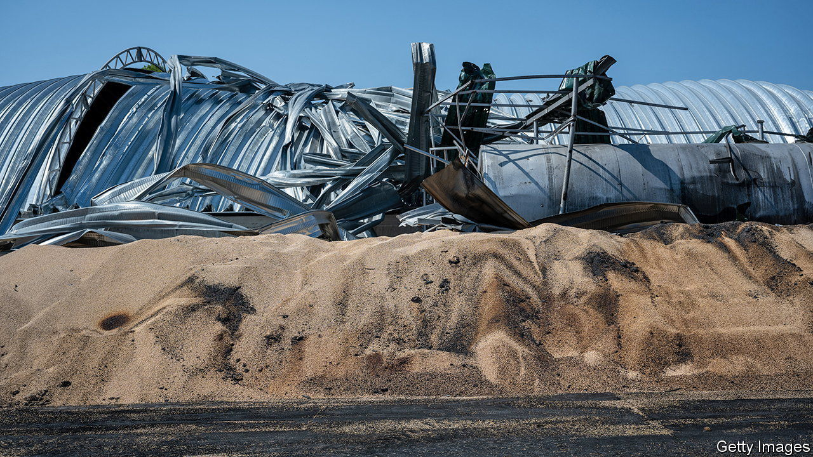

###### Grain wreck

# Russia is attacking Ukraine’s agricultural exports 

##### It is blowing up both the facilities used to ship food out and the deal that grants it safe passage 

 

> Jul 27th 2023 

“TODAY’S DECISION”, António Guterres, the UN’s secretary-general, lamented last week, “will strike a blow to people in need everywhere.” The injury he was decrying was Russia’s repudiation of a year-old deal whereby it had allowed exports of food crops from Ukrainian ports on the Black Sea despite a naval blockade. The resulting leap in grain prices, Mr Guterres warned, would leave many hungry. This week Russia landed blows of a more literal sort on Ukraine’s grain exports, bombing the ports around Odessa from which they are shipped.

A volley of missiles against wharves near the city centre on the night of July 22nd was so indiscriminate it hit one of the city’s cathedrals. On July 19th 60,000 tonnes of grain were destroyed in another bombardment. And on July 24th Russia targeted Reni, a port on the Danube river (not covered by the agreement) through which Ukraine had been exporting grain via Romania. 

Before Russia’s invasion Ukraine exported some 45m tonnes of grain a year, around 90% of it via Odessa and other ports on the Black Sea. In the year the grain deal was in operation almost 33m tonnes were exported through Odessa’s ports. That has now stopped.

Exports by road, rail and river barge have been increasing but Hanna Shelest, an analyst from Odessa, says there is not enough capacity to replace maritime shipments. Anyway, she adds, these alternatives are “several times more expensive in terms of logistics, and slower”. Exports by land have also caused grain prices to slump in neighbouring countries, infuriating farmers in otherwise friendly places such as Poland.

Before the war agriculture accounted for more than 10% of Ukraine’s gdp and nearly 15% of employment. Many farms are still operating. The wheat harvest is under way. Sunflowers will follow in early autumn and maize a few weeks later. Russian bombardment has destroyed much of Ukraine’s storage capacity, so the need to find a new outlet for Ukraine’s exports is pressing.■

