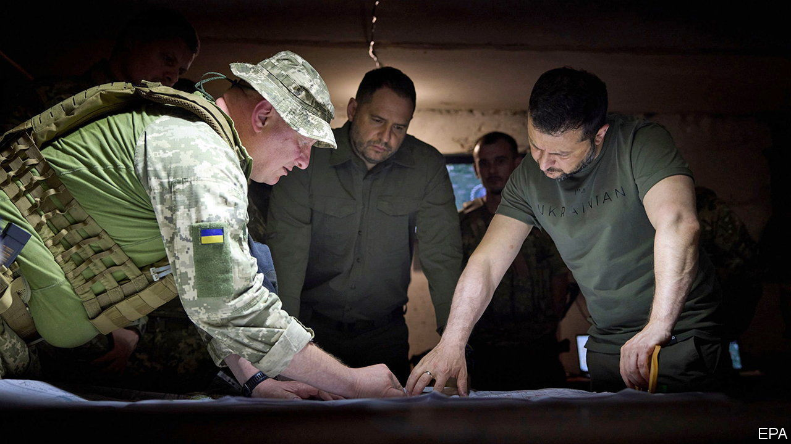
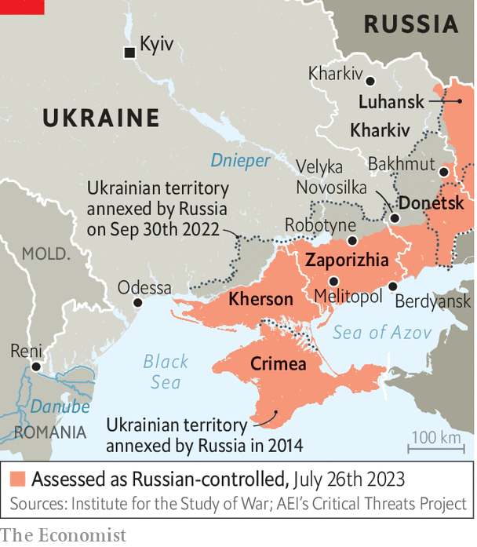

###### Hunting for a breakthrough

# The Ukrainian army commits new forces in a big southward push 

##### After eight of weeks of slow progress, it is trying to revive its counter-offensive 

 

> Jul 27th 2023 


After eight weeks of slow progress, Ukraine’s counter-offensive entered a new phase on July 26th when Ukraine’s army committed a big part of its reserve forces in the south. There was heavy fighting reported around the village of Robotyne. Ukrainian officials say their units are attacking in the direction of Melitopol, a city that dominates the “land bridge” linking Russia to Crimea, and Berdyansk, a port on the Sea of Azov (see map).

 


Ukraine’s hope is that Russia’s army, roiled by dysfunctional command and a drumbeat of Ukrainian missile attacks against its logistics, will break under the new pressure. But for that to happen, Ukraine must overcome the problems that hobbled the first phase of its offensive earlier this summer.

The counter-offensive began on June 4th when Ukraine launched attacks near Velyka Novosilka and around Bakhmut in Donetsk province, as well as a prior thrust in Zaporizhia province in the south where it is now intensifying its assault. Its new Western-equipped brigades got bogged down, sometimes in , and were targeted by Russian artillery, anti-tank missiles, attack helicopters and loitering munitions. Ukraine responded by changing tactics. It held back armour and sent in smaller units of dismounted infantry, often no more than 20 soldiers, to proceed slowly and haltingly.

“The various wargames that were done ahead of time have predicted certain levels of advance,” conceded General Mark Milley, America’s top officer, on July 18th. “And that has slowed down.” In part, the slow progress reflects the scale of the task. Russian defences are 30km deep in places, bristling with tank traps and spattered with mines. Most NATO armies would struggle to punch through comparable lines without complete dominance in the air, which Ukraine does not enjoy.

Another problem is that Russia has mounted a  than expected, conducting rapid, mobile counter-attacks in response to Ukrainian advances, rather than remaining confined to trenches. Rob Lee, an expert on Russia’s armed forces who recently visited the front lines, notes that they have not just executed their doctrine competently, but also innovated, for instance by stacking multiple anti-tank mines on top of one another to destroy mine-clearing vehicles. 

Ukraine’s inability to breach Russian lines is partly to do with equipment—it needs demining kit, air-defence systems and anti-tank missiles capable of blunting Russian counter-attacks from a greater distance. It is also to do with tactics. Mr Lee describes an occasion when a brigade’s advance was delayed by a couple of hours, until dawn. That not only negated Ukraine’s advantage in night-vision systems, but also meant that the accompanying artillery barrage lifted hours earlier than it should have done. Russian infantry and anti-tank squads, who should have been suppressed by well-timed shellfire, were free to attack.

This lack of proficiency in co-ordinating complex attacks involving multiple units and different sorts of weapons is hardly surprising. Ukraine’s new brigades were put together in a hurry with unfamiliar equipment. Newly mobilised men were given a month of training in Germany. They have struggled with tasks like reconnaissance, says Mr Lee, with new units becoming disoriented at night time. Co-ordination has also been a problem, with confusion around where friendly units have placed mines. 

Ukraine’s allies do not seem troubled by the slow progress to date. “It is far from a failure, in my view,” said General Milley, when asked whether the offensive had stalled. “I think that it’s way too early to make that kind of call.” Optimists point to three factors in Ukraine’s favour. One is that it need not fear a serious Russian counter-attack, despite minor Russian gains in northern Luhansk province in recent days. “There appears now to be little prospect of the Russian forces regaining momentum,” said Richard Moore, the head of MI6, a British spy agency, on July 19th. That may be one reason why Russia has torn up a  and  on Ukraine’s ports and grain stores.

Second, Russia’s decision to defend forward, rather than falling back to prepared defences, has slowed down Ukraine’s progress but also left Russia with little mobile reserve in the rear, a point underscored by Yevgeny Prigozhin’s unhindered march to Moscow in June.

The third factor is that Ukraine has been chipping away at Russia’s combat power. On July 11th a Ukrainian strike reportedly killed Oleg Tsokov, a Russian general, in Berdyansk, suggesting that Ukraine was successfully targeting command posts. In recent days Ukraine has also used British-supplied Storm Shadow missiles to strike air bases and ammunition depots, including in Crimea. Meanwhile, America’s decision to provide cluster munitions, allows Ukraine to keep up the offensive for longer than originally planned—certainly beyond the summer if necessary.

These factors explain why General Valery Zaluzhny, Ukraine’s top general, decided to throw in fresh legs on July 26th. He has been forced to adapt his original plan. Brigades from Ukraine’s 9th Corps had been expected to fight their way to Russia’s main line of defence. Then the 10th Corps, in essence a second echelon, including three Western-equipped brigades, were to be deployed to fight their way through the strongest defences. Finally, light, fast-moving air-assault units were supposed to exploit any breakthrough, pouring through the hard-won breach. 

In the event, 9th Corps struggled. Advances that were supposed to be completed in days ended up taking weeks. Ukraine was unable to deploy whole brigades, instead breaking them down into smaller units. Some experts worry that 10th Corps has now been thrown in prematurely. The main Russian line is still kilometres away and 10th Corps’s units might be worn down before they get there, leaving them too exhausted to punch through.

Western officials play down these concerns. “I think they timed it well,” says one. Ukraine is in a “very strong operational position”, says another, pointing to the turmoil in Russia’s senior ranks, including the decision in early July to sack General Ivan Popov, who commanded a big portion of Russian forces in southern Ukraine. Russian military bloggers have described heavy losses of Russian artillery pieces in recent weeks. 

However, a fluid war of manoeuvre is likely to remain a stretch for a force cobbled together in a few months. The Russian verb to grind through) is invoked on both sides. But Ukraine’s junior commanders, having seen their units gutted over the past 18 months, refuse to send their new citizen army into a meat-grinder in the way that Russia did in Bakhmut. As Ukraine has become more European, Ben Wallace, Britain’s defence minister, recently suggested, it has acquired “a Western European caution”.

Some American and European military officials argue that Ukrainian commanders have in fact been too slow to strike with their new brigades, a mistake that they think Ukraine committed last year in Kherson, when tens of thousands of Russian troops withdrew east over the Dnieper river with their equipment. Ukrainian commanders chafe at the idea that they should gamble their army in circumstances that NATO generals have never faced. 

The 10th Corps’s assault is a break with that hesitation. And the upside of the aversion to casualties thus far is that many Ukrainian units are in better shape than planners had assumed. Brigades that assaulted Russian positions were expected to be left with only a third of their original strength. Thanks in part to well-armoured Western vehicles, they have taken a lighter knock. Even so, the commitment of 10th Corps is a fateful moment for General Zaluzhny, a cautious commander with the weight of Ukrainian and allied expectations on his shoulders. “This is the last big decision for Zaluzhny to make this summer,” says the Western official. “The die is cast.” ■

