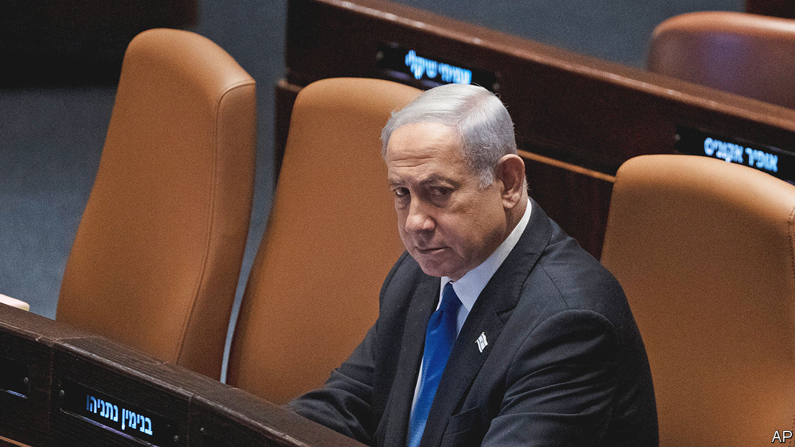

###### A sad day

# Israel has lurched closer to constitutional chaos 

##### But there are still ways to step back from the brink 

 

> Jul 26th 2023 

Tisha b’av is the saddest day in the Jewish calendar. A time of mourning and fasting, it marks the destruction of the first and second temples in Jerusalem—the result, in part, of infighting among the Jewish people. This year the commemoration began on July 26th, two days after Israel’s government passed a law aimed at . The reform’s many opponents see it as an act of self-destruction. The echo of Tisha B’Av only deepened their sorrow.

The vote on July 24th means that the Supreme Court will no longer be able to overturn government decisions on the ground of “reasonableness”, which critics had seen as a  for judicial meddling. It has prompted a furious reaction among many Israelis. The opposition boycotted the final vote. Israelis once again flooded into the streets to protest. Trade unions are talking about a general strike. Thousands of army reservists have vowed not to turn up for duty. The day after the vote Morgan Stanley downgraded Israeli sovereign debt. In a striking criticism, America, Israel’s closest ally, described the government’s move as “unfortunate”. 

The outrage reflects—and has deepened—the divisions within Israel over the most fundamental questions surrounding the country’s democratic and Jewish character. If infighting is not to threaten the Jewish state once again, politicians from all sides need to step back from the brink and search for a constitutional reform that commands broad support.

Whether or not Binyamin Netanyahu wished it, the judicial reforms have become his defining policy. The prime minister had delayed a vote in March to give time for compromise, but talks went nowhere. Even as he waited to vote in the Knesset this week, he tried in vain to persuade his allies to delay once again. Instead his coalition of far-right and ultra-religious parties forced through the reform. Just a day out of hospital for heart surgery, Mr Netanyahu looked exhausted. He faces charges of corruption that Supreme Court reform may help dismiss. By caving in to his far-right partners’ threats to resign, he has made clear that he puts his own political survival above all else. He has thus given the extremists the upper hand. 

Even the government’s fiercest critics agree that Israel’s judicial system needs reform. Many would place limits on use of the reasonableness standard, without abolishing it altogether. The committee that appoints judges has a majority of sitting justices and Bar Association representatives, leaving politicians in a minority. Because the right feels the court no longer reflects the country’s views, the idea that it is self-perpetuating is harmful. 

However, the way the government has rammed through its changes has fed fears that the far-right means to clear any legal obstacles to its efforts to transform Israel, whether by changing the status of religion or by annexing parts of the Palestinians’ West Bank. After the vote, Yariv Levin, the hardline justice minister, declared that this was merely the first step in the coalition’s plans. Some worry that the government wants legislation that would skew the electoral system to make conservative victories more likely. Because the Knesset has only one chamber, Israel risks falling into majoritarian rule—a particular threat to secular Jews and minorities, including Israeli Arabs. 

The Knesset is about to go into its summer recess. That gives two months to find a way to heal a divided country. Although Mr Netanyahu is concerned with his own political survival, he must realise that if the cost is ramming through the judicial reform, he will pay with his legacy. If he does not want to be remembered as the prime minister who weakened Israeli democracy, he needs to build consensus. If he cannot find that among politicians, he should establish a broad and inclusive constitutional convention that would codify the powers of parliament and the courts. 

And if Mr Netanyahu fails? The task will fall to the Supreme Court. It has said it will hold off from hearing appeals against the law until September. If the coalition is determined to pursue the reforms to their full extent the court should strike down the law. It faces a terrible choice. As the first court to reject part of one of Israel’s basic laws, which is in effect the country’s stand-in constitution, the court would seem to be vindicating those who say it is out of control. But failing to do so would leave all of Israel’s institutions in peril.

Striking down the law would bring Israel’s constitutional crisis to a head. But that would force the country’s leaders to deal explicitly with how to preserve democracy. Israel’s founders failed to write a constitution because they could not agree on principles such as its relationship with the Palestinians and the role of religion. It has muddled through for 75 years. If the temple is not strengthened, it may start to crumble. ■

