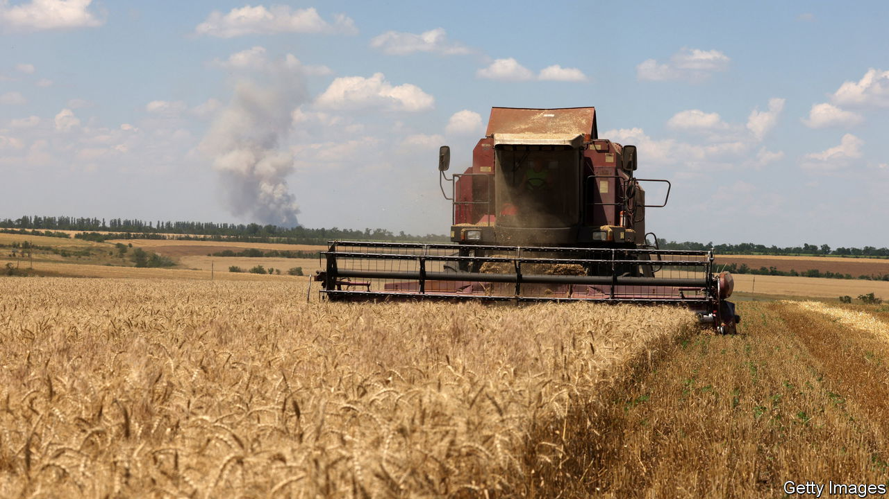
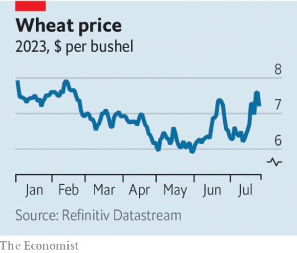

###### Make Ukraine’s grain Russia’s loss

# The world should not let Vladimir Putin abandon the grain deal 

##### Here is how to get him to sign up again 

 

> Jul 26th 2023 


RUSSIA’S BELEAGUERED president took up his pen this week. In the days before a  in St Petersburg on July 27th, Vladimir Putin published an article on the Kremlin’s website to justify why he has abandoned the grain deal that ensured safe passage for Ukraine’s crops and fertiliser. Promising to make up the shortfall, he wrote that the “so-called” deal solely enriched Western businesses, and that promises to exempt Russian exports from sanctions had been broken. Pretty much every word was false.

 


For a start, Russian exports of food and fertiliser, though shunned by Western businesses, are not under sanctions. What’s more, the arrangement has benefited all food-importing countries. Under the deal, signed in July 2022 and overseen by Turkey and the UN, Ukraine has exported over 32m tonnes of crops. That helped lower prices, which have risen since Russia quit on July 18th and then set about destroying Ukraine’s grain stocks and ports (see chart). 

Mr Putin’s real reason for sinking the deal was to further ruin the prospects for Ukraine’s economy. Ever since the invasion stalled, Russia’s strategy has been to convince the West that Ukraine cannot win a long war—and that Russia’s foes had better cut their losses. Yet, after the mutiny by Wagner mercenaries in June and ructions in Russia’s regular army, it became clear that time is working against Mr Putin, too. Abandoning the grain agreement is his attempt to strike back. He must fail.

If Ukraine cannot export grain, its economy will suffer. Food made up roughly two-fifths of its total exports of $68bn in 2021. Farmers can still send limited amounts of grain by rail and by ship, via the Danube, though both are expensive. But Mr Putin has taken to attacking these alternative export routes, and European Union farmers resent falling prices in local markets. If Ukrainian farmers cannot earn enough, they will not be able to replant their fields, ruining the next harvest.

The blow to Ukraine’s economy comes on top of its . Mr Putin’s message is that he will inflict whatever pain it takes to keep fighting—whether on Ukraine, the world or his own people. This appeal finds an audience in the global south. Some countries sympathise with Russia; more suffer from the war and resent the West for putting off its supposedly inevitable resolution.

Ukraine’s backers need to expose Mr Putin’s mendacity. Forcing an unequal ceasefire on Ukraine, even if that were possible, would not bring lasting peace. The lack of Western resolve it signalled would invite Mr Putin to attack again after he had re-armed. In the meantime, he would surely continue to seek to harm Ukraine’s economy by disrupting its exports.

Instead, the world should press Russia to revive the grain deal—starting at the Russia-Africa summit. African leaders have no interest in higher prices and fragile global food markets. They could berate Mr Putin, and send a grain ship to Ukraine under an African flag. In addition, Turkey has influence over Mr Putin and the motivation to wield it. As a large importer of Ukrainian wheat, it can help solve its inflation problems and earn money by selling some supplies on. Turkey is a conduit for Russian imports. Its grandstanding president, Recep Tayyip Erdogan, could win prestige as a mediator. 

Ukraine’s Western backers have a part to play, too, by signalling that if diplomacy fails they will use force to break an illegal blockade of international waters. Giving Ukraine long-range missiles would be a first step; offering insurance for convoys another. A last resort would be to provide them with a military escort. If Turkey exercises its right to refuse warships access to the Black Sea through the Bosporus, some NATO members could supply air cover instead. By quitting the grain deal, Mr Putin may think he has demonstrated that he has the advantage. All he has revealed is that he is running out of options. ■

