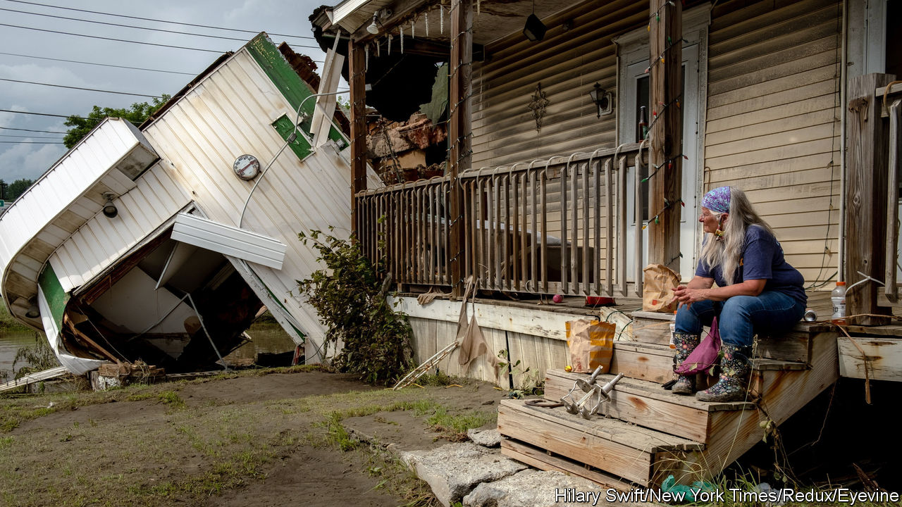

###### A spell of sunshine

# Weather forecasting has come far. Its future is brighter still 

##### Three things need to be done to make the most of its potential 

 

> Jul 27th 2023 

MANIAC, a computer designed at Princeton after the second world war, could perform a blistering 10,000 calculations a second. This extraordinary power was applied to two main problems: modelling thermonuclear explosions and the Earth’s weather. They were the two most consequential applications the machine’s creators could imagine.

It would have taken MANIAC the entire 13.8bn-year history of the universe to perform as many calculations as today’s fastest computer can carry out in an hour. But though their abilities and ambit have increased, today’s supercomputers still see a great deal of their capacity devoted to weaponry and weather. Their contributions to H-bomb design add little to most everyday lives beyond an undercurrent of dread. But their work on the weather at forecasting outfits around the world finds practical application almost everywhere. 

Research from the World Bank and others puts the benefits of numerical weather prediction (NWP) at $162bn a year. Its success can be attested to by any modern farmer or military commander. It can also be felt in the fabric of everyday life. No smartphone lacks icons redolent of sun, rain, wind or cloud. Deciding to leave an umbrella at home on a forecaster’s advice is no longer necessarily a triumph of hope over experience.

The application of machine learning and other forms of artificial intelligence (AI) will improve things further. The supercomputers used for NWP calculate the next days’ weather on the basis of current conditions, the laws of physics and various rules of thumb; doing so at a high resolution eats up calculations by the trillion with ridiculous ease. Now machine-learning systems trained simply on past weather data can more or less match their forecasts, at least in some respects. If advances in AI elsewhere are any guide, that is only the beginning. 

What is more, in some cases the AI approach seems able to  that NWP cannot reach by calculation alone. And AI’s lower costs will attract new entrants into the weather business. They can be expected to bring products exquisitely tailored to customers’ needs and fresh ideas that open new markets.

Three things need to be done to make the most of the possibilities. One is to ensure that healthy competition does not erode basic infrastructure. The mostly governmental outfits that dominate NWP put a great deal of effort into assimilating observations from around the world into the consistent representations of the weather their models need. The costs of this can be defrayed by selling high-value forecasts into specialist markets.

To do their best work, AIs will need to be trained on the data in those representations. But that best work will almost certainly undercut some of the current forecasters’ wares. So a modus vivendi has to be found whereby being generous with the data new entrants need to train their AIs does not leave existing forecasters too much out of pocket. To do otherwise could threaten the meticulously set up systems they use to turn observation and computation into the data sets on which the AIs and the world rely, at least for the time being.

The second thing to be done is to bring together AI and number-crunching to deal with climate change. At the moment it is not possible to run climate models at the resolution used for weather forecasting. New hardware being built for AI systems could help (Nvidia, a chipmaker, is interested). And AI could also be used to look for patterns in the projections such models produce, making them more informative, and as an interface that makes their insights more accessible to non-experts. 

Before that becomes an issue, better access is needed in the here and now. In 2019 the Global Commission on Adaptation reported that 24 hours’ notice of a destructive weather event could cut damage by 30%, and that a $800m investment in early-warning systems for developing countries could prevent annual losses of $3bn-16bn. Accordingly, the World Meteorological Organisation has made “Early Warnings for All” by 2027 its priority. Its chief, Petteri Taalas, argues that, given three out of four of the world’s people have mobile phones, it is outrageous that only half their countries have systems to warn them of disaster. 

How to save some lives

No breakthroughs are required to put this right, just some modest investment, detailed planning, focused discussion and enough political determination to overcome the inevitable institutional barriers. It is not an effort in the Promethean tradition of MANIAC’s begetters; it will neither set the world on fire nor model the ways in which it is already smouldering. But it should save thousands of lives and millions of livelihoods.■

