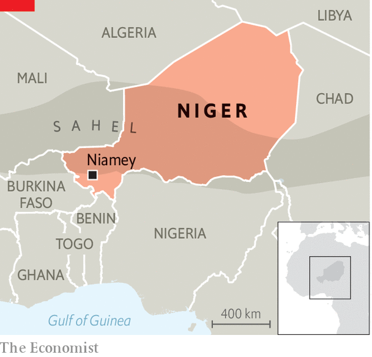

###### Coup and chaos

# Soldiers declare they have overthrown Niger’s president 

##### The fall of Niger’s democracy would be a heavy blow to regional stability 

 

> Jul 27th 2023 

The last seemingly solid government aligned with the West in the jihadist-plagued Sahel, a belt of poverty-stricken Francophone countries that spreads across the Sahara desert, seems to have fallen to a military coup. Late in the evening of July 26th a group of soldiers appeared on Niger’s national television to declare that they had “decided to put an end to the regime that you know”. 

 


President Mohamed Bazoum, who took office about two years ago in the country’s first peaceful democratic transfer of power, had reportedly planned to dismiss the presidential guard’s head, General Omar Tchiani, who may now be the new man in charge. Yet uncertainty remained. After the announcement Mr Bazoum, who was reportedly held but had not yet publicly resigned, tweeted: “The hard-won achievements will be safeguarded. All Nigeriens who love democracy and freedom will see to it.” 

Political chaos and violence in Niger, a country of 26m, could sorely harm the wider region, too. Niger is the only true Western ally and the sole democracy in the fight against jihadists linked to al-Qaeda and Islamic State that have slaughtered their way across much of Mali and Burkina Faso to the west—and into parts of Niger. It is also trying to fend off jihadists from Boko Haram, another terrorist outfit, that spills over from Nigeria. 

If it sticks, this coup would be the sixth to succeed in west Africa in under three years. None has helped. In Mali soldiers overthrew civilian rule in 2020. In Burkina Faso soldiers seized power in January 2022, only to be overthrown by rival gun-toting men in September. In both countries they soon pushed out and scapegoated French forces fighting the jihadists. Mali replaced them with mercenaries from Russia’s Wagner Group. Yet the result was even more violence. Last year in Burkina Faso, Mali and Niger more than 10,000 people were killed, the bloodiest rate so far. This year could be bloodier still. 

Yet much less of the carnage is in Niger, where fewer people were killed in the first six months of this year than in any similar period since 2018. The West has poured in billions of dollars in aid to the country. Some 1,500 French soldiers have been fighting alongside the army; 1,000-plus Americans are also deployed there. And they have drone bases, too. 

Mr Bazoum has not just relied on Western muscle. Fighting between ethnic groups plays into the jihadists’ hands, so he has backed peace deals between local communities. His government has even reached out directly to jihadists to try to persuade them to lay down their arms. 

Now this progress is at risk. Even if Mr Bazoum regains control, his army will be divided. Speaking of the coups in Mali and Burkina Faso, he told  in May: “The army, which is the institution we need the most to deal with insecurity, is weakened by these coups, because they turn things upside down.” Alas, his words apply to Niger, too.

