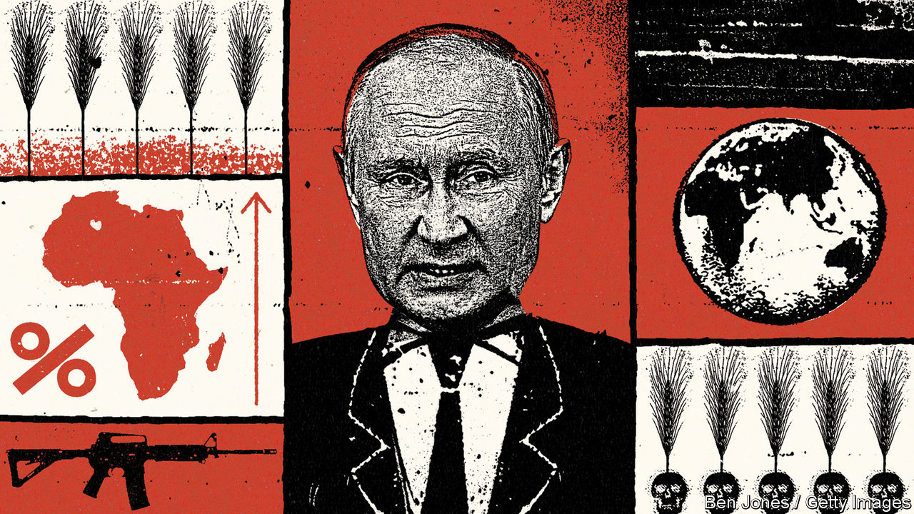
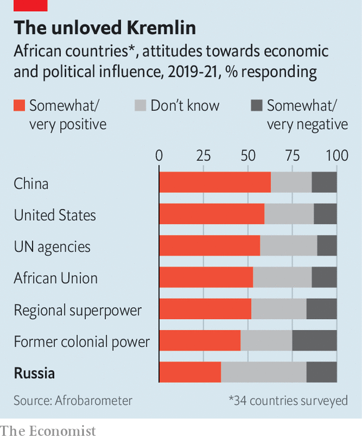

###### Grain games

# Why African leaders shunned Vladimir Putin’s summit 

##### Russia’s weaponisation of food reflects its cynical approach to the continent 

 

> Jul 26th 2023 

Vladimir Putin has never been so diplomatically isolated. Few heads of state have visited him since his invasion of Ukraine last year. So when African leaders arrived in St Petersburg on July 27th for the second Russia-Africa summit, it was something of a coup—so to speak—for Russia’s president. Yet the turnout shows the limits to Russia’s sway on the continent. Reports suggest that just 17 African leaders travelled, less than half the 43 who went to the first bash in 2019. 

The showing underlines Africa’s ambivalence towards Russia. Of Africa’s 54 countries, 19 backed Ukraine in most of the five votes on the war at the un General Assembly in the first year of the conflict, versus just two that did the same with Russia. But overall, African states abstained or did not show up on 52% of occasions. 

There is no single reason for the postures of African countries. Several are autocracies run by elites with close links to Russia; a few host Russian mercenaries from the Wagner Group. Some states selectively recall their historical links to the Soviet Union, or are instinctively sceptical of the West’s foreign policy. Most feel that, pulled hither and yon by geopolitical shifts, it is better to avoid picking sides—and instead strike a balance. 

The African response to Russia’s withdrawal from the Black Sea grain initiative should be viewed in this primarily pragmatic context. On July 17th Russia said it would no longer honour the deal it signed a year earlier that unblocked an export channel for Ukrainian grain and helped push cereal prices down by 14%, according to the Food and Agriculture Organisation, a un agency. ngos working in the Horn of Africa, in particular, say Russia’s move will worsen inflation and hunger. Though no leader publicly criticised Mr Putin, they will raise the deal at the summit. 

Russia will hope that it can keep African leaders quiet with the kind of cynical, elite-driven approach to the continent that it favours. Ukrainian officials say that Russia has blocked their efforts to donate grain to Africa, under a programme launched in November. Meanwhile Russia is exporting its wheat to friendly states; Mali, the junta of which is propped up by Wagner, received 50,000 tonnes at knockdown prices last month. The Kremlin has used a scheme to donate Russian fertiliser stranded in Europe, through the World Food Programme, to lobby African states to call for an end to sanctions on Russia. 

Russia has to exert its influence where it can because it is an economic minnow in Africa, relative to America, China or European powers. In 2018, the most recent year analysed by researchers, Russia gave $28m in bilateral aid to African countries, less than one-hundredth of Britain’s total—and one-thirteenth of what Russia gave Cuba. Russia accounts for a tiny fraction of foreign direct investment in Africa. In 2020 Russia-Africa trade hit $14bn, 2% of the continent’s total and about one-twentieth of eu-Africa trade. At the first Russia-Africa summit officials bragged of signing deals worth $12.5bn. Few materialised. No wonder leaders from Kenya, Nigeria and other big economies skipped this year’s event. 

Still, Russia is a compelling partner for authoritarian regimes clinging to power. It has been Africa’s largest weapons supplier for more than a decade. Though more than half of these exports were to Algeria and Egypt, it also sells weapons to sub-Saharan African regimes such as Uganda more cheaply and with fewer strings than the West would attach. 

The Wagner Group—another part of the Kremlin’s security offer to autocrats—is seemingly staying put in Africa after its short-lived mutiny against Mr Putin. “There was—and will be—no reduction in our programmes in Africa,” Yevgeny Prigozhin, its leader, said last week. In the Central African Republic Wagner is helping run a referendum on July 30th that will see Faustin-Archange Touadéra, the president, abolish term limits. 

Guns and mercenaries are just part of Russia’s low-cost, high-impact strategy of targeting African elites. Many of the countries where the ruling class has the closest ties to Russia—such as Algeria, Madagascar, Mozambique, Uganda and Zimbabwe—often abstained at the un. And the targeting of elites extends to more democratic places. Jacob Zuma, who came close to signing a gargantuan nuclear-power deal with Russia, is one of several figures in South Africa’s ruling African National Congress that Russia has tried to woo and protect. The former president is currently in Russia for “health reasons”; as it happens, he faces prison time at home. 

All Russia’s efforts are backed up by propaganda. Its disinformation campaigns target influential African voices on social media. They are effective in part because the messages fall on fertile anti-Western ground, especially in French-speaking west Africa. In a poll of 23 African countries in 2022 Gallup found that the states with the highest approval ratings of Russia were Mali (84%) and Ivory Coast (71%). The top seven were Francophone. 

 


But there is a limit to Russia’s appeal. In 2021 Afrobarometer, a research group, released results of polls across 34 African countries. On average just 35% of respondents said Russia was a good influence. That share was behind those for former colonial powers, regional hegemons, America and China (see chart). 

Volodymyr Zelensky, Ukraine’s president, has belatedly joined the battle for these hearts and minds. Last week in Kyiv he hosted a group of African journalists. He compared the war in Ukraine to the anti-colonial wars in Africa: “Many of your ancestors went through this.” Mr Zelensky added that Russia’s approach to grain and Africa was like its earlier use of oil and gas in Europe. In both cases, he said, Russia tried to eliminate competitors and use resources to create political dependence. 

To judge by the low turnout for this week’s summit, African leaders are recalibrating their views of Russia. Mr Putin’s officials blame Western pressure. In truth, it reflects exactly the sort of African autonomy they cynically claim to champion. ■

