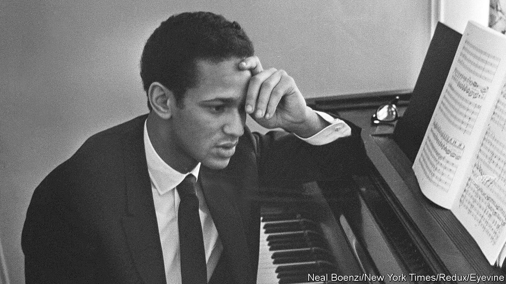

###### The last Romantic

# André Watts took both Liszt and Schubert to his heart 

##### One of America’s first black stars of classical piano died on July 12th, aged 77 

 

> Jul 26th 2023 

The concert piece, Franz Liszt’s E-flat Concerto, opened with a bracing call and response: a seven-note motif from the strings, answered by a rousing clarion from the horns and woodwinds. Then the same again, the strings pitched a bit lower and the winds higher: a call to action. The pianist took it up. The orchestra responded, and a chase began: for the next 20 minutes the pianist played sweeping flights that sounded like improvisations, using almost the entire keyboard. The orchestra doing the chasing on January 12th 1963 was the New York Philharmonic under Leonard Bernstein, then perhaps the most celebrated conductor in the world. The pianist was André Watts. Blade-thin and straight-backed, he played with burning-eyed fluency, every inch the Romantic hero. He was 16.

The call had come to his parents’ house in Philadelphia only two days before. The pianist who was billed to play, Glenn Gould, was ill. Could André replace him? Of course he could. He surmised later that the manager and conductor had said to each other, “Remember that kid?” The one who had already won an audition to play for Bernstein’s nationally televised Young People’s Concerts, even though his practice had been on a rickety old piano with 26 strings missing. 

The effect of that January concert was electric. He went from having no concerts booked, to 75 in a year. At 17 he won his first Grammy, for most promising new classical recording artist. Young as he was, he was now firmly launched on a career largely devoted to the Romantic repertoire. He emerged onto the world stage as one of the very few African-American classical-music headliners.

Inevitably his colour was noted. At that famous concert Bernstein told the audience he looked rather like a young Persian prince, and commented on his “mixed-up name”. The allusion was to his mixed-race parentage: his father was an African-American soldier stationed in West Germany after the second world war, his mother a Hungarian refugee. In 1971 the  described him as “capable of appearing as variously as an austere mulatto…a wistful pa’san surveying some Mediterranean terrace, or a bookish adolescent confronting his bar mitzvah”. People kept asking whether he played jazz. 

All this he took in his stride. Colour was just a physical description that could soon be dismissed. The simple fact was that he was half-black and half-white, a position he liked: it meant he could take potshots at both sides. His formative influences, in any case, were European. After his parents divorced when he was 13, his mother brought him up. His earliest memory was of her playing Strauss waltzes on the piano in their apartment in Ulm, in Baden Württemberg. In Philadelphia, his home from the age of eight, she was the one who insisted that he should learn to play music, just as he should learn to read and write. 

Violin was his first instrument, but whenever he played the family dog would sit beside him, baying at the moon. So he switched to piano, and for a year did just what he liked on it. He would hold down the pedal for pages, feeling the immense sounds mushrooming all round him. Love of that sound lasted. When he started proper lessons his mother encouraged him to practise, which he disliked, and she travelled to concerts with him until he was 21. He, in turn, was solicitous of her: dining out with her when he was 25, he graciously accepted a bottle of champagne from the restaurant, explaining that she only drank Taittinger. 

He stayed devoted all his life to the drive and showmanship of Liszt, revelling in the way the great composer wore his virtuosity with a bit of a smile, as if saying, “Isn’t it interesting to see me on this high wire?” All the same, he disapproved of the way some pianists played him, slamming their feet down, clipping the corners. The Hungarian Rhapsodies had to be approached as respectfully as a Mozart concerto; stripped of cliché and sloppiness, it was amazing what you could hear in them. 

In these explorations, he needed to feel an audience was with him. Though he made many recordings, playing music without live listeners had a chilly sort of sterility. He wanted to transmit his personal response to the music readily and freely, without hiding anything of himself. The composer he felt closest to was Franz Schubert, because of his clarity and openness. ”Guileless” was the word that struck him—all feelings exposed in a sacred space. 

Before music, he was always humble. He wanted to compose his own, but put no notes on paper. Perhaps, he thought, he did not really have anything to say. He found interviews awkward, because he was so intent on his search for the precise word. And he disliked vaunting himself. Even as a child, when at nine he performed with the Philadelphia Orchestra, he did not suppose he was better than any of the other children who played. And, as a perfectionist, he feared he might get too frustrated with composition. In a musical career, there was always another level to strive for. But as soon as you reached that, there was yet another. 

Instead he preferred to settle into learning from the masters, especially from Leon Fleischer, his chief teacher. The hardest part of playing music, he thought, was to preserve a balance between being the star who strode onstage, proclaiming to the audience that he would give them something worthwhile, and the man who felt he was nothing but an idiot who didn’t know what he was doing. Fleischer taught him how to manage that. He also learned how to defy the tendonitis that assailed him as he got older. When nerve damage limited the use of his left hand, he simply transcribed Ravel’s “Concerto for the Left Hand” for the right one. 

That entailed more than just sliding a bit to the left on a piano bench; it involved re-engineering a hugely challenging piece. But his version worked, and he was surprised by its power, which seemed to come from learning it so late in life. When he came to play it, with the Detroit and Atlanta orchestras, it was an act of daring; and no less so than playing Liszt on national television, with the world’s most famous conductor, when he was just a boy. ■

