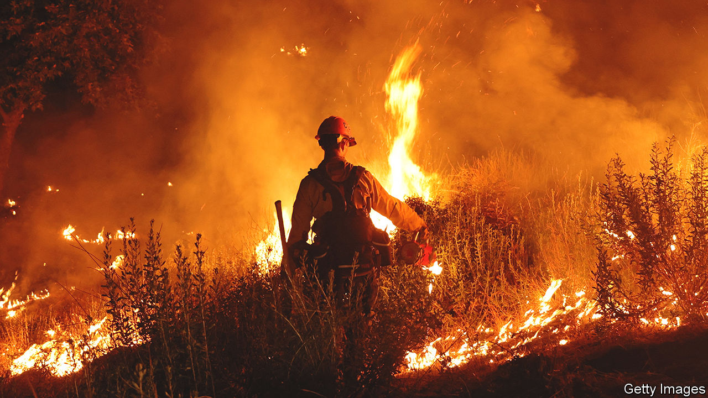

###### Taming the chaos

# How to better forecast the weather 

##### Private companies—and AI—are transforming the weather business 

 

> Jul 26th 2023 

Matteo Dell’Acqua has to shout to make himself heard. Engine Room Number Five at the European Centre for Medium-Range Weather Forecasts’ data centre in Bologna houses a series of motors, each turning a three-tonne flywheel. Should the electricity cut out, the flywheels—and those in four other rooms elsewhere in the building—have enough momentum to keep the ECMWF’s newest supercomputer running until the back-up diesel generators fire up. 

Those generators have fuel for three days. A longer blackout would spell disaster. Weather shapes military campaigns and crop harvests, sports matches and supply chains. Losing access to the world’s most reliable weather forecast would drastically reduce the prescience and preparedness of more than 35 countries, NATO, at least one space agency and a great many research institutions and businesses. The operation must run constantly, says Mr Dell’Acqua, who is in charge of the whole affair. “It’s really critical.”

Built inside a former tobacco factory, the Bologna data centre is a nerve centre of ECMWF’s operations. Every day, 800m observations pour in from satellites, ocean buoys, ground weather stations, balloons and aircraft. Besides preparations for a power cut, there are contingency plans for floods and fires. Water from two external towers is circulated constantly, keeping the electronics cool. 

Outside, though, cooling is in short supply. For the past two weeks much of Europe has been gripped by a punishing heatwave. Bologna was one of 23 Italian cities put on “red alert”. Several countries broke temperature records; fires have burned across Greece and the Canary Islands. Large swathes of America and Asia were also beset by sweltering heat. July 6th saw the highest average global air temperature ever recorded on Earth, according to estimates published by the University of Maine. Elsewhere, the weather brought a different kind of misery. Torrential rain in South Korea, India and on America’s east coast killed scores. Two days after ’s visit to Bologna, hailstones the size of tennis balls rained down on the nearby city of Milan. 

Climate scientists reckon the heatwaves were made far more likely by climate change. Weather forecasts gave countries advance warning, a job that will become even more important as the planet warms further. Governments are investing in bigger and better forecasting models. They are being joined by private firms producing smaller-scale, specialised forecasts for businesses—and by tech firms betting that AI can revolutionise the field. 

 


Modern weather forecasting owes its existence to the advent of digital computers in the 1960s and 1970s. It has improved steadily ever since (see chart). The World Meteorological Organisation (WMO), an arm of the United Nations, reckons that a five-day forecast today is about as accurate as a two-day forecast was a quarter of a century ago. 

Cloud computing

Most of that improvement has been down to more powerful computers, says Tim Palmer, a meteorologist and physicist at the University of Oxford. Weather forecasts work by carving the world into a grid of three-dimensional boxes. Each is populated with temperature, air pressure, wind speed and the like, and the system’s evolution simulated by grinding through enormous numbers of calculations. 

Better computers allow finer models. In the same way that a high-resolution digital photo looks more realistic than a coarse-grained one, using a smaller grid helps match a model more closely to the real world. The ECMWF’s highest-resolution global model, for instance, chops the globe into boxes that are 9km square, down from 16km in 2016, and splits the atmosphere vertically into more than 100 layers. 

Smaller grids also allow models to recreate more of what happens in the real weather. “Deep convective clouds”, for instance, are formed as hot air floats upwards. They can produce heavy rain, hail and even tornadoes, but typically cannot be resolved with grids bigger than about 5km. Models have instead represented them using stopgap code that acts as a simplified substitution. 

But smaller grids come at a high price. Halving the horizontal size of a grid means that four times as many boxes—and four times as many calculations—are needed to cover a given area. One option is to trade resolution for locality. The sharpest offering from the National Oceanic and Atmospheric Administration, in America, for instance, uses grid boxes 3km square, but covers only North America. Computing, meanwhile, continues to improve. The world’s fastest computer is Frontier, installed at Oak Ridge National Laboratory in Tennessee. Using it, ECMWF scientists were able to experiment with running a worldwide model with a 1km resolution. 

But no matter how powerful computers become, there is a limit to how far ahead a numerical forecast can look. The atmosphere is what mathematicians call a “chaotic system”—one that is exquisitely sensitive to its starting conditions. A tiny initial change in temperature or pressure can compound over days into drastically different sorts of weather. Since no measurement can be perfectly accurate, this is a problem that no amount of computing power can solve. In 2019 American and European scientists found that even the most minor alterations to simulations resulted in highly divergent forecasts for day-to-day weather after about 15 days. “It seems to be a limit that nature sets,” explains Falko Judt, a meteorologist at the National Centre for Atmospheric Research, in America. “It has nothing to do with our technological capabilities.”

Private prognostications

The WMO reckons numerical forecasting will approach that theoretical limit sometime around 2050. But that leaves plenty of room for improvement in the meantime. The ECMWF presently produces accurate forecasts of daily weather—meaning it can predict things like the temperature and when it will rain, give or take a couple of degrees or hours—around the globe at least a week ahead of time. It has, on occasion, successfully predicted certain big events, like hurricanes, up to ten days ahead.

But big global or regional forecasts are not the only game in town. There is also a growing demand for faster or more specific forecasts than can be provided by public institutions (which, being mostly funded by taxpayers, tend to produce what will be the most helpful to the most people). Private companies are filling the gaps. 

In 2016, for instance, IBM, an American computing firm, bought the Weather Company, which specialised in combining different governmental models, for an estimated $2bn. (Sceptics joked that IBM had invested in the wrong type of cloud.) Within a year the firm began selling “hyper-local” forecasts to businesses, designed to predict the weather in a small area between two and 12 hours ahead. By 2020, according to Comscore, an American media-analytics firm, IBM was the biggest provider of weather forecasts in the world. 

The firm’s success stems, in part, from its freedom to pick its own priorities. Predicting the weather only a few hours ahead drastically reduces the amount of number-crunching required. That, says Peter Neilley, the Weather Company’s chief meteorologist, allowed the firm to develop a global model with a 3km resolution that churns out a new forecast once an hour. (The ECMWF’s high resolution global model, by contrast, produces a new forecast every six hours.) 

Alongside its own model, the Weather Company still sucks in the output of publicly funded forecasters around the world. That reveals another private-sector perk. Some national and international agencies, including both the Met Office in Britain and the ECMWF, can charge businesses that use their output. But all are obliged to make them available. The pipeline does not have to flow in the other direction.

In recent years, private offerings have become even more specific. Companies are increasingly aware of how the weather affects their work. For instance, wind and solar energy producers—and the electricity grids to which they are connected—rely on knowing what the weather will do in the next few hours. Other applications are less obvious. Deliveroo, a food-delivery firm, knows that it must account for the effect of rain on traffic when working out the fastest way to transport a pad Thai from one side of a city to another. 

Meteomatics, a Swiss firm founded in 2012, allows its customers to crunch data from a range of sources in a way that suits their needs—such as “downscaling” the output of a numerical model by shaping it around the local topography. Those customers, say Alexander Stauch and Rob Hutchinson, two of the firm’s senior managers, increasingly want to pipe that data directly into their own algorithms. Energy traders, for example, predict gas prices based on how much wind or sunshine is around to generate wind or solar power. 

Meteomatics also aims to fill in gaps in observational data for places their clients are interested in. To that end, it flies its own fleet of sensor-covered drones. In May Tomorrow.io, an American firm founded in 2015, began launching satellites that are likewise designed to help plug data holes around the world. Its main product, though, is “weather intelligence” software that turns forecasts into instructions. The Bill and Melinda Gates Foundation, one of the world’s biggest charities, uses the company to send text messages to farmers in sub-Saharan Africa, advising them on when best to plant their crops. 

 


Private players insist their participation is beneficial for everyone. There are far more weather stations in rich countries than poor ones (see map). “Outside of America, western Europe, Japan and Australia, and a couple of other countries, national meteorological services are lagging decades behind,” says Rei Goffer, one of Tomorrow.io’s founders. Some rich-country agencies help other countries—the Met Office, for example, works with the governments of India, South Africa and several South-East Asian countries. Even so, Mr Goffer argues, many countries simply cannot afford the sort of good-quality forecasting that might help them adapt to a changing climate. Tomorrow.io’s satellites aim to allow countries access to better weather infrastructure without having to build it from scratch. 

Sunny with a chance of AI

Private companies have also been at the forefront of attempts to find new, less computationally onerous ways of predicting the weather. Many are focusing on machine learning, a type of artificial intelligence (AI) that looks for patterns in big piles of data. Salient, an American startup, uses an AI trained to recognise patterns in historical data to produce forecasts on a seasonal scale, rather than over days or weeks. Its customers include Zurich Insurance Group, which hopes to get early warnings of extreme weather its clients might face.

AI can spot patterns that human researchers may have missed. Ray Schmitt, a researcher at the Woods Hole Oceanographic Institution in Massachusetts, is one of Salient’s founders. He had theorised about a link between ocean salinity around the east coast of America in spring and rainfall across the Midwest the following summer. AI analysis of weather data seems to confirm the connection, though the precise mechanism remains unclear. 

That illustrates another intriguing feature of AI-based forecasts. Numerical simulations rely on their programmers having a good understanding of the physical processes that drive the weather. But using an AI to spot recurring patterns can help useful forecasts be produced even before the underlying science is fully understood. 

Machine learning has already proved its worth with precipitation “nowcasting”—predicting whether it will rain or snow in a given area over the next few hours. The WMO reckons that, over the past 50 years, 22% of deaths and 57% of economic losses caused by natural disasters were the result of “extreme precipitation” events. But predicting them can be tricky for existing numerical models, partly because, by the time they have finished running, the moment has often passed. AI pattern recognition requires less computational grunt, allowing it to make forecasts more quickly. 

A 2021 collaboration between DeepMind, a part of Google, and the Met Office in Britain used AI to forecast precipitation based on observations from rain-detecting radar. The AI system outperformed existing, numerical forecasting methods nine times out of ten—though it started to stumble when asked to forecast beyond about 90 minutes. 

Other big firms with AI expertise are getting involved, too. A paper published in  on July 5th described Pangu-Weather, an AI system built by Huawei, a Chinese firm, and trained on 39 years of weather data. Huawei claims Pangu-Weather can produce week-ahead predictions comparable in accuracy to forecasts from outfits like ECMWF, but thousands of times faster. Last year Nvidia, an American chipmaker, claimed that FourCastNet, its AI weather program, could generate, in two seconds, a forecast that can predict hurricanes and heavy rain up to a week in advance. 

 


Governmental incumbents are coming around. The ECMWF was surprised by the results of Pangu-Weather, says Florence Rabier, the organisation’s director-general. “We did see a lot of potential, and they are not exaggerating the claims that it is much cheaper [to run],” she says. The ECMWF is now working with Huawei, as well as with Google and Nvidia. 

That does not mean that AI will replace numerical forecasting, though it could help it become more efficient. AI relies crucially on high-quality data on which to train models. Since many parts of the world lack reliable data from weather stations, old-fashioned numerical simulations must be used retrospectively to fill in the gaps. And just as computational approaches face fundamental limits to their utility, so too do AI-based ones. History is a less reliable guide to the future in a world whose weather is being fundamentally altered by climate change. 

More public-private collaboration is on the cards. By 2030, the European Commission hopes to have finished “Destination Earth”, a simulation that can handle both short-term weather patterns and longer-term changes in the climate. It hopes that users, with the help of AI, will be able to visualise how animal migration patterns might change as temperatures rise, or what might happen to fish stocks as the oceans warm. Nvidia, whose chips power most of the world’s biggest AI models, has said it will participate. The firm has also signed up to an even more ambitious plan for a network of “Earth Virtualisation Engines” proposed at a meeting this month in Berlin by a group led by Bjorn Stevens, the director of the Max Planck Institute for Meteorology in Hamburg. 

Dr Stevens sees all this ferment as part of a shift in how information about the weather is conceived of, produced and used. Turning observations into something helpful like a forecast used to require a lot of expert knowledge, he says. That made it the domain of a handful of big institutions. But recent technological advances, especially AI, have made doing that both easier and cheaper. “That makes [weather] data valuable,” he says. “And that is transforming everything.” ■


