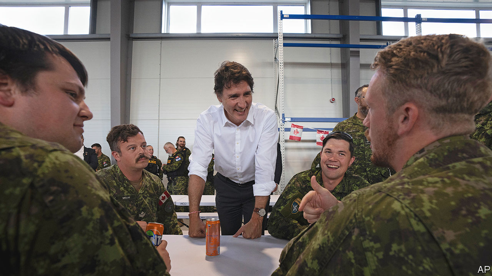
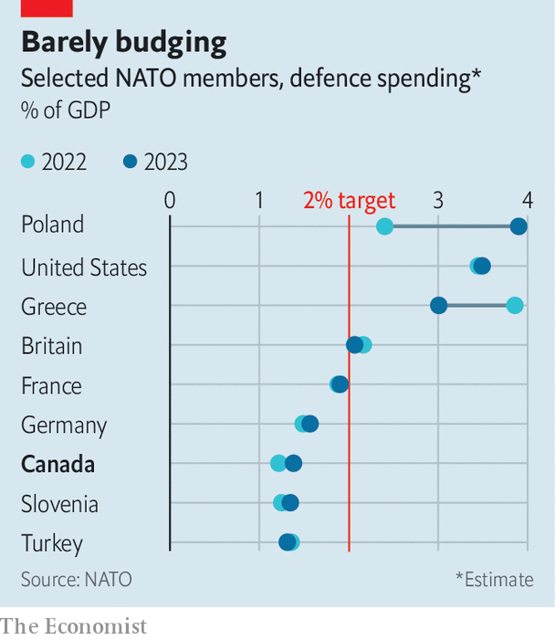

###### A NATO laggard

# Canada’s miserly defence spending is increasingly embarrassing 

##### Even after the invasion of Ukraine, the country doles out just 1.22% of GDP 

 

> Jul 24th 2023 

Despite its renowned special forces and stalwart service in Afghanistan, Canada has long been seen by its allies as something of a laggard when it comes to its defence spending. Many Canadians still recall an excruciating exchange between Donald Trump, then president of the United States, and Canada’s Liberal prime minister, Justin Trudeau, at a  in 2019 when Mr Trump asked jeeringly: “Where are you at? What is your number?” Mr Trudeau had more friends at that summit than Mr Trump. But since the Russian invasion of Ukraine, Canada’s position as a penny-pinching outlier has become more embarrassing for the country.

 


The statement of Jens Stoltenberg, NATO’s secretary-general, before the NATO summit in Vilnius this month that spending  was no longer to be regarded as the “the ceiling” but “the floor” could have been designed to cause blushes in Ottawa. According to the alliance’s latest data on defence spending, Canada’s defence budget amounted to just 1.22% of its GDP in 2022. That puts it in the same company as Belgium, Luxembourg, Slovenia, Spain and Turkey—a country whose commitment to NATO is at best shaky. All spend less than 1.4% of GDP on defence (see chart). 

Following Russia’s invasion of Ukraine, even former military slowcoach  announced its determination to meet its 2% obligation. But Mr Trudeau has not shown much enthusiasm for bridging the gap. Leaked Pentagon intelligence documents, first reported in the  in April, confirmed that Mr Trudeau had told NATO allies not only that Canada would not reach the 2% commitment but that it “never” would. When Mr Trudeau was asked to confirm or deny the remark, he blandly replied: “I continue to say and will always say that Canada is a reliable partner to NATO, a reliable partner around the world. And with our military investments, with the support we give to Canadians, we will continue to be doing that.” 

The gulf between what Mr Trudeau intends and what NATO expects is indeed a large one. Last year the parliamentary budget officer, Yves Giroux, estimated that Canada would need to spend an additional C$75.3bn ($57bn) before the end of 2027 to get to the 2% target.

Yet, while Mr Trudeau remains seemingly unrepentant that his government ranks defence and security behind social spending, some effort is being put into presenting a more reassuring picture to Canada’s allies. Last year, in the immediate aftermath of Russia’s invasion, the government said it was undertaking a defence-policy review in the light of the changing security environment. When Canada’s foreign minister, Mélanie Joly, was confronted in an interview ahead of the Vilnius summit about Mr Stoltenberg’s demand for more spending, she suggested that the defence review would reflect the need “to make sure that we step up our game”.

However, the review is now not expected to report until next year, and any new procurements that may stem from it will be subject to delays, which in Canada’s case tend to be long. Earlier this year the government finally signed a deal to spend C$19bn on 88 F-35 fighter jets, some 13 years after the decision of the former Conservative government to buy the stealth aircraft. When campaigning to be prime minister in 2015 Mr Trudeau said he would cancel the deal. Once in power, however, he opened it up to a bidding process (which was in essence for show, as Lockheed pretty much has a monopoly on the market for the most advanced fighters).

The politicisation of procurement decisions is not the only issue Canada’s defence budget faces. Another problem is that the Department of National Defence (DND) has a poor record in spending the money it has been given. According to a recently leaked DND internal report, staffing at the department’s acquisitions arm is about 30% under strength, with 4,200 jobs vacant at the end of May last year. None of this bodes well for Canada’s navy, which is chugging along with 30-year-old frigates and just four former British Royal Navy submarines that are even older. 

A reason often given for Canada’s reluctance to invest in its armed forces is that it is a long way from Europe and that the United States will always have its back. But even if Ukraine is distant from Canada, neither Russia nor China is. As Canadians are grimly aware, global warming is opening up  and making the High North an increasingly contestable strategic region. Both Russia and China are showing a close interest in Canada’s backyard. If the navy is to respond to this, the money will have to be found for new frigates and submarines to give it a persistent presence in harsh conditions.

After Mr Trudeau visited South Korea in May there was speculation that the Canadian navy, which wants 12 new submarines, would push for that country’s highly capable KSS-III. The submarine programme could cost around C$60bn. The navy is also hoping to get 15 new Type-26 frigates, which would cost between C$60bn and C$84bn. But such decisions must await the conclusions of the review.

The paradox of Mr Trudeau’s determination to brush aside his NATO spending obligations is that the country actually has a growing appetite for an enhanced security role. Polls suggest that there is support for higher defence spending, particularly among older voters. And although delayed, the F-35 purchase and the infrastructure that goes with it are a major commitment, with a total cost of about C$70bn. So too is Canada’s agreement to a NATO plan for it to to lead a brigade-strength force in Latvia by 2026. Canada has also pledged to invest nearly C$40bn in NORAD, the North American air-defence system, over the next 20 years. But the first and last of these undertakings will occur over the long term. The funding for them will be spread out over several decades.

Whatever Mr Trudeau thinks about the NATO 2% threshold, he and Anita Anand, Canada’s outgoing defence minister, have publicly committed themselves to spending more in the future. The much-touted defence review should identify what capabilities Canada needs. But the damage done by decades of complacency and neglect by governments of both parties will take many years to rectify. The consequence will be a growing tension between budgetary constraints and strategic ambition. One or the other will have to give. ■

