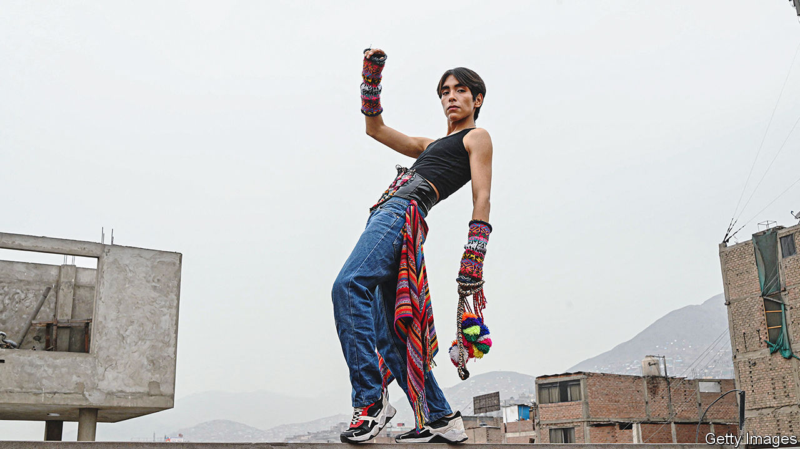

###### Call it Q-pop

# Meet the Peruvian indigenous singer inspired by K-pop 

##### Lenin Tamayo is fusing South Korean culture with his Quechua heritage 

 

> Jul 27th 2023 

As a teenager Lenin Tamayo Pinares, now 23, used to fantasise about leading a glamorous life in South Korea. His reality in Peru seemed a world apart. He grew up as an indigenous person in a country with deep-seated racism. His mother, a talented Andean folk musician, often struggled to make ends meet. Although she raised him to take pride in their Quechua culture, he was bullied at school. 

K-pop offered an escape. He discovered the genre through a group of girls he befriended in secondary school. “My mind was blown,” he says. Part of K-pop’s appeal among indigenous youth in Peru is simply that its performers look more like them than other pop stars do, Mr Tamayo explains. The same features he was ridiculed for at school—his prominent cheekbones, straight black hair and slight build—were what distinguished K-pop artists. 

Now Mr Tamayo is making his own version of K-pop under his first name, Lenin (his mother named him after the Russian revolutionary). His compositions blend Korean-style beats and ballads mixed with Andean instruments and sounds. He writes choruses and rap interludes in Quechua, the most widely spoken indigenous language in the Americas. His videos feature choreographies infused with folk-dance moves and costumes with traditional flair, such as devil masks worn at highland parades.

His fans call it Q-pop. Mr Tamayo sees it as a platform for indigenous culture. Although indigenous peoples make up nearly a quarter of Peru’s population, they tend to be underrepresented in the media. Quechua society is often depicted as a relic of Peru’s Incan past, and comedians still perform brown-face skits of Andean women on TV and in film. Peruvians “have to broaden their idea of what pop culture is, because I don’t fit into it,” says Mr Tamayo. 

Mr Tamayo is not the first non-Korean to dabble in K-pop, which itself drew inspiration from American hip-hop. But two things make his efforts distinct. For a start, because he lacks the backing of a big record label to imitate K-pop, he has more creative liberty to reinvent it. His recording studio is run by friends, and his mother helps him create his music. Mr Tamayo is also part of a generation of influencers in Peru who are building their careers on social media. Since he went viral last year, his videos have had more than 5m plays per month on TikTok, where he has more than 200,000 followers. That is small by Korean standards—but it is a start. ■

