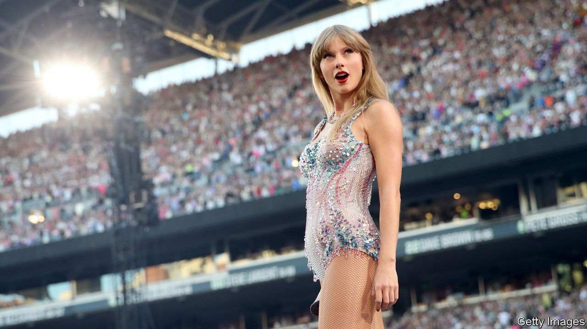

###### The Economist explains

# Can superstars like Beyoncé or Taylor Swift spur inflation? 

##### Some economists think that tours by big acts drive up the consumer-price index 

 

> Jul 25th 2023 

THE SWORN enemies of Europe’s central bankers include Vladimir Putin, covid-19 and, apparently, Beyoncé. All three have recently been blamed for , but the American singer seems an unlikely macroeconomic force. Hotel prices surged in Sweden when 46,000 fans flocked to the capital, Stockholm, for the pop star’s tour in May. The country’s  hit 9.7% that month, higher than expected. “Beyoncé is responsible,” declared one local economist, as though he had caught her red-handed. Do superstar tours really spur inflation?

In most cases, probably not. Inflation is calculated by comparing the prices of a basket of goods, rather than measuring sudden price rises in one sector, such as hotels. Britain’s consumer-price index, for example, includes almost 750 goods and services. Concerts, theatre and cinema have a weight of less than 0.8% in the basket. Countrywide inflation therefore rarely jumps as a result of a single event, unless it is on an enormous scale. Fans of , another pop giant, are projected to spend around $600m on tickets for her current tour of America—but the country’s consumers spent almost $7trn over an equivalent period last year. Tours are big business, but not that big. 

Nor should price rises in entertainment contaminate other goods or services and make them more expensive. Pricier hotels may even be offset by falling costs elsewhere. To afford eye-wateringly expensive tickets (up to $899 for Ms Swift’s American tour), some fans will skimp on other treats, bringing down demand—and in theory prices—for those goods for a short time. 

For small countries, things may be different. They could see a small, temporary bump in inflation as a result of a huge tour, reckons , an economist formerly at the Bank of England. In Singapore, a city state of around 5.6m people, Ms Swift is putting on six shows—her only dates in South-East Asia. In theory around 6% of the population could attend. (The country’s education minister recently refused to grant children an ad hoc school holiday for the tour, in case it “fuelled further inflation”.) In reality, thousands of Swifties are flying in from across the region, bringing a jolt of new demand and cash. That could throttle the supply of hotels, pushing up prices enough to cause a small bump in inflation. Locals may dip into savings, too, spending money intended for the future. That could also push up prices.

Even then, any effect would be short lived. When die-hard fans depart, prices will fall; hotels cannot charge Swiftian rates year-round. The inflation rate may look correspondingly lower the following month. This means tours are probably not something central bankers should bother responding to, says Mr Yates. 

The price of seeing big acts perform has always been high. Jenny Lind, a soprano who toured America in the 1850s, flogged tickets at $6 a pop. Adjusting for inflation, that is around $230 today. The average cost to see Ms Swift is $254. But today acts visit fewer small venues and play to bigger crowds. One reason is the competition to stage bigger and better shows. Perhaps that is why Ms Swift has opted to perform her only South-East Asia dates in Singapore. Carting sets around is riskier and more expensive than playing multiple times at the same venue, if the demand is there. Coldplay and Harry Styles, two other big pop acts, are taking a similar approach. The economics of touring may be changing—but that need not worry most central bankers. ■


