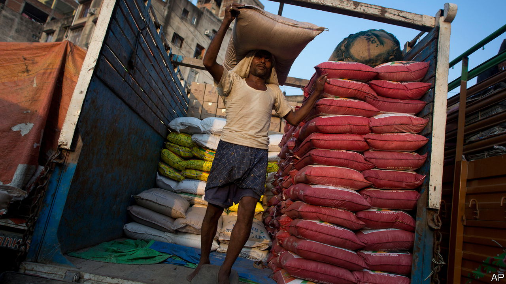

###### The Economist explains

# What will be the impact of India’s rice-export ban? 

##### Global rice prices will soar, and poor countries will bear the brunt 

 

> Jul 26th 2023 

FEW THINGS frighten governments as much as . In India, after  in early July wiped out paddy fields, officials acted to pre-empt an unpalatable increase in rice prices. On July 20th the government banned the export of non-basmati white rice to “ensure adequate domestic availability at reasonable prices”. Last year, for similar reasons, it slapped export duties on all types of rice and blocked exports of broken rice grains, which are sold cheaply. Policymakers hope that keeping more of the staple in India will drive down domestic prices, which have risen by nearly 12% over the past year. But what about the rest of the world? 

India is the world’s biggest rice exporter, accounting for 40% of global trade by volume. In 2022, it shipped 22m tonnes to more than 140 countries. Around half of those shipments were of non-basmati rice. Those types, which are cheaper than the fragrant, long-grained basmati, are especially popular in poor places such as Bangladesh, Nepal and parts of sub-Saharan Africa. A reduction in its supply will drive up the prices these countries pay, according to rice traders.

As a result global rice prices, which were already rising, could reach record highs. The rice-price index published monthly by the Food and Agriculture Organisation, a UN agency, rose by 14% in the year to June. It is at its highest since the food-price crisis of 2008. That is mostly because of  that have also pushed up the prices of other foods. Rice is especially vulnerable to , the weather pattern that brings hotter temperatures and drier conditions to Asia. In China heat and weak rainfall have reduced soil moisture in rice-growing regions to the lowest level in more than a decade, according to Gro Intelligence, a research firm. In anticipation of shortages, even big rice producers are stocking up. Vietnamese  surged by more than 70%, and to Indonesia by almost 2,500% in the first four months of 2023. 

Many of the countries that will be worst affected by the ban are already suffering soaring food costs. According to Gro, food prices in Benin, Africa’s biggest importer of rice, are 40% higher than in 2020. India insists that it will accommodate requests from countries to meet their food-security needs with broken rice. But such support will have to be the result of time-consuming diplomacy rather than market activity. 

India’s export ban could disrupt the market further through contagion. In 2008 Vietnam banned rice exports, prompting India, China and Cambodia to follow suit. A study by the World Bank estimated that export restrictions in that period increased global rice prices by 52%. So far, following the announcement of India’s ban, Vietnam’s government has merely urged traders to ensure there is enough domestic supply. Should countries go further and follow India in imposing export restrictions, the effects could push prices even higher than in 2008. 

Climate change will tempt governments to make these choices more often. Demand for rice is  as the global population rises, and as per-person consumption in Africa expands, spurred by greater urbanisation and economic growth. But yields are stagnating, in large part because of climate change, which is causing higher temperatures and more frequent extreme events, such as floods. Rice is the  for nearly half the world. The more its supply is threatened, the stronger the temptation to restrict exports will become. ■

