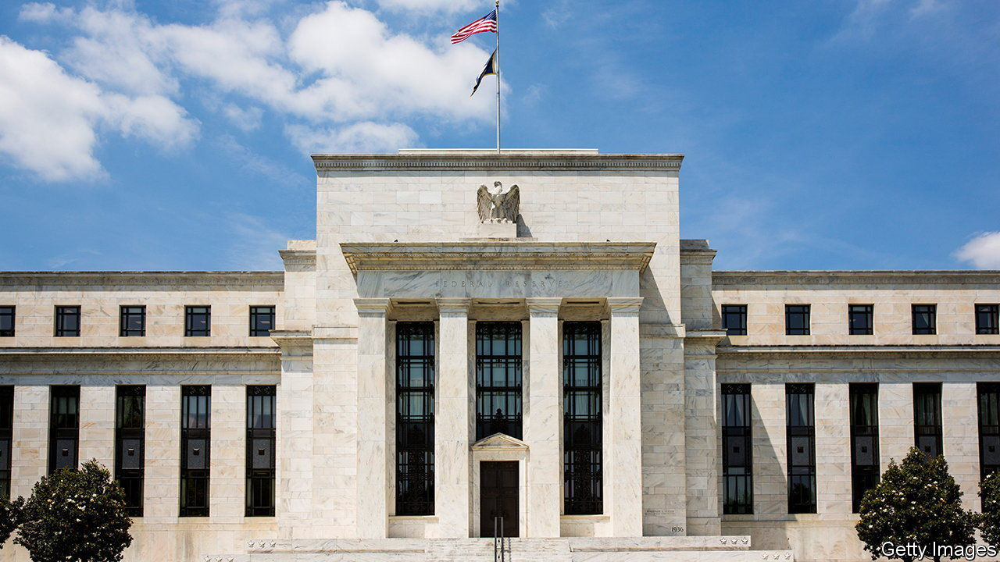
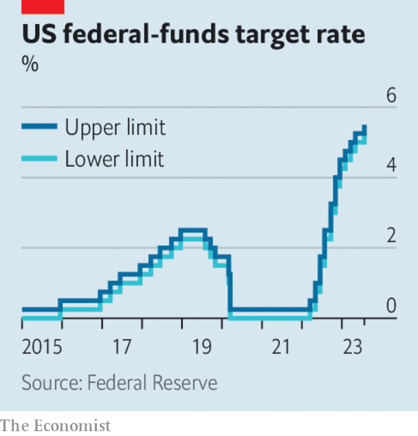

###### The world this week

# Business 

#####  

 

> Jul 27th 2023 

 


The  resumed its policy of monetary tightening following a pause at its last meeting in June, raising its key interest rate by a quarter of a percentage point to a range of between 5.25% and 5.5%. Inflation has slowed in America. However, other indicators point to a labour market and overall economy that, while no longer “hot”, have not cooled sufficiently for the ratesetters. The Fed offered few clues about its next move. 

The  also raised interest rates by a quarter point, which took the deposit facility to 3.75%. It, too, provided little guidance about whether it will raise rates at its next meeting in September, but said it would follow a “data-dependent approach”. 

 central bank took more measures to try to control inflation, increasing the maximum interest rates charged on overdrafts and credit-card cash advances. On July 20th the bank lifted its main interest rate from 15% to 17.5%. Although that extended the bank’s reversal of its previous low-rate policy, the rise was smaller than markets had expected. 

The Chinese government appointed Pan Gongsheng as governor of the . Mr Pan was confirmed as the central bank’s Communist Party secretary earlier this month. It is the first time the two jobs have been combined since 2018, which may reflect the party’s growing control over the financial sector. Meanwhile, the government promised to do more to aid China’s “tortuous” recovery from the pandemic, but provided scant details on how it would do so. 

The  is now expected to grow by 3% this year, according to the IMF, a slightly faster pace than its previous estimate in April. Britain is no longer expected to fall into recession, in part because of strong consumption and less post-Brexit uncertainty. However, Germany’s economy is forecast to shrink by 0.3% because of weak manufacturing output. 

 grew by 2.4% at an annualised rate in the second quarter, according to a first official estimate. The figure came in well above the expectations of most economists’ surveys. GDP expanded by 2% in the first quarter. 

The Federal Reserve and the Bank of England fined  a total of $387m for misconduct at , which UBS recently acquired. The fines relate to Credit Suisse’s “unsafe and unsound” practices in managing the risk from its dealings with Archegos Capital Management. Archegos collapsed in 2021, saddling Credit Suisse with a $5.5bn loss. 

A crushed Rose

Dame Alison Rose resigned as chief executive of , a British bank, after admitting that she was the source of an incorrect BBC story about the closure of a bank account held by . Mr Farage helped to lead the campaign in 2016 to pull Britain out of the EU. Dame Alison told the BBC that his account had been shut at Coutts, a subsidiary of NatWest, solely for commercial reasons. But Mr Farage obtained a dossier that showed the account was closed in part because his political views on a range of issues were “at odds” with the bank’s “position as an inclusive organisation”. The affair has raised concerns about how far banks can go to withhold their services from someone with whose views they disagree. 

Two of America’s tech giants,  and , reported solid increases in revenue and profit as their core businesses outperformed expectations: digital-ad sales for Alphabet and cloud-computing for Microsoft. Both companies said their spending on AI would increase over the coming quarters, which could hit profit margins. 

 quarterly revenue and profit also rose at a fast clip, but the loss at its Reality Labs division, which is developing the metaverse, stood at $3.7bn. That pushes the division’s cumulative losses since the beginning of last year to $21bn. 

Despite surging revenues on the back of big orders for its planes, reported another quarterly loss. The aerospace company was dragged down this time in part by charges related to delays in some defence projects. Still, Boeing is ramping up production of commercial aircraft, and expects to deliver up to 450 737 jets this year. 

, a big mining company, said it would not reach its target of reducing emissions by 15% by 2025 because of engineering constraints, and the needs of integrating its ambitions with the “needs of our local communities.”

won the battle of the box office against , taking more money in ticket receipts after both films were released on the same day. Barbenheimer made for the best opening weekend in America this year, renewing hopes for a revival in cinema attendance. Other recent blockbusters, such as “Indiana Jones and the Dial of Destiny”, have not attracted the audiences that had been hoped for. 

Er, Elon, what are you doing?

 killed off its blue bird logo. The platform has been rebranded, now displaying a white “X” on a black background. The bird is not entirely dead, however, and still floats around on many mobile apps. Twitter is now officially called X, though everyone still calls it Twitter. Workmen trying to remove the old name from its headquarters in San Francisco were stopped midway by police, leaving “er” as the company’s front signage. 

