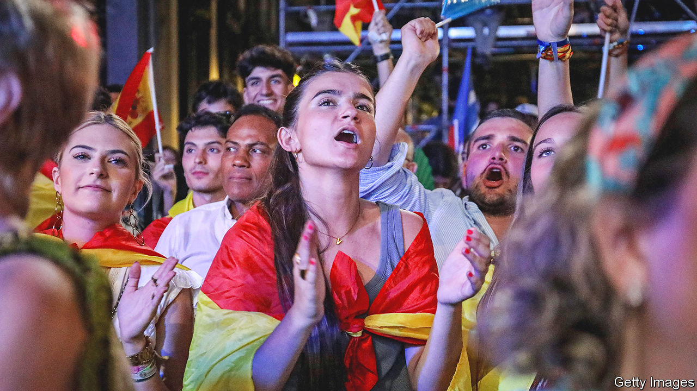

###### The world this week

# Politics 

#####  

 

> Jul 27th 2023 

The Knesset passed the first in a series of laws aimed at drastically limiting the powers of Israel’s Supreme Court. Members of the opposition walked out in protest at the final reading of the bill, which passed 64-0 in the 120-strong chamber. The legislation significantly curtails the court’s ability to review government decisions on the ground of “reasonableness”. The White House criticised the law, saying it was “unfortunate”. Israel’s credit rating was downgraded. The Supreme Court has said it will hear petitions against the bill after the summer recess. 

Soldiers staged a coup in , the Sahelian country most closely aligned to the West, and said that Mohamed Bazoum had been removed as president. Two of Niger’s neighbouring countries, Burkina Faso and Mali, have each had two coups since 2020.

Russia complained that Western pressure had dissuaded most African leaders from attending a  this week in St Petersburg, to the chagrin of President Vladimir Putin. Only 17 African heads of state and government (out of 54) were reported to have made the trip. 

A suicide-bomber loyal to al-Shabab, a jihadist group aligned to al-Qaeda, killed at least 25 soldiers at a military training barracks in Mogadishu, the capital of . The government has pledged to defeat the movement, which has been waging a civil war for nearly two decades. 

Guillermo Lasso, the president of , declared a state of emergency in the country’s prisons amid rising violence. A nightly curfew was also imposed on three coastal provinces. The measures came into force after eight people were killed over one weekend, including a mayor. Battles between rival gangs in prisons have also caused over 30 deaths in recent days. 

An independent panel investigating the disappearance of 43 college students in nearly a decade ago issued its final report. The panel, appointed by the Inter-American Commission on Human Rights, said that members of the armed forces, navy, police and intelligence services knew of the location of the students, but had been unco-operative. 

Justin Trudeau, the prime minister of , announced a cabinet reshuffle. The ministerial changes come amid a rise in the cost of living, which has heaped pressure on the minority government led by Mr Trudeau. An election is not expected until 2025.

On the campaign trial

A judge in Florida set the date of May 20th 2024 to begin the criminal trial of  over his alleged concealment of classified material at his home. The date falls after the bulk of primary contests, so the Republican candidate for president should be known by then. Mr Trump holds a strong polling lead in that race. 

, Joe Biden’s son, pleaded not guilty to federal tax charges, after a deal with prosecutors in which he would have pleaded guilty and avoided prosecution on a gun charge started to unravel. The judge in the case told both sides to come back with a new deal. 

 foreign minister, , was removed from his post. Mr Qin had not been seen in public for weeks, fuelling rumours that he was being purged for personal indiscretions. Wang Yi, the previous foreign minister, has been returned to the job.

Hun Sen,  autocratic leader, said he would step down as prime minister on August 10th and hand the job to his son, Hun Manet. Mr Hun Sen has ruled Cambodia for 40 years, recently winning an election in which there was no opposition. He will remain head of the governing party. 

Chinese and Russian delegations attended military parades in Pyongyang,  capital, to mark the 70th anniversary of the end of the Korean war. It was the first public visit by officials from North Korea’s allies since the start of the covid-19 pandemic. Russia’s delegation included the defence minister, Sergei Shoigu. 

 


 general election resulted in . The opposition conservative People’s Party took the most seats, but not enough to form a majority. It would still fall short even if it joined forces with the hard-right Vox party. The governing Socialists did better than expected, but to govern they would need the support of left-wing parties and Basque and Catalan nationalists. The PP’s leader, Alberto Núñez Feijóo, is trying to form a minority government. 

 on the Danube, which lie just across the river from Romania, were attacked by Russia in a series of drone strikes. Ukraine has been trying to establish an alternative route for its grain exports following Russia’s bombardment of Odessa and other Black Sea ports.

The IMF warned that India’s ban on  could push up global food prices. India accounts for 40% of the world’s total rice exports. The ban comes amid a surge in wheat futures caused by uncertainties about Ukrainian supplies. 

Russia blamed Ukraine for another drone attack on . One of the drones caused minor damage near the defence ministry, close to a room where the army discusses its strategy for the war in Ukraine.

Vladimir Putin signed a law that bans  surgery in Russia and outlaws any attempt by a person to change their sex legally. It also annuls marriages in which one spouse is transgender. 

 ordered Russia to reduce the number of diplomats at its embassy in the capital, Chisinau, from 80 to 25, claiming the mission’s staff were trying to undermine the government.

A group of far-right protesters set fire to copies of  outside the Egyptian and Turkish embassies in Copenhagen. It was the latest incidence of Koran-burning in Denmark and Sweden. In Iraq outraged Muslims have set the Swedish embassy alight. 

Six men were found guilty of murder in  over a terrorist attack on the city’s airport and metro system in 2016, which killed 32 people. One of the men convicted was Salah Abdeslam, who was sentenced to life imprisonment last year as the sole survivor of the terrorist squad that attacked Paris in November 2015. 

Cruel summer

 swept through many Mediterranean and south European countries. Dozens of people were killed in Algeria, ten of them soldiers who were trapped by fire during an evacuation. 

Jim Skea was elected as the new chairman of the . Mr Skea is a professor at Imperial College London and co-led the IPCC’s landmark reports on global warming in 2018 and climate change and land in 2019. 

Three parliamentary by-elections in Tory-held seats in  provided mixed results for the Conservative government. Two of the by-elections went as scripted, with Labour taking a seat in the north and the Liberal Democrats winning one in the south-west, both with swings from the Tories of well over 20 percentage points. But the Conservatives held on, just, to Boris Johnson’s former seat in west London. That emboldened Rishi Sunak, the prime minister, to claim that a Tory defeat at next year’s election is “not a done deal”.

