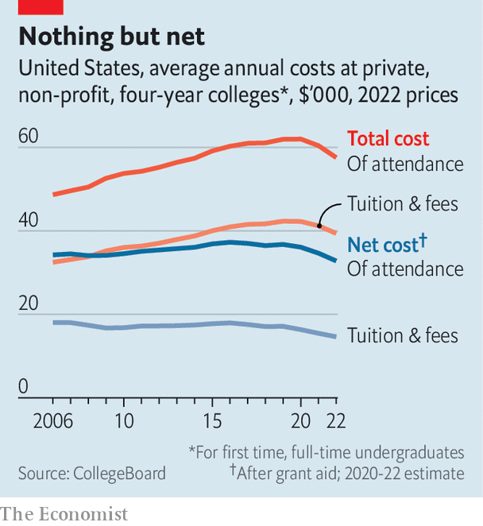

###### Sticker shocker

# American universities have an incentive to seem extortionate 

##### They are much cheaper than the “crisis of college affordability” suggests 

 

> Jul 23rd 2023 

The cost of many private colleges in America has reached $80,000 a year. The median household income in America in 2021 was $71,000 a year. This shows that  is unaffordable. Or does it?

The consensus view is that America has a college-affordability crisis and things are getting worse. According to the Heritage Foundation, a conservative think-tank, “college costs are out of control”. Bernie Sanders, a senator from Vermont, and other progressives have pushed for free college and loan-forgiveness for years. The White House attempted a costly bail-out of student borrowers which the Supreme Court recently . Both sides are telling a similar tale. But it does not reflect reality. Most undergraduate degrees in America are actually affordable, and in many cases going to college is actually getting cheaper.

There are three main types of colleges in America: public, non-profit private and for-profit private. Public colleges are much less expensive than private ones. According to US News &amp; World Report, which ranks universities, the average annual tuition fee for students at a public college studying in their home states is about $10,000, compared with $40,000 for private colleges. And most American students benefit from these lower prices. In 2021, 77% of college students (about 12m) were enrolled in public colleges. Some states are cheaper than others. Tuition in Wyoming costs $6,000 per year for residents, whereas Vermont charges $19,000.

Public colleges in America look more expensive than most of their rich-country counterparts. America ranks second-highest for fees in the OECD, a club of mostly rich countries, behind England. However, this does not give a full picture. 

 


American universities advertise a sticker price that few students actually pay. According to the National Association of College and University Business Officers, a non-profit organisation, private colleges discount tuition by over 50% on average. And contrary to the common narrative, the net cost (what students really pay) of public and private colleges has fallen (see chart).

Schools with large endowments are particularly generous. According to US News &amp; World Report the average student at Princeton pays $16,600 per year for tuition and fees (compared with a $56,010 price tag), and tuition is free for families making $160,000 a year or less. With these tuition discounts, private colleges can sometimes cost less than public ones, though public colleges are usually cheaper.

Americans also have alternative paths to a four-year degree that can help them save money. Students can attend two-year public community colleges for less than one year’s tuition cost at a four-year university degree, then apply those two years towards a four-year degree. The system is flexible: two-thirds of community-college students work and 70% attend part-time. This flexibility is unusual compared with higher education in other countries, says Simon Roy of the OECD.

Though there are plenty of stories of students being landed with lots of debt for worthless degrees, college generally pays off too. College-educated men earn $587,400 more over their lifetime than men who only graduated from high school (women earn $425,100 more). This is much greater than the equivalent premium in Britain ($210,800 for men and $193,200 for women). “The expected gains from having a college degree are actually quite high in the US because the US is also one of the countries where income inequality is the highest,” says Abel Schumann of the OECD. This inequality makes college-going worth the initial cost for most people.

Why, then, is there a perception that there is some sort of general crisis in college affordability in America? One reason is that country-level comparisons, such as the analysis by the OECD, compare the sticker price of American universities with that of their peers. Sticker prices are rising while net costs remain steady and, in some cases, drop. A report from the College Board, an ngo, shows that whereas published tuition and fees for private non-profit colleges increased from $30,000 in 2006-07 to $38,000 in 2021-22 (in 2021 dollars), the net price actually decreased from $17,000 to $15,000. The story is similar for public colleges. Published tuition and fees were nearly $8,000 in 2006-07 and rose to nearly $11,000 in 2021-22. Meanwhile the net cost fell by $730. 

This discrepancy between the sticker price and the net price creates confusion, but it continues because it is valuable to colleges, says Beth Akers of the American Enterprise Institute, a conservative-leaning think-tank. Wealthy students pay the full price, subsidising their poorer peers. The higher prices are also good for marketing. Consumers tend to associate higher prices with higher quality. And students (and their proud parents) are flattered by tuition markdowns pitched as merit scholarships rather than discounts.

Yet even with decreasing costs and discounts, college can still seem unaffordable to many. Plenty of citizens in countries with free or low tuition do in fact pay for college. Instead of paying a tuition bill, they pay over time with higher taxes. Americans pay less in taxes, but that lump-sum tuition bill can be off-putting. For those students and their families unable to pay in cash, loans can be an answer. But accrued interest can quickly turn a reasonable cost into an unreasonable one. Here too there is some progress: a new initiative by the Biden administration will prevent interest from accruing on federal loans for people making timely payments.

College does not benefit everyone and the quality is variable. Some for-profit colleges have become notorious for providing little value and targeting poor and non-white students. Students who chose to major in photography (or journalism) at a private college may find it takes a while to pay off their loans once they encounter the job market—but that choice may be worth it too. For the vast majority, though, college is affordable and worth attending.

Regardless of the reality, American confidence in college is declining. A poll by Gallup released this month shows that only 36% of Americans have “a great deal” or “quite a lot” of confidence in higher education. This is down from 48% in 2018 and 57% in 2015. The perceived high cost of college could be driving down these results, says Jeremy Wright-Kim, an education professor at the University of Michigan. College may be relatively affordable and worth the overall cost, but Americans are struggling to believe it.■


