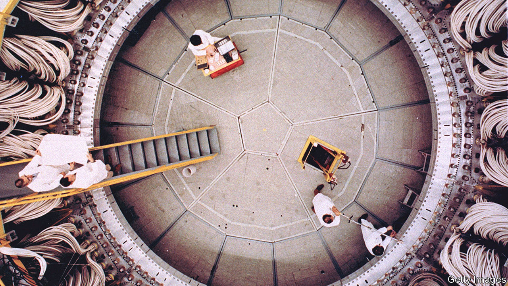

###### Destroyer of worlds

# Oppenheimer’s secret city is a shrine to the Manhattan Project 

##### A tiny town in New Mexico is proud to be the place the bomb was invented 

 

> Jul 24th 2023 

WALK AROUND the old historic centre of Los Alamos, New Mexico, and J. Robert Oppenheimer greets you at every turn. The local event centre—which hosted an Oppenheimer festival to celebrate the release of  about the father of the atomic bomb—is just off Oppenheimer Drive. A bronze statue of Oppenheimer, dapper hat and pipe included, stands on a street corner. The local pub offers Oppenheimer trivia. To pay homage to the “Trinity test” detonation of Oppenheimer’s bomb in the New Mexican desert, there is Trinity Drive, Trinity Urgent Care and Trinity on the Hill Episcopal Church. 

When Oppenheimer was recruited to run the Manhattan Project in 1942, he chose to build his laboratories in Los Alamos. The site, in the government’s view, was an ideal place for bomb-building. The desert mesas and ponderosa pine forests offered solitude and secrecy. But Oppenheimer also had a personal reason for picking the Land of Enchantment. Early in Mr Nolan’s film, Oppenheimer (Cillian Murphy) admits to being homesick for New Mexico, where he and his brother owned a ranch. “When I was a kid”, he says, “I thought if I could find a way to mix physics and New Mexico, my life would be perfect.” 

The most notable thing about the town, apart from its history and vistas, is that it is home to the Los Alamos National Laboratory, the successor to Oppenheimer’s science campus, where research on nuclear weapons continues. But the release of Mr Nolan’s film has residents rolling out the red carpet. Tourism is surging. Wendy Berhman, who runs the Manhattan Project National Historical Park, says visitor numbers have more than doubled since last year.

Locals are still starstruck, even a year after Hollywood’s glitterati descended on their stretch of desert. “I believe I was there when Nolan decided to film in the Oppenheimer house,” says Leslie Linke of the Los Alamos Historical Society. “I could see it in his eyes.”

Mr Nolan’s film dwells on Oppenheimer’s internal battle between his relentless pursuit of scientific inquiry and his moral qualms about the lethal purpose of his lab’s invention. Yet Los Alamos’s shrines to the Manhattan Project feel more celebratory than sombre. Plaques around town salute the scientists whose work “ended world war two” and “deterred global conflict”. A re-examination of Oppenheimer’s legacy is slowly taking place, however. Posters in the visitor centre mention the Hispanic homesteaders and tribes that were forced off their land so the government could build Oppenheimer’s secret city. New Mexicans exposed to radiation from the Trinity test, known as “Downwinders”, say their health was sacrificed for America’s atomic advantage. 

Perhaps Los Alamos’s newfound fame will hasten that retelling. But for now, the town is all Oppenheimer, all the time. “Robert built that place,” says Lewis Strauss (Robert Downey Jr), the film’s eventual villain. “He was founder, mayor and sheriff, all rolled into one.”■


