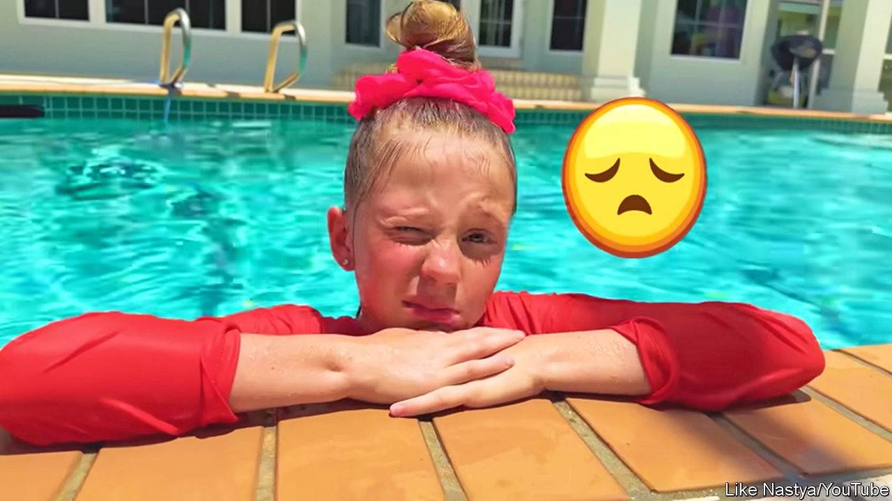

###### Child influencers

# Regulation could disrupt the booming “kidfluencer” business 

##### America’s Federal Trade Commission is reviewing rules for advertising aimed at children 

 

> Jul 27th 2023 

IT STARTED WITH a Lego “choo-choo train”. The video shows three-year-old Ryan Kaji picking it out from the store “because I like it”, he tells his mother, Loann. Back at the family home in Houston, Texas, the toddler opens the box and plays with his new toy. It’s nothing out of the ordinary. But it helped make the Kajis millionaires. Loann had recorded and uploaded the video to a new YouTube channel, “Ryan ToysReview”. Eight years, many toy unboxings and 35m subscribers later, “Ryan’s World”, as the channel is now known, is considered YouTube royalty. He is part of a new generation of child social-media influencers (those under the age of 18) changing the shape of kids’ entertainment in America—and making a lot of money in the process. 

Ryan, now aged 11, and “Like Nastya”, a nine-year-old with 106m subscribers, lead the charge on YouTube; they earned $27m and $28m in 2021, respectively, according to . Most social-media sites require users to be over 13, but parents or guardians can create and run accounts on behalf of their children. Kid creators speak to other kids in their videos: they play make-believe with friends and family, show off new toys and give tutorials on dancing and hand-washing. A survey in 2020 by Pew Research Centre, a think-tank, found that 81% of American parents with a child aged three to four allowed their children to watch YouTube. (YouTube Kids, which lets children of all ages navigate the site under parental controls, was created in 2015.)

Money can be made through ads on videos and by partnering with brands, which see an opportunity to reach very young audiences, sometimes paying thousands of dollars for the privilege. “If it can be a revenue source for the family, and a way for them to have new experiences or put a kid through college, why not?” asks Greg Alkalay, CEO of BatteryPOP, a kids-entertainment network that also manages child influencers. (Mr Alkalay also claims to have coined the term “kidfluencers”.) 

Operating these accounts once “felt more like a family business”, says Allison Fitzpatrick, who represents brands and agencies in influencer negotiations at Davis+Gilbert, a law firm. Now they have been “taken over by production companies”. Ryan’s World partners with pocket.watch, an entertainment studio that works with 45 top kid creators and helps them to franchise. The firm has facilitated Ryan’s partnerships with brands such as Nintendo and Mattel (one of his recent uploads is an advertisement for a new Mario Kart game). It has also brought his videos to children’s television channels and streaming services, and his own branded merchandise—toys included—to sellers such as Target. These products have generated “hundreds of millions of dollars at retailers globally”, says Chris Williams, the firm’s CEO. 

Some child influencers are born to “momfluencers”, inheriting large followings before they have learned to walk. The LaBrants, a family based in Tennessee, have accumulated millions of followers documenting their lives online. They run Instagram accounts for each of their children; their youngest, aged one and four, already have 1.4m followers on a joint profile. Other mini influencers are sprouting. Like the grown-ups, some are ambassadors for clothing lines, or are represented by talent agencies that have traditionally worked with actors. It is a sign of how advertising has changed: spending on influencer marketing is projected to swell to $21.1bn this year, up from $1.7bn in 2016, according to Influencer Marketing Hub.

But concerns from regulators threaten to rein in kids’ earning potential. Watchdogs have accused creators of not clearly signposting sponsored content in toy videos. And in 2019 America’s Federal Trade Commission (FTC) clamped down on targeted advertisements shown on YouTube videos directed at kids, accusing the social-media platform of illegally collecting data from underage users. Channels must now label content for children. The FTC is also reviewing research that suggests current advertising disclosures do not work for kids. If the commission chooses to act on this, “everything we’re talking about is going to rapidly disappear and change,” warns Ms Fitzpatrick.

Mommy managers

The ever-changing nature of social media has made it trickier for new stars to rise to the top. “There used to be this sense that anybody could suddenly become the next Ryan ToysReview. Now it’s much harder,” says Mr Alkalay. Critics argue the business is exploitative. The earnings of child actors are protected in some states under the Coogan Law, a Hollywood-inspired piece of legislation from the 1930s. Child influencers have no such protection.

Children cannot sign brand deals, so parents do so on their behalf. Production studios will suggest guidelines and choose only to work with families that follow them, but those who are just starting out might not have the same oversight. Change could be coming. In May Illinois became the first state to pass a bill to protect the privacy and earnings of child influencers. 

What happens when a child influencer grows up? “Ryan always comes first to us,” say his parents in a statement to . “If he doesn’t feel like filming, we do not force him to.” The Kaji family have pivoted into educational content and cartoons, employing 30 people to help run Ryan’s channel and several others under their own production company. 

Other child influencers are trying to move away from playing with toys on YouTube and into making lifestyle content on TikTok and Instagram, but may struggle to bring their audiences, who followed them for something else, with them. Then there are those who will simply tire of making videos and go back to reality. But there will always be another starlet (and another pushy parent) waiting in the wings. ■


