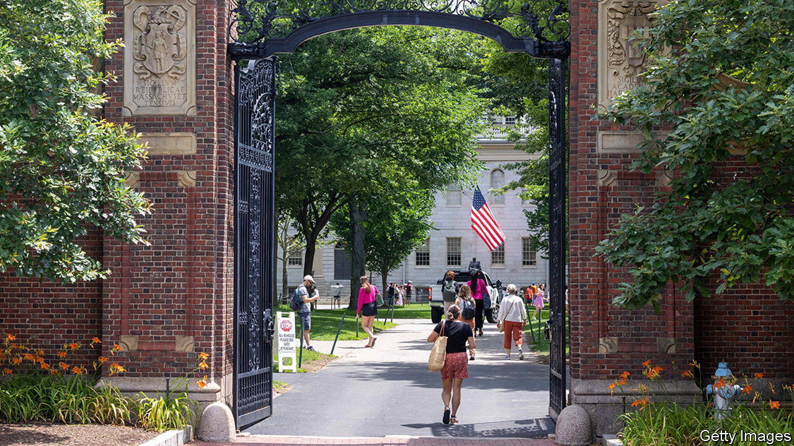

###### Legacy problems

# The making of America’s elite 

##### A new paper quantifies the boost that students with rich parents get when applying to the best universities 

 

> Jul 24th 2023 

THE RULING by America’s Supreme Court in June that in effect banned universities from using racial preferences in admissions sparked two lively debates. Although the better publicised argument was over whether the decision represented an advance or a setback for equality of opportunity, perhaps the more interesting one focused on whether the admissions decisions of a handful of selective institutions deserved so much attention to begin with.

Just 6% of American undergraduates attend colleges that accept less than a quarter of their applicants, leaving the vast majority unaffected. Moreover, most academic analyses of the socioeconomic impact of a bachelor’s degree from highly selective colleges have failed to quantify just what it is that they add. Although these universities’ alumni do have unusually high incomes after leaving college, they also had unusually strong high-school qualifications before they went.

One study, by Stacy Dale and Alan Krueger of Princeton, found that those who attend higher-ranked universities do not, on average, wind up earning more money than do those who go to lower-ranked ones. This suggests that the likes of Harvard and Yale do not actually improve their students’ earning prospects, but instead admit bright, ambitious applicants who are destined for success regardless of which college they attend. 

However, a working paper by Raj Chetty and David Deming of Harvard and John Friedman of Brown University, released on July 24th, refutes this interpretation. Linking together data on tax returns and tuition subsidies, standardised-test scores and universities’ internal admissions records, they tracked the lives of 2.4m students who applied to top colleges between 2001 and 2015, from high school to their early 30s. The researchers’ findings suggest that pupils have good reason to burnish their résumés in the hope of securing admission to highly selective colleges, because they are the most surefire route into America’s economic and professional elite.


The paper also shows that the preferences these universities give to “legacies” (children of alumni), athletes and students at private high schools cause them to admit the children of America’s richest families at remarkably high rates—at the expense of less privileged, better qualified applicants who would be more likely to achieve success after graduation. Eliminating these policies would improve socioeconomic diversity at such colleges. It would also improve the brainpower of America’s future elites. The White House has noticed: it is now looking at whether Mr Chetty’s and Mr Deming’s employer, Harvard, is breaking civil-rights law.

The study focuses on three groups of universities: “Ivy-plus”, consisting of the eight members of the Ivy League (including Harvard, Yale and Princeton) plus Duke, the University of Chicago, Stanford and MIT; “other highly selective private colleges”, such as Caltech and New York University; and “highly selective flagship public colleges”, like the University of California, Berkeley and the University of Michigan. Simple data on the number of alumni from the Ivy-plus group who reach positions of unusual wealth or power make clear that graduates of these universities exercise an influence that is vastly disproportionate to their small numbers. Since 1967, two-thirds of justices on the Supreme Court have been Ivy-plus alumni. So are 12% of current Fortune 500 CEOs and a quarter of sitting senators.

Separating the effect of going to one of these colleges from the selection effects (that they attract the cleverest applicants) is hard. The new study comes up with various different ways of doing so, but the most ingenious involves looking at the 10% of Ivy-plus applicants who were wait-listed—those that admissions offices thought were neither strong enough to admit outright nor weak enough to reject. Of these, 3.3% eventually get in.

The authors note that, although selective colleges tend to reach the same decision (acceptance or rejection) about students who apply to more than one of them, there is no such correlation for wait-listed students. Those who get in via a wait-list are no more likely to be accepted by other colleges than are those who are rejected. As a result, the paper assumes that all wait-listed applicants at a given college are equally strong—and thus that comparing the fortunes of those who get in and those who do not provides a natural experiment.

When examining average earnings, this approach confirmed that Ivy-plus attendance did not seem to make much of a difference. However, this broad average disguised a striking difference at the upper “tail” of the distribution: the most successful subset of Ivy-plus alumni fared far better than did the most successful graduates of other colleges. Among wait-listed students with similar test scores and whose parents had similar incomes, those who went to Ivy-plus universities were 60% more likely to be in the top 1% of earners by age 33 than those who attended leading public universities. Moreover, they were three times as likely to work for “prestigious” but not necessarily high-paying employers, such as highly ranked hospitals.


If Ivy-plus universities really do improve their students’ chances of reaching the pinnacle of professional success, then the way they choose which applicants receive this benefit merits close scrutiny. And the study’s second central finding is that three factors given heavy weight by admissions offices bias their decisions in favour of applicants whose prospects for post-college success are relatively weak, but who have extremely wealthy parents.

Students whose parents earn more than 95% of Americans are no more likely than the average student with the same test scores to attend an Ivy-plus college. In contrast, those at the 99th percentile of family income are nearly twice as likely to go to one, and those in the top 0.1% three times as likely. If admissions were based solely on test scores, 7% of students at Ivy-plus colleges would come from families in the top 1% of the income distribution. In fact, this share is 16%. This is roughly comparable to the effect of racial preferences for African-Americans and Hispanics.

It takes two to make an accident

Not all of the responsibility for this belongs with admissions offices. Students from the richest families are unusually likely to apply to Ivy-plus schools, and to enroll if they are accepted. But of the total nine-percentage-point difference, around six points occur because such applicants are unusually likely to get in.

The biggest of their advantages is the preference given to legacies. On average, children of alumni are four times likelier to get into an Ivy-plus college than are non-legacies with equivalent academic records. They are no likelier to get into Ivy-plus colleges that their parents did not attend. Nearly 15% of Ivy-plus applicants from the richest 0.1% of families are legacies.

Wealthy families also benefit from selective colleges’ insistence on fielding teams in dozens of sports, many of which are upper-class pastimes like rowing or lacrosse. Just 5% of Ivy-plus students whose parents land in the bottom 60% of the income distribution are recruited athletes. Among those from the richest 1% of households, this share is 13%.

The paper also identifies a third, less well-known variable that benefits the wealthy: non-academic ratings. These scores measure extra-curricular activities like theatre, debating or writing for student newspapers, which are most common at the non-religious private schools that privileged children often attend. Among applicants with equivalent test scores, admissions offices assign vastly higher non-academic ratings to students from families whose incomes are in the top 1%. Students at non-religious private schools are twice as likely to be accepted to Ivy-plus universities as students from good state schools with similar academic qualifications.

Private colleges have the right to select applicants on any basis allowed by law. They may well view a class with strong family ties to the university, a wide range of intercollegiate sports and lots of students with strong extra-curricular accomplishments as preferable to one solely composed of the brainiest applicants possible. In theory, the fact that all three of these factors boost attendance by the students whose parents are most capable of making large donations could simply be an unintended benefit. But these preferences also affect American society as a whole—and not just by perpetuating inequality.

The study’s analysis of wait-listed applicants found that, after accounting for academic qualifications, parental incomes and demographic factors, Ivy-plus graduates who were legacies had a worse chance of reaching the top 1% of the income distribution than did those who were not legacies. The same was true for their odds of attending elite graduate schools or working for prestigious employers, as it was for athletes and students who were assigned high non-academic ratings.

However, students who benefited from these preferences still had better odds of achieving these measures of professional success than did similarly qualified and privileged students who did not attend an Ivy-plus school. In other words, these universities are channelling comparatively underqualified legacies, athletes and private-school graduates into positions of unusual influence. A greater emphasis on academic merit would yield not only a fairer society, but also a brighter elite.■


Source: “Diversifying Society’s Leaders? The Causal Effects of Admission to Highly Selective Private Colleges”, by Raj Chetty, David Deming and John Friedman, working paper, 2023

