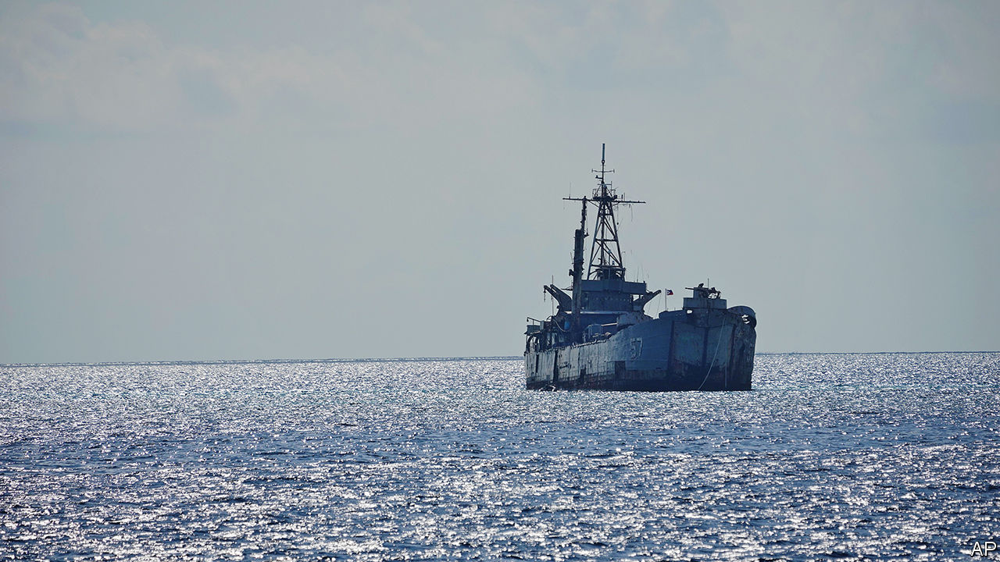

###### Dangerous shoals

# A rotting warship becomes a flashpoint for Sino-American rivalry 

##### Its Philippine guards hold out against China’s expansion in the South China Sea 

 

> Aug 10th 2023 

SHE BEGAN life as USS, an American wartime landing ship for tanks. As the USS , she became a base for river boats and helicopter gunships during the Vietnam war. Later as South Vietnam’s , she carried refugees fleeing the fall of Saigon in 1975. Now a rusting hulk named the BRP , she is serving in what may be her most celebrated role yet—as a Philippine outpost defying mighty China.

A small band of Philippine marines have been living in her carcass since 1999, when she was deliberately run aground on the Second Thomas Shoal, part of the Spratly “islands” around 200km from Palawan, the nearest big Philippine island. The point was to assert the Philippines’ claim to the reef and portions of the South China Sea. For its part, China claims almost the entirety of the sea, and has built up several reefs into military bases. The , though it sits more than 1,000km from China’s Hainan, is a persistent thorn in its side, and a potential flashpoint for wider Sino-American rivalry.

On August 5th Chinese ships prevented Philippine boats from resupplying the , not least by using water cannon. The Philippine government summoned the Chinese ambassador to protest against its “aggressive” behaviour. China, which suspects that the ship is being repaired to ensure its longevity, accused the Philippines of having violated its sovereignty for the past 24 years and demanded the removal of the ship.

In doing so, China is disregarding a ruling made in 2016 by an international arbitration court, which dismissed most of its claims to “historic rights” as invalid under the UN Convention of the Law of the Sea. The Spratlys were not islands, it found, so could not generate exclusive economic zones. The Second Thomas Shoal lay within the Philippines’ zone. 

Tensions have worsened of late. China’s military build-up gives it a greater presence around disputed features such as rocks and atolls, notes Harrison Prétat of the Centre for Strategic and International Studies, an American think-tank. The Philippines has become more vocal about China’s bullying and has moved closer to America under President Ferdinand “Bongbong” Marcos Jr. America is strengthening its various security accords with countries across the region.

America has warned China that “an armed attack on Philippine public vessels, aircraft, and armed forces”—including coastguard ships—would trigger the mutual-defence treaty with the Philippines. What America intends to do is less clear. Its warships conduct “freedom of navigation” patrols to challenge Chinese claims. Its coastguard is training local forces in the western Pacific. Joint naval patrols with the Philippines are expected soon, but Ian Storey of the ISEAS-Yusof-Ishak institute in Singapore thinks they will probably be symbolic. China will be hoping that, if it prevents repairs long enough, the  will soon collapse into the reef. ■

