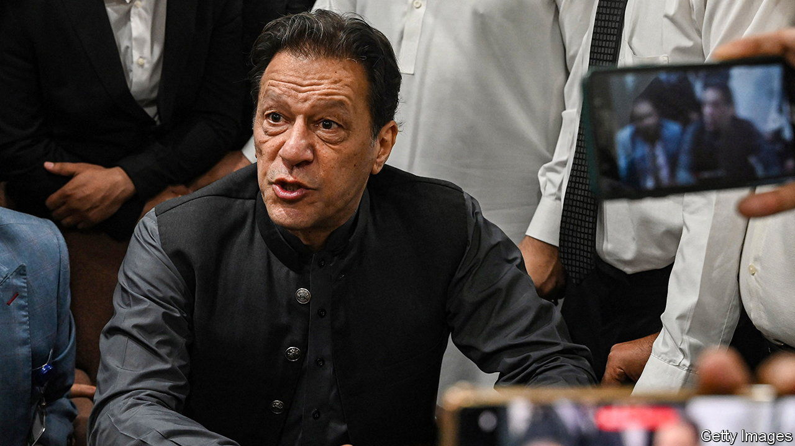

###### Enter the generals

# Pakistan’s army is back in charge of politics 

##### The jailing of Imran Khan heralds a period of tighter military control 

 

> Aug 10th 2023 

Fifty miles—and five years—separate Imran Khan’s greatest political triumph and the nadir, for now, of his political career. At one end is Parliament House in Islamabad, where the assembly that elected him prime minister of Pakistan in 2018 wrapped up its term on August 9th, with power due to be handed to a caretaker administration. At the other is the district jail in Attock in Punjab province, where Mr Khan began a three-year prison term for “corrupt practices” on August 5th. 

Mr Khan denies wrongdoing and has unsuccessfully appealed the conviction. He says the charges are politically motivated, which the government denies. The conviction, which comes with a five-year ban from politics, is the culmination of a campaign by Pakistan’s powerful army to remove Mr Khan and his party, Pakistan Tehreek-e-Insaf (PTI), from the political fray. It also heralds a period of more active involvement in politics by the generals. 

The case has exposed a taste for cash and bling that is at odds with Mr Khan’s idea of himself as a pious anti-corruption crusader. Yet the nature of the conviction, for violating electoral laws that are rarely enforced, hints at the former prime minister’s true crime: challenging Pakistan’s army. Like many Pakistani politicians before him, Mr Khan started out as a general’s favourite. Yet the army eventually tired of his political grandstanding and his mismanagement of Pakistan’s faltering economy. In April 2022 he was removed from office in a vote of no confidence. 

Unlike some of his predecessors, Mr Khan refused to go quietly, attacking the generals in a series of rallies across the country and claiming that they tried to assassinate him last November. After he was briefly arrested in early May, his supporters smashed up military installations. The army, unused to and enraged by such displays of defiance, dismantled his party and rounded up his supporters. Eventually, Mr Khan was nabbed for good.

Mr Khan’s forced exit from politics heralds more ambitious plans. Assisted by the outgoing prime minister, Shehbaz Sharif, and a pliant parliament, the army has rearranged Pakistan’s hybrid system decisively in its favour. Among the scores of laws tweaked or introduced before parliament’s lights were switched off, several granted sweeping new powers to the armed forces and intelligence agencies, alarming civil-rights groups. The incoming caretaker government has been given the power to negotiate with the IMF and sign foreign investment deals. It may also stick around for longer than the 90 days prescribed by the constitution. The day Mr Khan was arrested the government ratified a new census which could require a fresh demarcation of electoral constituencies. The outgoing law minister says this could delay elections by at least five months. The caretakers will in effect report to the army until then. 

Mr Sharif’s indulgence of the army is explained by the state of the economy. He secured a $3bn IMF emergency agreement last month to ward off the possibility of default. But the price is steep: higher energy tariffs, high interest rates and a market exchange rate, none of which is popular with voters. The later the election, the more time Mr Sharif and his allies will have to put distance between themselves and unpopular decisions. 

Yet Mr Sharif may be tempting fate. Nine months into the job, newly victorious in his battle with Mr Khan and his supporters, General Asim Munir, who heads the armed forces, is growing assertive. He is spearheading a new economic council and is busy touting Pakistan’s investment potential to Gulf states that have grown tired of doling out cash to Pakistan. More than their money, he may be eyeing their political support. “We are probably moving towards a new political order, a controlled democracy where civil liberties are curtailed in the name of economic development,” says Ahmed Bilal Mehboob, president of the Pakistan Institute of Legislative Development and Transparency. In perennially chaotic Pakistan, order can seem attractive to an ambitious general. ■

