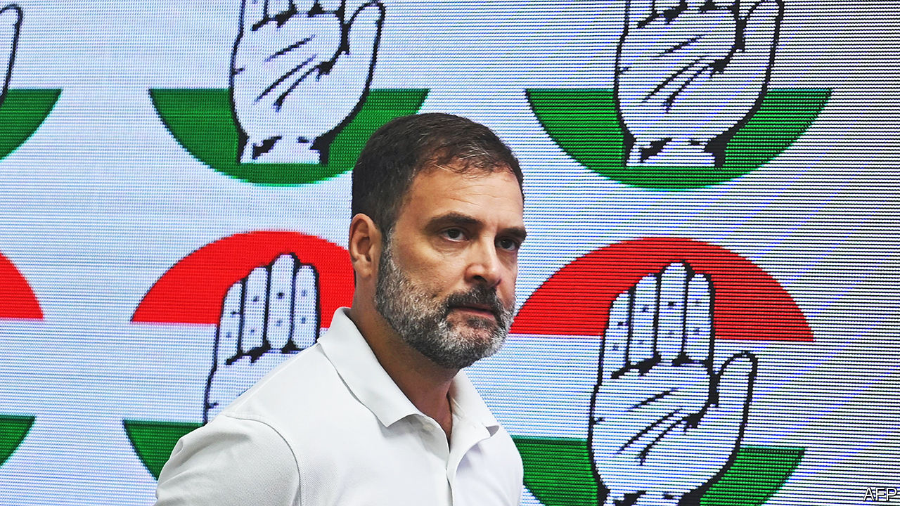

###### Comeback kid

# Rahul Gandhi is back in parliament 

##### India’s opposition is having a—possibly brief—moment in the sun 

 

> Aug 8th 2023 

I t was NO less welcome for being overdue. On August 7th Rahul Gandhi, leader of India’s main opposition party, Congress, reclaimed his seat in parliament after the Supreme Court suspended his controversial conviction for defamation. Mr Gandhi’s return to the fray, ahead of a general election due next May, looks like a vindication for the many who considered his conviction to have been a political stitch-up orchestrated by supporters of Narendra Modi. It has also increased a spurt of momentum behind the prime minister’s opponents, who recently clubbed together to form an anti-Modi alliance.

The Indian National Developmental Inclusive Alliance (INDIA), which includes Congress and most other opposition parties, appears to have put Mr Modi on the back foot, a rare occurrence, over his party’s handling of ethnic violence in the north-eastern state of Manipur. Though Mr Modi’s Bharatiya Janata Party (BJP) is still likely to win re-election next year, handing the prime minister a third term, a resuscitated opposition could make the election more interesting—and the future of Indian democracy appear more robust.

Mr Gandhi was convicted in March by a lower court in Gujarat, , of defaming anyone called “Modi” through some intemperate criticisms of the prime minister. The charge against him had been brought by a minor BJP politician, called Purnesh Modi, who is unrelated to the prime minister, but claimed nonetheless to have been deeply wounded by Mr Gandhi’s remarks. The Congress leader was sentenced to two years in prison—the minimum sentence required to trigger automatic disqualification from parliament.

The controversy interrupted a tentative improvement in Mr Gandhi’s helmsmanship of a party previously led by his father, grandmother and great-grandfather, all Indian prime ministers. Long regarded as unserious, spoilt and ill-suited to politics, Mr Gandhi had spent five months walking across India on a , or political pilgrimage, during which he had sought to burnish his image by advancing a vision of unity and equality to counter what he called the BJP’s “politics of hate”.

Besides permitting Mr Gandhi to return to politics, the court’s decision could represent an additional political fillip for Congress and its 25 partners in the anti-Modi alliance, reckons Rahul Verma of the Centre for Policy Research, a think-tank in Delhi. “It’s convincing evidence for the public that he was unfairly treated.” A sense of the 53-year-old Mr Gandhi battling adversity, as millions of Indians do daily, could be a useful counterpoint to his image as a gilded princeling. He will also now have an early opportunity to show off his new battle scars. On August 8th, the day after he resumed his parliamentary seat, the opposition bloc tabled a motion of no confidence in Mr Modi over his handling of the Manipur violence. Mr Gandhi took the floor on August 9th to launch an attack on the BJP, saying it was “setting the country on fire”.

Mr Modi’s opponents are in dire need of a break. In 2014 the BJP became the first party in three decades to win a parliamentary majority; in 2019 it increased its majority; and there is little sign of its popularity waning. The Hindu-nationalist party currently controls half of India’s state governments and, in Mr Modi, has by far the country’s most popular politician. Roughly 75% of Indians approve of his leadership. It will take more than Mr Gandhi’s return, and hounding of the government over the situation in Manipur, where an estimated 70,000 people have been displaced, to seriously erode that advantage. 

Congress and its partners would need to find an attack-line more relevant to most Indians’ daily lives, reckons Neelanjan Sircar of Ashoka University, near Delhi. “Without a genuine opposition narrative it is hard to imagine the alliance making much of a dent in the BJP’s popularity,” he says. Mr Sircar believes that Mr Gandhi’s focus, developed during the , on economic inequality and those left behind by India’s economic growth, holds promise. It will still be hard to erode Mr Modi’s overwhelming dominance. But even if Mr Gandhi has his work cut out, he is at least now back at work. ■

