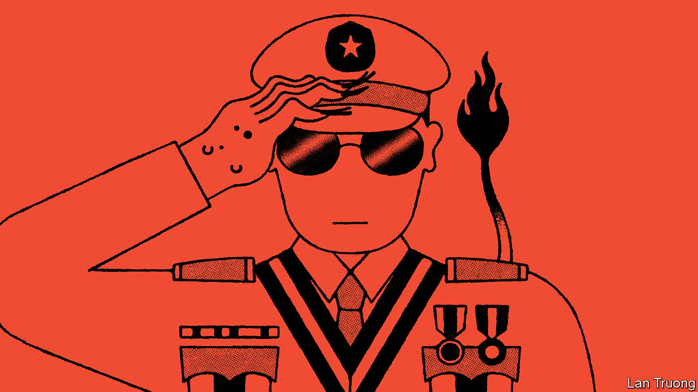

###### Banyan

# The meaning of relief for Aung San Suu Kyi 

##### Myanmar’s generals crave international recognition and are beginning to get it 

 

> Aug 10th 2023 

RUNNING A MILITARY dictatorship comes with certain perks, as Myanmar’s generals know very well. Unchecked power allows for the capture of a state’s economy and the suppression of dissent with near-impunity. Opponents can be intimidated or, if necessary, locked up or killed. 

Yet running a military dictatorship also comes with certain downsides. Apart from the need to maintain an expensive apparatus of oppression, the chief one is that nobody likes you. Many in Myanmar despise the junta. Much of the world has shunned the army ever since it seized power in a coup in February 2021, when it ended nearly a decade of civilian governance in Myanmar. The UN does not recognise it. The Association of South-East Asian Nations (ASEAN) has banned it from meetings. America and the EU have imposed multiple rounds of sanctions on individuals and businesses associated with it. Plenty of other countries refuse to engage or do business with it. 

Sanctions eat into state coffers and the lack of international respect makes it harder to establish legitimacy within the country. Both undermine the junta’s efforts to win a decisive victory in Myanmar’s bloody civil war, in which it has slaughtered thousands of its own citizens since it returned to power.

As a result the regime craves few things as much as international recognition. It has hired foreign lobbyists to improve its image abroad and invited foreign journalists to advise it on how to make its conduct appear more palatable to the world. It stages religious events to burnish its own image.

Of late it appears to be making some headway in its efforts. On August 1st General Min Aung Hlaing, the army chief, inaugurated a giant marble statue of the Buddha to mark an important Buddhist holiday. Monks visiting from eight countries were present at the ceremony. On the same day the regime announced a partial amnesty for prisoners, and a reduction in the sentence of Aung San Suu Kyi, the civilian leader ousted in the coup in 2021. Ms Suu Kyi is widely seen as a symbol of Burmese democracy, particularly by foreigners. Myanmar, was the message, is run by benevolent rulers who deserve the recognition of foreign observers. 

In July Don Pramudwinai, Thailand’s foreign minister, paid a secret visit to Naypyidaw, the capital. The reduction in Ms Suu Kyi’s prison sentence from 33 to 27 years was an act of reciprocity for that visit, argues Min Zin of the Institute for Strategy and Policy, a Burmese think-tank. It allows Thailand, which shares a 2,400km-long border with Myanmar, the chance to claim that its diplomatic efforts to engage the junta are making the regime slightly less horrible.

Such outreach has begun to undermine the united front against the junta formed by ASEAN. Myanmar’s authoritarian neighbours in mainland South-East Asia—Thailand, Cambodia and Laos—are keen to re-engage with the generals, despite the junta’s atrocities. The more democratic ASEAN members—Indonesia, Malaysia, the Philippines and Singapore—seem increasingly prepared to be swayed. In late July, the leaders of Malaysia and the Philippines met to discuss allowing neighbouring countries more “flexibility” to deal with Myanmar. That is likely to continue, especially as Laos, a one-party state backed by armed forces, prepares to take over as chair of ASEAN.

China has given the generals’ quest for recognition an additional boost. Fearful that the civil war in Myanmar will destabilise China’s borders, Chinese diplomats have pressed the country’s multiple ethnic armed groups battling the army not to support the forces of the National Unity Government (NUG), Myanmar’s main opposition movement. That has helped the army’s strategy to divide and conquer, reckons Morgan Michaels of the International Institute for Strategic Studies, a London-based think-tank. It has also served to undermine the chief force competing with the junta for recognition as the legitimate government of Myanmar. 

Despite such support, the junta still struggles to impose control over vast swathes of the country. In late July it decided to extend a state of emergency for the fourth time. The generals also postponed a sham election they had planned for August, apparently worried that it could embarrass rather than legitimise them. Yet given the recent initiatives by Thailand and China, the junta may gain some of the international recognition it craves even without regaining full control.■


