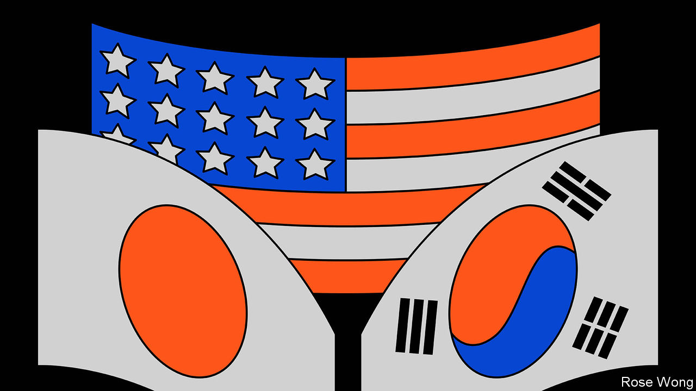

###### Indo-Pacific strategy

# Why Joe Biden will host Japan and South Korea’s leaders at Camp David 

##### America wants to institutionalise co-operation with two key Asian allies 

 

> Aug 10th 2023 

CAMP DAVID, the American president’s country residence, occupies a special place in diplomatic lore. The wooded grounds have been the setting for intimate meetings and historic negotiations, including a wartime confab between Franklin Roosevelt and Winston Churchill and peace talks between Israel and its Arab neighbours. On August 18th President Joe Biden will host Japan’s prime minister, Kishida Fumio, and South Korea’s president, Yoon Suk-yeol, for the first-ever standalone summit between the three countries’ leaders. Officials hope the meeting will enter the annals by cementing ties between America and two key allies whose bitter history has often divided them. 

These days China’s assertiveness, North Korea’s belligerence and Russian aggression are bringing the three closer. The governments’ strategic visions “have never been this closely aligned”, boasts Rahm Emanuel, America’s ambassador to Japan. A recent rapprochement between Japan and South Korea has helped, too. The summit will focus on deeper defence ties. Technology and supply chains for energy and semiconductors will also be on the agenda. The leaders will probably issue a joint declaration laying out their shared interests in military and economic security.

Though short of a formal three-way alliance, such steps herald a strategic shift in the Indo-Pacific. Under Moon Jae-in, Mr Yoon’s left-wing predecessor, security co-operation stalled and intelligence sharing dried up as Japan and South Korea bickered over Japan’s colonial-era atrocities, much to China’s and North Korea’s delight. Yet since Mr Yoon took office in 2022, South Korea has sought to put such gripes aside. In May Mr Kishida made the first official visit by a Japanese leader to Seoul, South Korea’s capital, in more than a decade. 

The three countries’ armed forces are working together again. The American, Japanese and South Korean defence ministers met in June and pledged to begin sharing intelligence about North Korean missile launches in real time. Closer co-ordination between the three sends a signal to North Korea and other would-be belligerents that if “we are attacked, we can deal with the situation”, says Wi Sung-lac, a former South Korean diplomat and nuclear negotiator. Since Mr Yoon came to power they have stepped up defence exercises. In May a Japanese destroyer flying a controversial Imperial-era flag made a port call in South Korea; Mr Yoon’s government played down the incident—a small sign that present-day security concerns are taking precedence over historical grievances. 

Trilateral discussions have taken on a wider scope. When the governments talk, “they don’t just talk about the Korean peninsula, they talk about the Indo-Pacific more broadly,” notes Christopher Johnstone of the Centre for Strategic and International Studies, a think-tank in Washington, DC. Japan and America see South Korea as a key player in South-East Asia, where both seek to counter Chinese influence. Warming relations have allowed conversations on semiconductors to deepen, too: Samsung is reportedly planning to invest in a new chip factory in Japan.

China is paying attention. Chinese officials have been pushing to restart high-level trilateral talks between China, Japan and South Korea, which have withered in recent years. “This is what summit envy looks like,” Mr Emanuel quips. During a recent forum in Qingdao, Wang Yi, China’s top diplomat, addressed Japanese and South Koreans attending. “No matter how blond you dye your hair, how sharp you shape your nose, you can never become a European or American,” he said.

Crude appeals are unlikely to lure Japan or South Korea away from America. Yet there are limits to how close the three can get. Mutual suspicion between Japan and South Korea still runs deep. Japan’s constitution makes it difficult to enter new formal alliances. For South Korea, a Japanese military presence or role on the peninsula remains controversial. Even sharing intelligence is “difficult to accept for Korean people”, says Choi Eun-mi of the Asan Institute, a think-tank in Seoul.

The three countries also have different security priorities. For South Korea, the focus remains North Korea. Japan is more concerned about China and potential conflict over Taiwan, which South Korea is hesitant to discuss. America had hoped to launch a trilateral dialogue on extended nuclear deterrence, the commitment to use America’s nuclear forces to defend allies. But approaches to nuclear issues in South Korea and Japan differ. “Japan wants extended deterrence to be as invisible as possible, whereas South Korea wants it to be as visible as possible,” says Sahashi Ryo of the University of Tokyo. Japan and South Korea both gripe about America’s trade policies. Yet South Korea is more reluctant to alienate China.

Domestic politics in all three countries threatens to undo diplomatic progress. Most South Koreans agree that the relationship with Japan ought to improve, but many feel that Mr Yoon has papered over Japan’s crimes. His proposed solution to a long-running court case over colonial-era forced labour is no more popular than it was when he announced it in March. Constrained by his party’s nationalist conservative wing, Mr Kishida is unlikely to offer further concessions. If a candidate from Mr Moon’s party, which is ideologically ill-disposed towards the Japanese, were to be elected in 2027, Mr Yoon’s work might come to naught. A second term in America for Donald Trump, with his disdain for alliances, would be similarly damaging.

Thus the most important aim of the upcoming summit is to begin locking in the gains of recent months. The leaders need to institutionalise their relationship, creating structures that cannot easily be dismantled by their successors, Mr Sahashi says. That may mean scheduling regular trilateral meetings and perhaps even creating a formal leaders’ hotline. As Mr Johnstone puts it, such steps, especially when announced in a setting like Camp David, “become something harder for future leaders to walk away from”. ■


