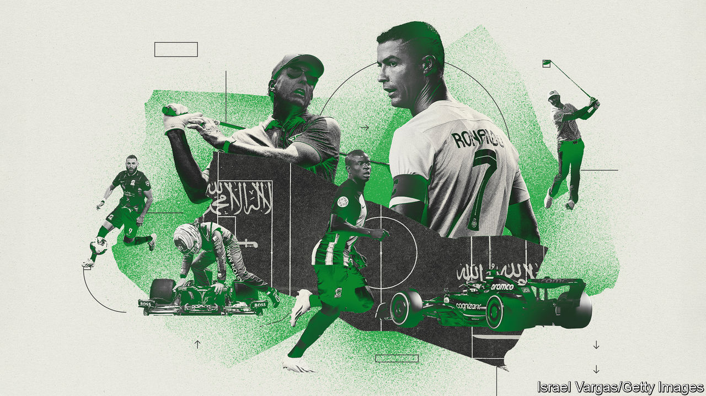
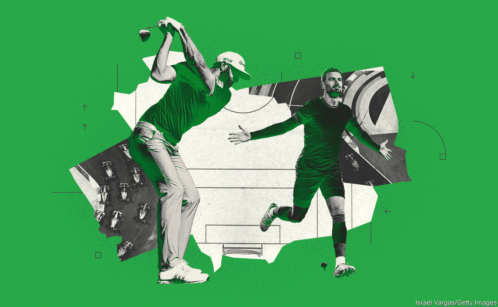
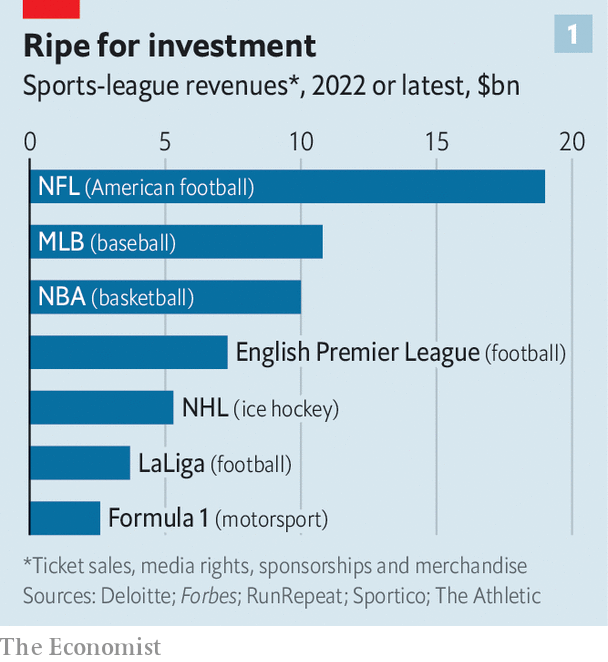
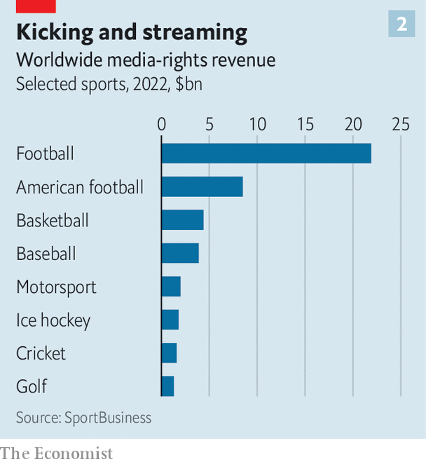

###### Scoring political goals

# Saudi Arabia is spending a fortune on sport 

##### It says this will help diversify its economy. Critics call it “sportswashing” 

 

> Aug 10th 2023 

On august 11th Saudi Arabia’s biggest football competition, the Saudi Pro League, will kick off for the 2023-24 season. Last season’s tournament did not exactly set pulses racing. Just 9,300 fans attended games on average. For three of the past five seasons the top scorer has been Abderrazak Hamdallah, a Moroccan who has not played for any of the world’s top clubs. 

But this season may be different. Mr Hamdallah’s team, Al Ittihad, has just signed Karim Benzema, winner of the 2022 Ballon d’Or award for best player in the world, from Real Madrid, and N’Golo Kante, a star midfielder from Chelsea. Cristiano Ronaldo, a five-time winner of the Ballon d’Or, moved to Al Nassr, another Saudi club, in January from Manchester United. Former Liverpool winger, Sadio Mané, joined him there, while Liverpool’s captain, Jordan Henderson, signed for Al Ettifaq. The list goes on. Teams in the Saudi league have spent more than $480m on fees this summer, catapulting them among the biggest spenders in global football. 

The Pro League’s moves are just one part of a multi-billion dollar push by Saudi Arabia into global sports, backed by Muhammad bin Salman, known as mbs, the country’s crown prince and de facto ruler. It goes far beyond football and is roiling global golf, Formula 1 motor racing, boxing and more. mbs’s ambition is to use sport to modernise Saudi Arabia, and to transform the outside world’s perception of the desert kingdom of 36m people. 

The Saudi splurge is happening just as the global sports industry is being shaken by digital disruption and a new wave of private-equity investment. Cynics accuse mbs of vanity projects and “sportswashing”—using sport to whitewash the country’s reputation for human-rights abuses. Saudi officials bridle at such criticism. Fahad Nazer of the Saudi embassy in Washington, dc, says the idea that the country is sportswashing “could not be further from the truth”. He says such claims reek of “ethnocentricity”: everything has been done with Saudi Arabia and its citizens—not Westerners—in mind, he says. 

Many observers believe the moves will change not just Saudi Arabia, but global sport itself, wresting the initiative from stuffy Western guardians of teams and tournaments and introducing a dynamic new force. The spending has been going on for several years but until recently its full scope was obscured by a scatter-gun approach. Investments and negotiations have taken place in multiple layers of the sports industry, including buying players, purchasing foreign clubs, developing domestic clubs and buying or developing tournaments at home and abroad. 

These deals have been pursued by a squad of Saudi entities including the government itself, the Public Investment Fund (pif), a sovereign wealth fund, and even Saudi Aramco, the oil firm that is the world’s most profitable company. The scope is impressive, with at least $10bn spent across half a dozen major sports. 

Howay, the lads

In 2021 a Saudi-led consortium took control of Newcastle United, a storied but struggling English Premier League (epl) team, for $391m. As well as developing its domestic league, there is intense speculation that Saudi Arabia will launch a bid to host the World Cup, perhaps in 2030, following in the footsteps of neighbouring Qatar in 2022. Gulf money is thought to have supported a 2021 attempt to create a European super league, which collapsed after opposition from fans. 

In golf, America’s main body, the pga Tour, has just agreed to a merger with liv Golf, a Saudi upstart tournament that threw the sport into turmoil by offering top players hundreds of millions of dollars to switch their allegiance. Europe’s dp World Tour, another organising body, is also part of the deal. Donald Trump, whose courses host liv events, describes it as a “beautiful and glamorous deal”. Elizabeth Warren and Ron Wyden, two left-leaning senators, recently condemned “the Saudi regime’s latest attempt to sanitise its abuses” in a public letter to the us Justice Department. 

Saudi Arabia hosts a new Formula 1 Grand Prix in Jeddah and is building a track near the capital, Riyadh; Saudi investors were reported to have considered bidding $20bn for the whole of Formula 1 last year. The Saudi sports minister dismissed the reports as “purely speculation”. Aramco remains a major sponsor of f1.

An official at the men’s atp tennis tour has admitted to “positive” talks with possible investors, pif among them. The women’s tennis tour, the wta, is considering whether to hold an event in Saudi and an official recently visited. The kingdom now hosts big boxing matches, wrestling bouts and e-sports events. Despite its climate, it has also been selected to host the Asian Winter Games in 2029.

A league of their own

Why is the country splurging on sports? Vanity and envy play a part. Many Saudi royals are fans. They have invested in teams elsewhere and now want some of their own. They also want to be taken seriously among the global sports elite. Yasir Al-Rumayyan, governor of the pif, is a golf nut. Documents released as part of recent congressional hearings into the pga Tour-liv deal suggest that one idea proposed as part of the transaction was that he might gain membership of Augusta, America’s most exclusive club.

Saudis have watched as their neighbours have stepped up. The race began in 1993, says Danyel Reiche of Georgetown University in Qatar. That was when Qatar first hosted an atp men’s tennis tournament (Boris Becker won). It spent $200bn preparing to host the 2022 World Cup. One of its royals also owns Paris St Germain, a top French club. Manchester City, owned by an Abu Dhabi royal, is now the world’s most valuable football brand.

But the Saudi plan goes far beyond perks for its elites and keeping up with the neighbours. Buoyant energy prices and production mean that its oil exports are expected to surpass $166bn this year, or 16% of gdp. With a global energy transition looming, the kingdom’s “Vision 2030” plan aims to diversify its economy away from oil by developing new industries and liberalising the economy, including by getting more women into the workforce. The pif is a key player, using its more than $700bn of funds to redeploy capital into new areas of the economy and make strategic investments in brands and technology.

The kingdom wants the Saudi Pro League to attract investment and fans. It aims to welcome 100m visitors a year by 2030 (there were 64m in 2021). Officials hope the league will quadruple its revenue to $480m by then, though that still pales beside, for instance, the epl, which generated ten times as much last year. 

Sport, it is hoped, will have a spillover effect on the rest of the economy. Part of this is a rebranding exercise in a region known for religious strife, extremism and war. “It is better for everyone to be working together for prosperity in the region, not in conflict, and the Saudis want to be seen at the forefront of it,” explains Steven Cook of the Council on Foreign Relations, a think-tank in New York. 

A better brand and more events can boost the tourism sector, which the government hopes will increase from 3% of gdp in 2019 to 10% in 2030. When you want to become a holiday hotspot, star-power helps: Lionel Messi, perhaps football’s greatest player, is a Saudi tourism ambassador and posts sun-drenched snaps to his 482m followers on Instagram. 

Sport may even be useful as a mechanism to complement social reform. The Saudi government has in recent years become more accepting of the sexes mixing in public and has taken some steps to rein in its over-zealous religious police. Women were finally allowed to drive in 2018. Now it is backing women’s sports as well as men’s. The Saudi women’s football team gained its first ranking from fifa in March. All of this may make the country more attractive to female tourists. 

Across the region, hosting sports events has “generally been positively perceived by residents,” says Wadih Ishac, an assistant professor in sport management at Qatar University. Mr Nazer of the Saudi embassy in Washington points out that 70% of the Saudi population is under 35 and that young people love the sporting events. 

The master plan faces two big risks. The first is that its business models may not work. Gulf owners can clearly run sports businesses well. Manchester City has thrived under its uae investor (though in February the epl accused it of allegedly breaking financial rules, a charge the club denies). During the first year of Saudi ownership, Newcastle United spent around £100m ($126m) and moved out of the relegation zone. In the second, the club came fourth, qualifying for the Champions League, Europe’s main club competition, for the first time in 20 years. 

Still, within Saudi Arabia, sport is a state-backed, rather than an entrepreneurial, concern, with the problems that can entail. In June some top football clubs, previously under the control of the Ministry of Sports, were notionally privatised. But pif has a 75% stake in four teams. Aramco, the oil firm, has another team and neom, a metropolis being built in the desert, has one in the second division, too. “It’s almost like football clubs have become quangos in Saudi Arabia,” says Simon Chadwick of Skema Business School in Paris. Rather than a new dynamic engine of the economy, sports could become a manifestation of its old, state-run patronage system. 

In order to attract stars, salaries must be huge. Mr Benzema reportedly signed a two-year contract worth $440m and Mr Ronaldo is rumoured to be earning $200m per year. Al Hilal this summer offered a record-smashing bid of €300m ($330m) to Paris St Germain for Kylian Mbappé, a French star, who so far has declined. Phil Mickelson, a golfer, pocketed $200m from liv Golf despite once describing the Saudis as “scary motherfuckers” (he later apologised). Colossal wage bills mean even the most successful European teams struggle to make money. Over half of the teams in the epl made losses in 2022, and overall the leagues in Italy, Germany and Spain are in the red. (Exor, which has a stake in ’s parent company, is also an investor in Juventus, an Italian football club, and Ferrari, an Italian carmaker.)

Thanks to its oil wealth, the Saudi experiment will not break the bank. According to pif’s annual report in 2021, leisure and entertainment accounted for just 1.6% of its assets. But the combination of low domestic revenues and high costs may mean many Saudi sports ventures cannot sustain themselves or compete globally without subsidies. 

Saudi Arabia may face some of the same issues with football as China, which tried to raise the fortunes of its Chinese Super League in the past decade. Expensive imported stars may grumble about the standard of football and there will be plenty of scepticism about the sustainability of the current level of spending. But the state’s backing for the league will negate the financial problems and political scrutiny which have hampered the Chinese project. The Saudis are also trying to attract younger talent, and not just be like the United States, where many top players from European clubs have traditionally gone to play out their twilight years. 

But Saudi’s smallish domestic audience may also impede its ambitions. There is an example of an emerging economy taking a dominant role in the business operations of a global sport. In 2008 India launched the Indian Premier League (ipl), a cricket tournament. Last year the rights to show matches over the next five years were sold for more than $6bn, making it the world’s second-most lucrative sports league per game after the nfl, an American-football competition. India’s financial clout has given it a powerful voice over cricket worldwide. But the foundation of India’s success has been the sheer scale of the audience there, with 1.4bn cricket-mad citizens. Saudi cannot rival that.

 


The second big danger is that the surge triggers a backlash. Sport can be a sensitive industry in which to invest and Saudi Arabia’s status as an autocratic state does not help. Several human-rights groups have accused the Saudis of sportswashing, for instance when fifa awarded them the Club World Cup for 2023. 

It is a new spin on an old idea, of nasty regimes using sports to show off their political models, as Mussolini did with the World Cup in 1934 and Hitler with the Olympics in 1936. East Germany and the Soviet Union had state-sponsored doping programmes in the 1970s and 1980s. More recently China was accused of sportswashing when it hosted the Winter Olympics last year, as was Russia when it staged the football World Cup in 2018. Qatar faced plenty of blowback in 2022, too. 

Today critics point to Saudi Arabia’s dearth of democratic freedoms and suppression of women’s and gay rights. The gruesome murder of Jamal Khashoggi, an outspoken journalist, at the Saudi consulate in Istanbul in 2018 has not been forgotten, nor has the kingdom’s central role in the . 

Insular peninsula

Yet Saudi Arabia’s autocratic politics will probably not prevent it from taking a growing role in global sports. Qualification for the Champions League has gone a long way to stilling criticism of Saudi investment in Newcastle United. President Joe Biden, having described the kingdom as a “pariah” in 2019, is now keen to repair America’s alliance. But its reputation may make deals more fiddly. The proposed pga Tour-liv golf merger has created a stink and is being assessed by the us Justice Department to see if it violates antitrust law. 

pga Tour executives were hauled before a Senate committee last month. Senator Richard Blumenthal complained that a gagging clause in the deal, which could stop players from badmouthing Saudi Arabia, is “about as broad a non-disparagement clause as I have ever seen”. The deal’s backers at the pga Tour are doubtless keen to suggest the Saudis will have a backseat role: probably a very different vision from that of mbs, in which the Saudis are in control and no longer just the “dumb money”.

 


But even if some deals do not transform the country in the way mbs hopes, Saudi Arabia is part of a broader shift that is changing global sports. The surge in capital from the kingdom is part of the rise of a new cohort of sovereign and private-equity funds that are investing in sports at scale. Bloomberg reported that private-equity firms spent $51bn on sports transactions in 2021, nearly double the total of 2017.

Ownership rules are being liberalised as clubs and tournaments seek new sources of capital to stay competitive. American sports leagues are the world’s best at raking in money (see chart 1). Since 2019, several big American leagues have relaxed their rules to allow minority investments by institutional investors. In July Qatar’s investment authority reached a deal to buy 5% of the parent company of the Washington Wizards, an American basketball team. 

 


Digital disruption has also finally reached live sports, which had been one of the last bastions of traditional television (see chart 2). Increasingly viewers who have “cut the cord” on television instead watch sports through streaming services which offer live games but also on-demand highlights, analysis and other digital add-ons. This digital shift is being accompanied by unexpected swirls and shifts in audiences. For example, Formula 1, once notable for having little presence in the United States, is now gaining some traction there, boosted by tie-ups with Netflix. 

Saudi’s sports splurge partly reflects the dynamics within the kingdom: a new flood of petrodollars; mbs’s ambition to create a more socially liberal society and to restore his tarnished reputation in the West. But the moves also reflect a sense that there is a new window of opportunity in global sports: to grab bigger and newer audiences, to create different kinds of events and tournaments and to reinvent old ones. 

The latest annual report from pif, released this week, includes the announcement of a sports-specific investment vehicle, hinting at broader future plans. Mr Benzema and Mr Ronaldo are likely to be hitting the back of the net come the autumn. The kingdom itself has plenty of other goals of its own. ■

