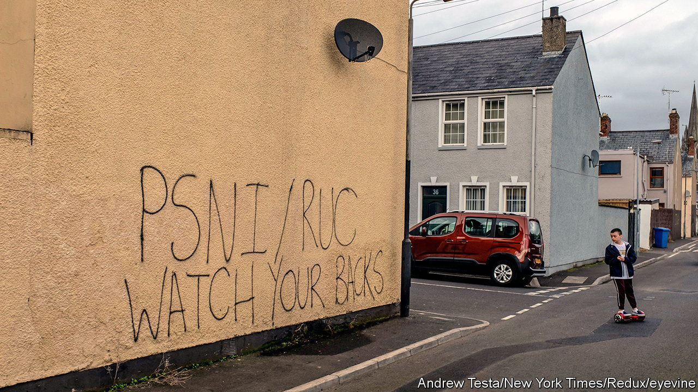

###### Northern Ireland’s police

# A big data breach endangers police in Northern Ireland 

##### Blame a cock-up, not a conspiracy 

 

> Aug 9th 2023 

HAD HOMER SIMPSON been put in charge of handling sensitive police data he could hardly have bungled worse. Unfortunately, in real life, publishing thousands of names of serving members of the Police Service of Northern Ireland (PSNI) is not funny. The service accidentally published online 345,000 pieces of data about its entire workforce—from the chief constable to his typist—of more than 10,000 people. Though they were removed from the initial site within a few hours, the information continues to circulate.

Elsewhere in the United Kingdom identifying all members of the police might rank as an inconvenience. In the province, where police face a generally high level of deadly threat, it is a serious security risk. Over 300 police officers were killed during the Troubles. Six months ago dissident republicans approached a police officer as he finished coaching a children’s football team, shot him several times and left him for dead. He survived, but many of his colleagues are now in fear for their lives. Some officers don’t even tell their parents or friends what they do for a living. Years of careful discretion have been torn up by their own force.

The breach was a cock-up, not a conspiracy. The PSNI had received a freedom-of-information request, placed via a website called WhatDoTheyKnow, seeking statistics on how many officers serve at each rank. It shared a file with the information, but left in the document an additional 10,799 rows of data, each containing 32 pieces of information relating to individual officers. These included surname and initials, home station, details of staff who are suspended, and more. 

The most sensitive data concern who works where. Listed by name are intelligence officers serving at ports and airports, bodyguards to senior politicians and judges, surveillance officers and almost 40 police who work at MI5’s Northern Ireland headquarters. A tiny number belong to a clandestine unit described only as “secret”. Their names were made public. So, too, were those of the several officers responsible for “information security”.

Also on August 8th, seemingly coincidentally, Britain’s Electoral Commission announced its own loss of sensitive data. In this case, according to the commission, it was no accident but the result of a prolonged and “complex cyber-attack” that had enabled “hostile actors” to peruse some electoral registers containing millions of names and addresses of voters. Hackers had also gained access to the commission’s emails and “control systems” in August 2021. Remarkably, they were not spotted for more than a year.

Anything that weakens trust in elections would be grave. But for now the blunder in Northern Ireland looks the more serious. Jennifer Cobbe, who researches technology and the law at the University of Cambridge, said the case “has the potential to be the worst data breach in UK history” when measured by its impact. 

The police system that is meant to prevent shambolic management of information evidently failed. Staff made more than one mistake, for example in sending a “recall” email to the website that was itself automatically published online. That unhelpfully alerted more users that sensitive data had been made public. Among those who circulated the file were police officers themselves. On August 9th the police admitted a second, smaller, breach after a laptop was stolen from a car a month ago.

The damage to the PSNI’s reputation will be hefty and this could yet discourage some from working for the service. Legal consequences may also follow. Traditionally the police in Northern Ireland have been fiercely secretive, often rejecting requests for information. It seems most likely that the service will clam up tighter again. It is unclear whether the breach will cost any senior figure their job. A greater risk is that it will cost someone their life. ■


