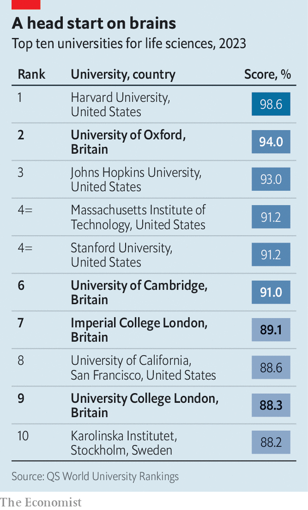
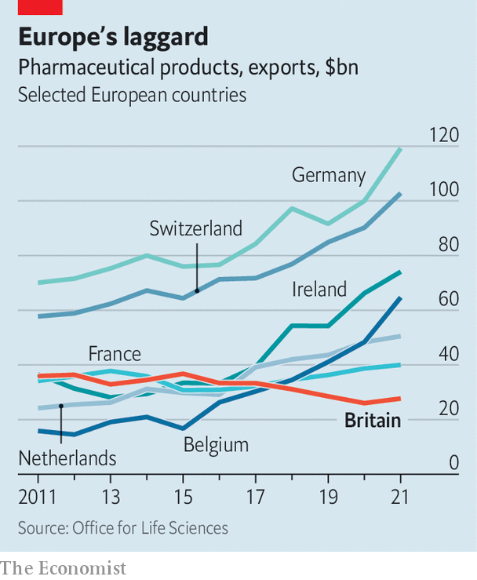

###### Life sciences

# Britain doubles down on the life-sciences industry 

##### The government vows to clear hurdles so the sector can flourish. Will it be enough? 

 

> Aug 8th 2023 

MANY CITIES hope that success in one industry may beget success in another. Take Aberdeen, which grew rich from oil exploitation in the North Sea. By a decade ago, the Granite City laid claim to more multimillionaires per head of population than anywhere else in Britain. Now a local tycoon, Sir Ian Wood, hopes to foster growth in a different sector. In May, with government funding, his development agency, Opportunity North East, opened a university-backed research facility to help startups in the city expand their commercial initiatives. 

His bet is on life sciences, a term encompassing high-tech efforts in making pharmaceuticals, biotechnology or medical devices. The city already has a decent record here. Professor David Blackbourn of the University of Aberdeen says ten companies have been spun out from his institution. One, TauRx, based in a former bus depot, is trying to develop a treatment for Alzheimer’s and has raised over $800m since its founding in 2002. Its innovation, tested in human trials, targets tau tangles (abnormal clumps of protein that stick to neurons in the brain). Regulators will soon determine if that treatment is sufficiently effective. Its chief operating officer, Glenn Corr, calls it a “life and death” moment for the company.

For life sciences in general much is also on the line. Since coming to office last year, Rishi Sunak has set great store by developing high-skilled sectors, such as artificial intelligence and the life sciences, arguing that they will bring long-term gains to the economy. Life sciences gained prominence during covid-19. The world’s first randomised trial for covid treatment was conducted by the University of Oxford and then an effective vaccine for covid was developed by AstraZeneca, a British-Swedish company. It saved millions of lives. 

Already some 300,000 people are employed in the sector and the government talks of that number surging. To that end, Mr Sunak’s administration has set out several ways that Britain aims to make matters easier for life-sciences startups. Will Quince, a health minister, says the “ecosystem” in which small firms operate puts too many obstacles in the way of those eager to grow. Both politicians talk of sweeping them away.

 


How much is really changing? Britain undoubtedly has advantages in advanced research. It is home to world-beating universities in life sciences in Cambridge, London and Oxford (see table), and in spots like Aberdeen. British universities publish some of the most-cited academic publications in life sciences, though the country falls a bit short in getting patents filed. It would help if academics were spurred harder to apply for them.

But academic excellence needs nurturing. Many had expected that, by now, Britain would have rejoined Horizon Europe, the EU’s fund (and the world’s largest) for research and innovation, worth some £85bn ($108bn). Boris Johnson, when prime minister, said this would happen after Brexit. Mr Sunak had seemed poised to unveil a deal to do so in July. He did not, apparently because of worries about paying in necessary funds. A decision may be taken soon. An alternative British-only scheme, called Pioneer, is widely seen as a second-best option.

Beyond the universities, a second series of hurdles block Britain’s startups. Here, again, the country enjoys distinct advantages, so should be able to prosper. Around a third of all life-sciences-focused startups in Europe are reckoned to be there, more than in any country on the continent. That is partly because of abundant talent, an entrepreneurial culture and sufficient funding for early-stage growth. 

 


But the startups face at least three more big challenges: painfully slow processes for getting trials for drugs or other products under way; the high cost of property (with knock-on effects on labour costs); and difficulty in securing access to large-scale capital to allow promising firms to grow. On each of these, the government has taken some welcome steps. 

Excessive delays in firms being able to conduct clinical trials are beginning to improve. The problems were created in part because the underfunded medicines regulator, the MHRA, took longer than most counterparts in other countries to let firms administer the first dose of a medication in a trial. Waiting for most of a year to get a trial started is “a really long time when your patent clock is ticking”, laments Lisa Patel of Istesso, a firm developing drugs to treat auto-immune diseases. (As 90% of products under trial end up failing, the faster the process is done, the sooner researchers can move on.)

As a backlog at the MHRA caused by the covid pandemic eases, trial efficiency is improving. Another measure for the regulator is whether companies can recruit trial participants quickly enough. By May, according to official data, 73% of trials signed up their target number of patients on time, up from just 23% in May last year. The government also promises to tackle a shortage of staff at the MHRA, which had held it back. 

The main reason for optimism, meanwhile, is an independent review that reported in May, by Lord O’Shaughnessy, which offered 27 recommendations including several to accelerate the regulatory process. The government sounds eager to implement many. These include creating networks to help speed up clinical trials, giving NHS staff incentives to sign up their patients, and finding ways for new technologies to be rolled out sooner in the NHS.

Government efforts to tackle the high cost of property are more limited. Many startups want to be in the “golden triangle” near Cambridge, London and Oxford, where finding space for labs, or for staff to live, is painfully pricey. Officials have announced plans to develop new lab space in Cambridge, and to build more homes there. Campuses are expanding in Oxford; private developers in London are building labs and offices for the sector, notably in Kings Cross and Canary Wharf. Such increased activity by private actors is an encouraging sign.

The third problem of raising larger-scale capital is the biggest challenge. Whereas venture funds for startups remain plentiful, investment for those moving to later stages has long been too hard to obtain. Last year only 22 life-sciences companies in Britain raised £30m or more in funding rounds. In America nearly 400 did so. Worryingly, life-sciences firms collectively were able to raise only £3.3bn in equity finance last year, down from £7.2bn the year before.

The government has tried to make up some of the shortfall. Since 2021 British Patient Capital, a subsidiary of the government-funded British Business Bank, has co-invested in eight later-stage biotechs. It also provides investment to specialist venture-capital funds. “But we really need to try to attract in much more private-sector capital to make a dent in what are quite significant funding gaps,” says Catherine Lewis La Torre, its outgoing chief.

In this, the biggest gain would be if more long-term capital from pension funds found its way to the firms. The government wants those who run defined-contribution pension schemes to invest in unlisted outfits, including life-science companies. In July the chancellor, Jeremy Hunt, said nine large investment funds had agreed to allocate at least 5% of their pension savings in such unlisted firms by 2030, up from 1%. If that came to pass, it would potentially add billions of pounds in funding for such firms. 

Steve Bates, chief executive of the BioIndustry Association, calls that a game-changer. He argues that the combined benefits of hurdles coming down at home and others going up elsewhere (such as draft legislation in the EU that could limit the patent life of pharmaceuticals) make Britain look increasingly attractive to those trying to expand in the sector.

Maybe so, but other big challenges will prove much harder to overcome. England remains a small market for pharma companies, accounting for only 2% of global pharmaceutical sales, whereas America makes up nearly 50%. Pharma firms complain about an NHS drug-pricing policy, now being renegotiated, which obliges them, in effect, to accept a discount that is currently worth 26.5% on the value of sales of most branded medicines. Those that produce new tech also grumble that the NHS has been far too slow in adopting their innovations, and changing habits here will not be quick. 

The London Stock Exchange looks increasingly moribund. Brexit has not made it easier to manufacture in Britain, whereas exporting to the EU has become more complicated. Britain is a diminishing actor in export markets: its firms account for 4.3% of global pharma exports, with both production volumes and export values dropping over the past decade. Nor has Britain been able to draw hefty levels of foreign direct investment into its life-sciences firms: in 2022 these shrank by nearly half, to £1bn. By contrast Ireland’s more than doubled, to £3.7bn.

In one area, British firms do reasonably well: startups find that bigger firms are often keen to buy them. Of the ten British companies with the largest venture rounds in 2018, one has since been bought by an American pharma company, Pfizer, and another by a Swiss one, Roche. Such exits are a boon to founders, some staff and potentially to future patients. They should encourage more new firms to be founded. British buyers may themselves also grow by taking over minnows. But it’s not what Mr Sunak has in mind when he talks of creating a superpower in the life-sciences. One measure of success, in future, will be how many businesses can grow up without being forced to sell out. ■


