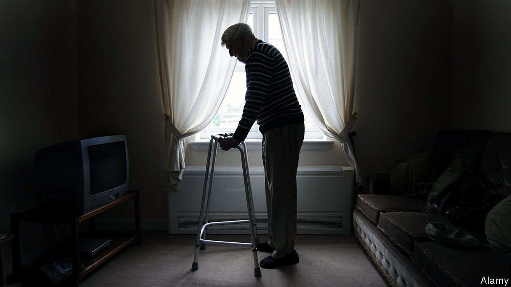

###### How to tackle loneliness

# Five years on, is Britain’s strategy to combat loneliness working? 

##### Why it’s worth fighting harder against loneliness 

 

> Aug 10th 2023 

“Where do they all come from?” wondered Paul McCartney in 1966. Britain’s government has taken a more analytical approach to lonely people. Five years ago it launched a “loneliness strategy”, to tackle “one of the greatest public-health challenges of our time.” The Office for National Statistics (ons) developed measures to test it. The government provided funds for research. It told doctors to try “social prescribing”, sending patients to social events rather than to the pharmacy. And it appointed a loneliness minister.

Loneliness is one of many briefs that Andrew Stuart, mp for Pudsey, West Yorkshire, has at the Department for Digital, Culture, Media and Sport. Yet it is tempting to scoff. Stephen Colbert, a comedian, joked that “Minister for Loneliness” sounded like “a Victorian euphemism for ‘gigolo’”. Loneliness is hard to pin down: the government defines it as “a subjective, unwelcome feeling of lack or loss of companionship.” Like all emotions, it is difficult to measure. So is the success of interventions designed to tackle it. 

It has probably become more common. Some 8.3m people lived alone in 2022, a 16% increase in two decades. Many Britons have less cash for going out than before. And socialising online is no substitute for the real thing. 

The Campaign to End Loneliness, a charity, says 7% of British adults report being lonely often or always. Those aged between 16 and 29 are twice as likely to report feeling lonely as those over 70. A large study by Pamela Qualter, a professor of psychology at Manchester University, and others found that people in countries (like Britain and America) that score high for individualism also report greater loneliness.

This matters because it seems to have a terrible effect on health. A large study in , a journal, found that people who are lonely are more likely to die early. That may be because they have no one to remind them to eat healthily, exercise or go to the doctor. Stress and unhappiness may affect the body in ways not yet understood. The sick may also be more likely to become socially isolated.

The government has done much to reduce stigma around mental ill health: the nhs repeatedly encourages people to consider their mental state (though it is unable to provide talking therapy to many who need it). Mr Stuart hopes the same thing will happen with loneliness. That seems unlikely because admitting to loneliness can seem to reflect on a person in painfully personal ways. Depression can strike anyone; no one wants to be thought of as love-less or friendless. 

Having public figures talk about loneliness would help. Alluding to specific causes is a useful start. That is why Mr Stuart talks about growing up gay, and feeling alone. Speaking about loneliness might also encourage people to consider that others are suffering. Small interactions are crucial, says Professor Qualter.

With this in mind the government has funded a few initiatives. nhs receptionists are being trained to identify lonely people. Not every harried staffer considers that the old man who arrives hours early for his appointment might not have seen anyone in days. People who sign up for such courses seem likely to be empathetic already, though. Lesley Emongo, a receptionist in Peterborough, says the training gave her strategies for dealing with the many lonely patients she encounters. 

The ons’s standard questions for surveys may be the most useful intervention. It hopes academics and charities will measure loneliness in the same way so “we will build a much better evidence base more quickly”. Professor Qualter says there is no evidence yet that any interventions have been effective. This may be because the things that make people lonely—such as poverty or disabilities—also make them hard to reach. 

The professor would like to see more ambition, including designing public services with spaces that encourage congregation. Austerity brought brutal cuts to many places, like youth clubs, where people once gathered. A loneliness strategy is unlikely to make up for those losses.■


