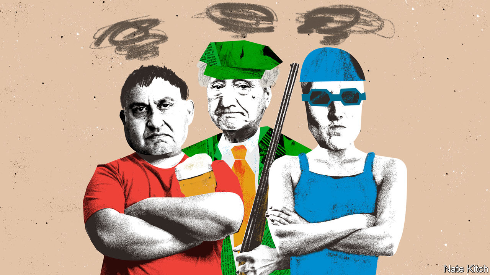

###### Bagehot

# From wild swimming to grouse shooting, Britain is in hock to hobbyists 

##### Beware the hobby lobby 

 

> Aug 9th 2023 

Hobbies shape a nation. For proof, drive to Bransdale, a grouse-shooting estate on the North York Moors. Providing a home for red grouse, a fast plump bird that is hard to shoot, requires a landscape as artificial as any garden. Controlled burning creates a mix of young and old heather, giving the bird something to eat and somewhere to live respectively; potential predators such as stoats are removed by skilled full-time gamekeepers. It is beautiful, barren and familiar. 

Grouse shooting sculpts the British countryside. About 7% of British land is given over to the sport. In Scotland, roughly 15% of the country is grouse moor. At 16,000 acres, Bransdale is the same size as Bradford, England’s tenth-biggest city. Considering the 12,500 or so people who do it each year could fit inside the ground of Oxford United, who play in the third tier of English football, it is a remarkable footprint. A niche pastime gives the country’s uplands their unique look. 

The sport, whose season begins on August 12th, is only the most extreme example of a hobby shaping Britain. Yet the power of hobbyists can be seen in everything from the regulation of polluting cars in London to rows over sewage. Hobbyists are the most powerful yet overlooked force in British politics. Call it the hobby lobby. Its influence is everywhere. 

People overstate the power of better-organised and well-funded lobbyists. Capital rarely has its way. Britain’s finance sector, which accounts for roughly 10% of tax revenue, had its business model battered by the Conservative government, which left the eu with a deal that offered little for the country’s banks. Workers have fared no better. In a supposed age of union militancy, most of them have managed little better than inflation-matching pay rises. Governments grumble about unions, but they do not quake. 

By contrast, when hobbyists come calling, governments tremble. Images of raw sewage being pumped into Britain’s waterways have hurt the Tories as much as a failing health service or rising taxes. Why? Because wild-swimmers have established themselves as one of Britain’s potent hobby lobbies. The Outdoor Swimming Society, which does what it says on the tin, had 300 members in 2006. It now boasts nearly 200,000. Believe it or not, England’s waters are in a better state today than in the 1990s. In contrast to the 1990s, however, a sewage spill today means a retired English teacher from Sussex cannot go for her weekly dip. Woe betide any government who denies her that. 

Wild-swimmers are not the first to whip the government to their will. The Campaign for Real Ale (Camra), an association of beer lovers, is probably Britain’s most successful hobby lobby. It campaigned for years against the “tie”, which forced landlords to buy overpriced beer from the brewers that owned the freehold of their pub. An industry worth £20bn wanted to keep it; the hirsute activists won. The government scrapped it in 2014. Even the Treasury whimpers in the face of Big Hobby. Britain’s tax code is littered with exemptions for small-time brewers, to encourage people to turn a brewing hobby into a job. 

In a crisis, the wishes of hobbyists come first. During the pandemic, mps inundated the government with pleading to let garden centres reopen, recalls one baffled adviser. The calls were heeded. An exemption from lockdown followed. Horticulturalists sometimes shape matters of state. Northern Ireland’s garden centres provided the emblematic example during Britain’s negotiations with the eu over the province. A generation ago, talks in the province involved secret haggling with terrorists; now it involves placating Ulster’s rosebush tenders. 

Hobbyists are able to secure carve-outs of even controversial policies. London’s “ultra-low emission zone” charges polluting cars £12.50 a day to enter the capital, triggering a backlash in the city’s car-dependent fringe. Sadiq Khan, the London mayor, stuck with the policy, arguing the controversy was a price worth paying for cleaner air. Classic cars, however, are exempt. White van drivers gripe about their diesel vehicles being hit; someone pootling around Richmond Park in a 60-year-old mg, however, has no such problem. A fight with hobbyists is not worth having. 

Taking on hobbyists is painful, after all. Sir Tony Blair regretted two pieces of domestic legislation the most: one was the Freedom of Information Act, which let nosy citizens see what their government was doing; the second was the Hunting Act, which banned fox hunting in England and Wales. “If I’d proposed solving the pension problem by compulsory euthanasia for every fifth pensioner I’d have got less trouble for it,” recalled Sir Tony. Explanations for the anger ranged from its cultural footprint to the jobs it guaranteed in rural areas. A more important fact was overlooked: people hunted foxes because they enjoyed it. When the government stopped them, they were furious. 

You will take my hobby from my cold dead hands

Perhaps this explains why grouse shooting has survived so long. Activists loathe the sport. Up to 500,000 birds are killed each season. But neither main party has any plans to ban it. The Royal Society for the Protection of Birds has 1.2m members, but its royal charter forbids it from directly opposing “field sports”. People who love watching birds are matched by those who love to shoot them. When two hobbies collide, stalemate can follow. 

Politicians fear the hobby lobby. They should learn from it instead. The most influential party in British politics over the past decade was the UK Independence Party, which was always more of a hobby than a project for political power. Leaving the EU was a curious obsession for a few odd men, but they got their wish in the end. Politics has professionalised in the past few decades. Yet skilled operators in the Labour and the Conservatives were no match for a bunch of dedicated amateurs. In British politics, the hobbyist will always have his way. ■


