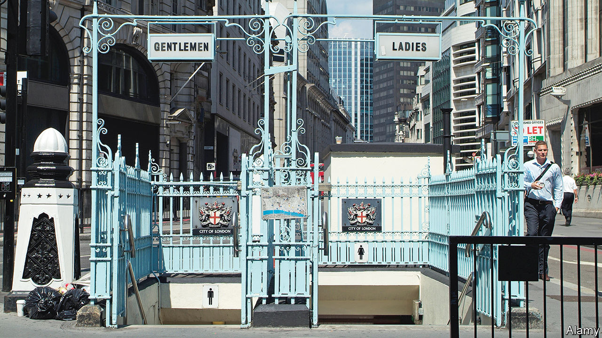

###### Loosing it

# In defence of Britain’s public toilets 

##### Britain’s toilets used to be Crapper. Now they are worse 

 

> Aug 10th 2023 

It is a magnificent Crapper. Push open the door of the gentlemen’s toilets beneath Wesley’s Chapel in London and you find yourself in some of the oldest and grandest loos in the city. The sinks are marble; the cubicles are panelled wood and everywhere—on the cisterns, on the ceramic pull chains, on the toilet bowls—is the name of the man who made them: “THE VENERABLE THOMAS CRAPPER.” These are a sanitary relic and a social one: toilets today rarely contain such pride. 

British toilets are no longer Crapper; they are worse. The nation that gave the world the S-bend, the U-bend, the internationally used initialism of “WC”, and rebuilt its capital city to suit its sewage, is increasingly incapable of offering its residents usable public toilets. In the past two decades, 2,000-odd public loos—a third of the total—have closed in England and Wales; historic toilets have been neglected or converted into wine bars; those conveniences that remain are increasingly inconvenient and frequently filthy. Campaigners are cross: the Royal Society for Public Health published a paper on the “Decline of the Great British Public Toilet” entitled “Taking the P***”. British public toilets, once among the best in the world, are now—a parable in porcelain—at best bog standard. 

It used to be so different. In the Victorian era London began what has been called a sanitary revolution. Like most, this one came from the bottom up. London was never a clean city: in 1660 the diarist Samuel Pepys went into his cellar and “put my foot into a great heap of turds” that had seeped in from a neighbour; by the Victorian era, London had 2m people and an even deeper problem. In 1855, the scientist Michael Faraday took a trip on the Thames and found “the whole of the river was an opaque, pale brown fluid”, broiling with visible chunks of “feculence”. Something, Faraday wrote, must be done. 

Then, as now, MPs were reluctant to talk about the lavatorial. As Raymond Martin, the head of the British Toilet Association, observes, “Nobody wants to be the Minister of Poo.” But the unusually hot summer of 1858 concentrated both Faraday’s feculent river and MPs’ minds: some were seen staggering out of Parliament, “each man with a handkerchief to his nose”. Within a few months, Parliament had passed a law and, since London had affluence as well as effluence, soon 265km of sewers had been built. As Adolf Loos, a pleasingly named architect, put it, in sanitation “the English are really the leaders”. 

The early history of women’s liberation is often told using fancy abstract nouns such as “emancipation” and “equality” but women’s freedom, then and now, is made possible by more humdrum concrete ones: by the pill, bank accounts and—before those—toilets. In the Victorian era women, trapped by the “urinary leash”, had either to return home for toilets or, like genteel truckers, use bizarre glass bottles that they slipped under their skirts. 

In 1893 the first women’s toilets appeared on the Strand. When Selfridge’s opened in 1909 it offered its clientele toilets: letting women “spend a penny” made it easier for them to shop for longer. This, says Clara Greed, a professor emerita of inclusive urban planning at the University of the West of England, Bristol, was “almost revolutionary”. 

The bottom line

A visitor to those revolutionary toilets is today met by a rusted chain on a wrought iron gate. “This facility is now closed” reads a sign from the council, Westminster. It is within its rights to do so. Since 1848 councils have been allowed to provide public toilets, but no law obliges them to. Many have closed, since to keep toilets open is costly for councils: Healthmatic, a company that builds and manages public toilets, puts the price of a very busy public one at £60,000-80,000 a year. Though that is perhaps cheaper than the alternative: Westminster spends £950k a year cleaning up after public urination. 

The lack of loos leaves many—pregnant women, those looking after small children, the incontinent—feeling desperate. Women are disproportionately affected, but not solely so. One 1937 report by Mass Observation, a social-research unit, records how its author, unable to reach a loo on a crowded train, chose to “gradually relieve myself into my trousers and hope for the best”. Builders, taxi drivers and truckers all suffer, says Gail Ramster, a researcher and the co-creator of the Great British Public Toilet Map. When she researched toilet use “most of the public toilets in London had vastly more male users than female”. Litter-pickers complain about numbers of bottles of yellow fluid at roadsides. 

Britain is not bereft of toilets: Ms Ramster’s map lists over 10,000 “publicly-accessible toilets” in shops, restaurants and pubs, paid for by a coffee or a sheepish look. As Selfridge knew, sanitation can be symbiotic: McDonald’s is almost as well-loved for its regularly checked loos as its regular fries; the pub chain JD Wetherspoon is celebrated by toilet experts such as Mr Martin for providing clean, spacious facilities. The chain’s founder, Tim Martin, honed these to compete on crowded high streets. Toilets, he thinks, are “a significant percentage of the appeal of the pubs.”

UK Plc seems less bothered. In many countries, fine toilets are still a matter of pride. But while toilet academics speak wistfully of facilities in China and Japan, English ones attract such adjectives as “not clean”. Britain, says Professor Greed, is “going backwards.”■


