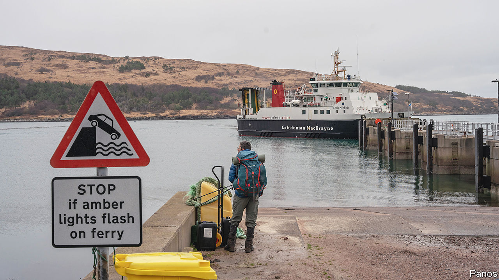

###### Ferry bad indeed

# What broken ferries reveal about Scotland’s government 

##### A sorry tale of mismanagement and waste 

 

> Aug 5th 2023 

WHEN OVER a quarter of your population rises up in protest, something is seriously amiss. In June some 500 of the 1,900 residents of South Uist, in the Outer Hebrides, demonstrated over their island’s wretched ferry service. For much of that month their vital connection to the mainland had been cancelled, one of a long-running series of transport problems for Scotland’s beleaguered coastal settlements. 

Ferry disruptions are costly. Island economies suffer when tourists or goods, including basics, are kept out. In August last year shops in South Uist imposed wartime-style rations, limiting sales of milk and bread. Some 90 inhabited Scottish islands rely on ferries. But the propellers have been coming off. Last year technical faults forced the state-owned Caledonian MacBrayne (CalMac)—which serves over 50 ports along 200 miles of the western coastline—to cancel 1,830 sailings, a 70% rise from 2019. Its ferries were on time on just 31 days in the year.

Ageing fleets are the main problem. When the pro-independence Scottish Nationalist Party (SNP) came to power in 2007 the average CalMac ferry had been in use for 17 years. Today it is a geriatric 25. Two new boats promised to CalMac are five years late, and will be vastly over their “fixed” price of £97m.

This reflects badly on the SNP. Just one-fifth of Scots think the government manages the ferries well. In April it emerged that Ian Blackford, the SNP’s former leader at Westminster, had asked the British Ministry of Defence temporarily to help manage the network. Such requests are normally reserved for emergencies. The Scottish government’s response is to dish out money. Two decades ago CalMac received £25.9m (around £42.8m today) in annual operating subsidies, some 30% of its gross revenue. Last year it was £157m, or 70%. 

The extra subsidies were required in part because eight years ago the Scottish government obliged operators to cut fares. That boosted ferries’ use just as the cost of fuel, maintenance and labour began to grow. In all, the government has awarded the operators a £700m budget to overhaul the ferry service. Two-thirds of CalMac’s fleet is supposed to be replaced by 2030. That looks as likely as Nessie showing up: no new boat has been built since 2017. 

A complex network oversees the ferries, including Transport Scotland and CalMac, the operator, and Caledonian Maritime Assets Ltd (CMAL), which owns the ferries and infrastructure. A parliamentary inquiry in June identified a “pass-the-parcel of responsibility culture” leading to bad decision-making. CMAL’s boss, Kevin Hobbs, rejected the criticism. 

The SNP’s nationalism has at times eclipsed its competence. A week before the independence referendum in 2014 Alex Salmond, then first minister, persuaded Jim McColl, a billionaire ally of the SNP, to buy Ferguson Marine shipyard—an emblem of Scotland’s shipbuilding heritage. The shipyard later secured an order for two new ferries from CMAL, despite submitting the most expensive bid and failing to provide a mandatory repayment guarantee if ships were late. It absorbed £45m in loans before going bankrupt in 2019; it was then nationalised. Documents recently obtained by the BBC suggested the shipyard had enjoyed preferential treatment when submitting its bid. 

CMAL has said an audit in 2018 found “no adverse issues” with the procurement. And ministers refuse to ditch the project: in June they vowed to keep building a vessel at Ferguson to protect its workers, though an official review suggested it would be cheaper to buy one elsewhere.

This is awkward for the first minister, Humza Yousaf, who was transport minister for a spell. Polls suggest a mauling for the SNP at the next British general election. The ferries saga has not helped the case for independence—indeed, it makes it likelier that voters will toss the SNP overboard. ■


