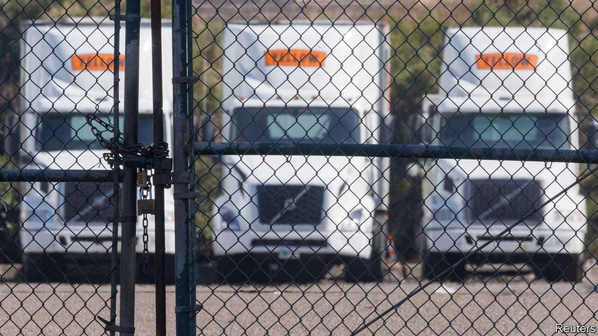
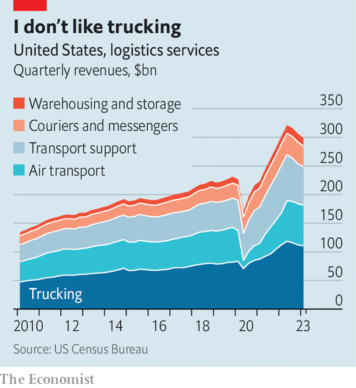

###### Logistic nightmares

# America’s logistics boom has turned to bust 

##### A pandemic-era frenzy of hiring and investment has gone into reverse 

 

> Aug 10th 2023 

ON AUGUST 6TH Yellow, one of America’s biggest trucking firms, declared bankruptcy and announced it would wind down operations after 99 years in business. It collapsed under the weight of falling sales and a mountain of debt. That is a heavy blow for its owners and 30,000 staff. It is also emblematic of a sharp reversal taking place in the American logistics industry.

Beginning in 2020 lavish stimulus cheques, combined with a lockdown-induced squeeze on services spending, led American consumers to splurge on goods. Appliances, cars and furniture clogged up ports, warehouses and truck depots. Online deliveries surged as shoppers shunned stores, adding to demand. As consumers groaned over lengthy delays, revenues in the logistics industry soared, increasing by roughly a third between the start of 2020 and mid-2022, according to America’s Census Bureau. Firms in the industry hired 1m workers and built 1.8bn square feet (nearly three Manhattans) of new storage space on hopes that the frothiness would continue.

 


Now, as the forces that fuelled its rise fizzle out, America’s logistics boom is turning to bust. Consumers are trading the material for the experiential, opting to splash out on holidays and hospitality rather than Hoovers. Goods spending, adjusted for inflation, has stagnated, leaving retailers with excess inventories. Consumers are also returning to physical stores, reducing the number of miles their goodies need to travel to reach them. Revenues in the logistics industry have now clocked up three consecutive quarter-on-quarter declines (see chart). The Cass Freight Index, a measure of rail and truck activity, is down by 5% over the past year. The volume of goods flowing through American ports in July was 14% lower than in the same month last year, according to Descartes, a supply-chain-technology company.

As demand has slumped, so, too, have prices. The cost of “dry van” shipping—the most common way to transport non-perishable goods on the road—is 21% lower than in early 2022, according to DAT Freight &amp; Analytics, a logistics-data provider. That, in turn, is squeezing margins and putting less competitive firms out of business. Some 20,000 truck operators, nearly 3% of the national total, have ceased activity since mid-2022, says ACT Research, another data provider.

Those that have survived are shedding staff. American parcel-delivery firms have jettisoned 38,700 workers since October last year when employment in the sector peaked, based on data from the Bureau of Labour Statistics. Warehouse operators have cut 60,800. More retrenchments are likely to come, given the frenzied hiring of the past few years. Lay-offs in the industry have thus far fallen short of what one might expect given the stagnation in consumer spending, argues Aaron Terrazas, chief economist of Glassdoor, an employment portal. Having long suffered from labour shortages, many firms have been reluctant to lay off workers, reckons Tim Denoyer of ACT Research. 

Investments are being slashed, too. The number of warehouses under construction in America has fallen by 40% from a year ago, observes Prologis, a warehousing giant. Amazon, America’s biggest online retailer, doubled its warehouse footprint in the country during the pandemic. In the past year the e-empire has either postponed investments in, scrapped plans for or closed 116 properties, reckons MWPVL, a logistics consultancy. 

Troubles with unions are adding to the industry’s headache. Earlier this year dockworkers at several west-coast ports went on strikes linked to pay negotiations. UPS and FedEx, America’s two largest parcel-delivery businesses, have also faced unrest. Yellow’s management blames its collapse on the Teamsters union, which blocked a restructuring plan.

Optimists hope the sector will start moving again in the second half of the year, once retailers finish clearing their excess inventories and start restocking their shelves. Analysts expect UPS, whose revenues have shrunk year on year for the past three quarters, to return to growth before the end of 2023. FedEx is expected to be growing again by next year. That may well come to pass, provided the American economy continues to be surprisingly strong. But it will be cold comfort for the businesses that will have gone bust along the way. ■


