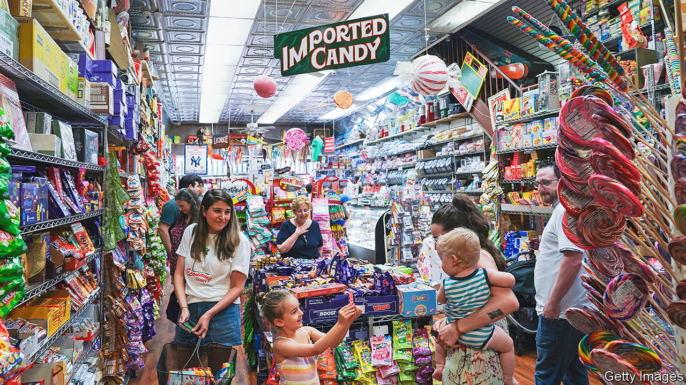
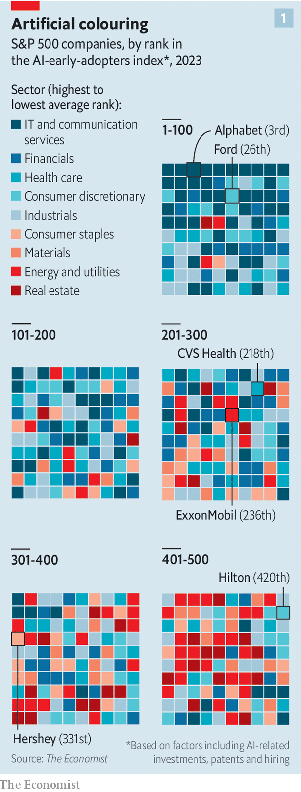
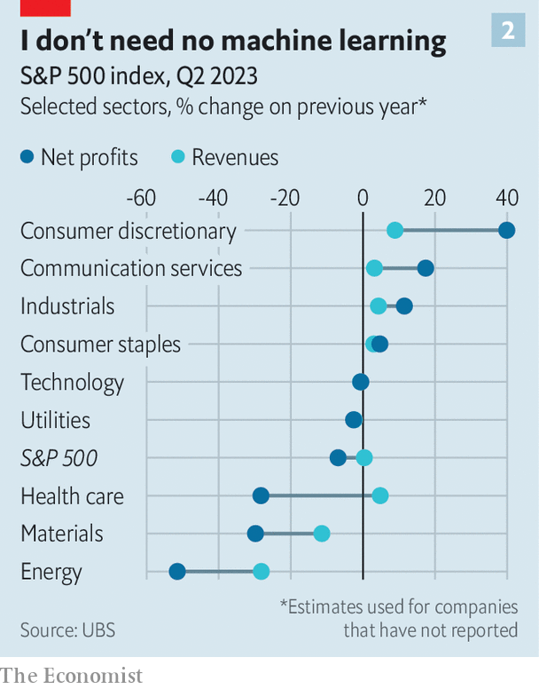

###### The view beyond the Valley

# Beyond the tech hype, how healthy is American business? 

##### Most parts of the non-AI economy are doing surprisingly well 

 

> Aug 6th 2023 

TEN MONTHS ago the spectre of recession haunted corporate America. Inflation was rampant, profits were depressed and the Federal Reserve was tightening the screws. Instead, inflation has moderated, the jobs market remains tight and recession is no longer a certainty. The prospect of an elusive “soft landing” has combined with hype over the productivity-boosting promise of artificial intelligence (AI) to give . This year the S&amp;P 500 index of big firms is up by nearly a fifth. 

 


Markets are especially bullish about a few large technology companies and carmakers. These are among the s&amp;p 500’s most ai-obsessed members, according to our  (which takes into account factors such as ai-related patents, investments and hiring, see chart 1). They have done well in the here and now, too: all reported respectable second-quarter results in the latest earnings season, which wraps up soon. But what about the health of the broad swathes of the American economy that are less affected by all the tech hype? Here the picture is more complex, but ultimately reassuring. 

Start with the bad news. Some of the businesses least prepared for an AI future are suffering in the present. Health-care companies look sickly: UBS, a bank, estimates that their profits slumped by nearly 30% compared with last year (see chart 2). CVS Health, a chain of chemists (ranked 218th in our AI index), is slashing 5,000 jobs after its earnings sank by 37%. Energy firms made half as much money in the second quarter of 2023 as they did a year earlier, when Russia invaded Ukraine, pushing up oil and gas prices. With other commodity prices also down, in part owing to weak demand from a sluggishly growing China, materials firms’ profits fell by 30%. 

As a result, overall earnings for S&amp;P 500 firms are estimated to have slid by 5% in the second quarter, year on year, reckons FactSet, a data provider. That is the biggest decline since early in the pandemic. 

 


Yet the pain has been concentrated in a handful of sectors. Dig deeper, and much of the non-AI economy looks surprisingly robust. Capital-goods manufacturers, such as Caterpillar and Raytheon (which come in at 204th and 340th in our ranking), are reckoned to have collectively increased their revenues by more than 8% in the second quarter, and their profits by twice as much—perhaps thanks in part to President Joe Biden’s taste for industrial policy. Even the oil-and-gas giants are doing better than the headline numbers suggest. The largest of them, ExxonMobil (ranked 236th), made nearly $8bn in net profit—down by 56% year on year but, bar that record-breaking result in 2022, still its highest second-quarter figure in nearly a decade.

The resilience is perhaps most obvious for businesses with fortunes tied to the condition of the American consumer, who remains in rude health. Pedlars of staples, such as foodstuffs and household goods, saw their profits rise by 5% year on year, according to UBS. For purveyors of non-staple consumer goods, earnings shot up by 40%. On August 1st Starbucks, a coffee-shop colossus (ranked 116th in our AI index), reported a quarterly operating profit of $1.6bn, up by 22%. The next day Kraft Heinz, a seller of ketchup and baked beans (ranked 253rd), said it made $1.4bn in operating profit, two and a half times what it did a year ago. 

Consumer-goods firms have held on to pricing power. Confectioners, for example, are charging 11% more for chocolates than they did last year, according to the Bureau of Labour Statistics. Hershey (331st) has offset the rising cost of cocoa—and then some. Its operating profit rose by 23%, to $561m. PepsiCo (245th) lifted prices of its soft drinks and snacks by 15% in the second quarter alone. Its operating profit bubbled up by three-quarters, to $3.7bn. It now expects to increase sales by 10% and net profit by 12% this year, up from an earlier forecast of 8% and 9%, respectively.

Americans aren’t just spending on sweets and cola. Air travel is recovering rapidly, particularly for international trips. American Airlines (266th in our AI index), Delta Air Lines (193rd) and United Airlines (183rd) collectively reported net profits of $4.2bn last quarter, the most since 2015. Hotels are inundated with leisure and business travellers. Hilton (a chain ranked a lowly 420th) said that its revenue per available room, a preferred industry measure, was up by 12%, year on year.

How long can the bonanza last? Shoppers are gradually drawing down the savings they accumulated during the pandemic, when they received stimulus cheques from the government but lacked ways to spend them. Between August 2021 and May this year, households spent over $1.5trn of these savings, according to the Federal Reserve Bank of San Francisco. 

At that rate they will burn through the $500bn or so they still have before the end of the year. Although unemployment remains near historic lows, at 3.5% in July, wage growth has slowed. The resumption of student-loan repayments in October, after the Supreme Court struck down Mr Biden’s plan to cancel some student debts altogether, could see consumer spending fall by as much as $9bn a month, according to Oxford Economics, a consultancy. 

If rising interest rates eventually curb demand, firms will find it harder to continue raising prices, leaving margins more vulnerable. Higher rates will also knock businesses with weak balance-sheets. In the first half of this year 340 companies covered by S&amp;P Global, a credit-rating agency, declared bankruptcy, the highest number since 2010. More could suffer a similar fate, especially if a recession does hit. 

That eventuality is not completely out of the question. Goldman Sachs, a bank, thinks there is a 20% chance of a recession in America in the next 12 months. Citigroup, another lender, expects a downturn at the start of 2024. If that happens, not even the AI-friendliest firms will emerge completely unscathed. ■


