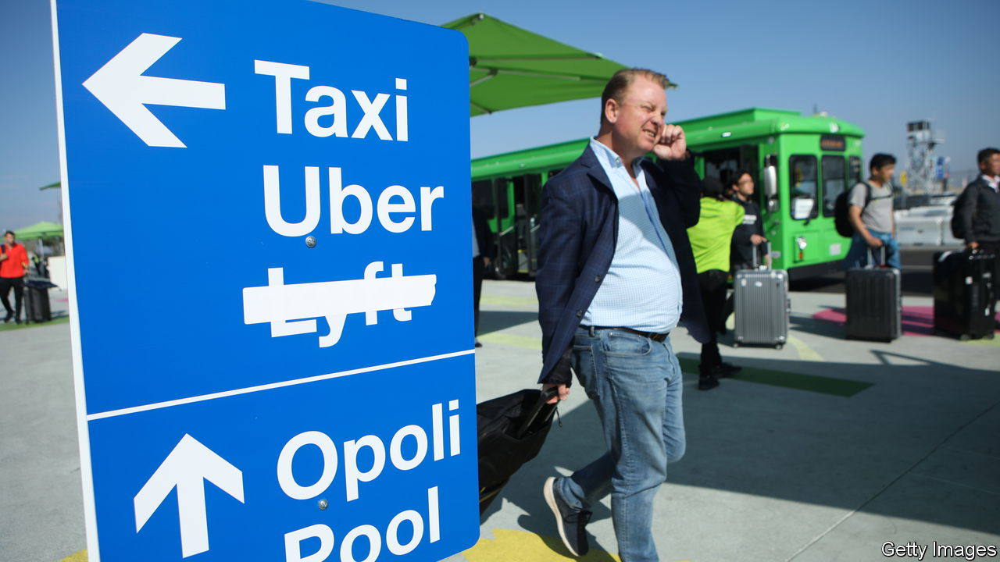

###### Not-so-super pumped

# Can Uber and Lyft ever make real money? 

##### Ride-hailing seems a long way from generating riches for investors 

 

> Aug 10th 2023 

IT HAS BEEN a bumpy journey for investors in Uber, the world’s biggest ride-hailing company, since it was listed in 2019. In its first six months as a public company Uber’s share price plunged by a quarter as doubts swirled over whether the perennial lossmaker would ever turn a profit. Thereafter it has seesawed, soaring amid the pandemic-era craze for tech stocks, then diving back down as rising interest rates spoiled investors’ appetite for businesses reliant on cheap funding.

Since its nadir in July last year signs of greater financial discipline have pushed the price of Uber’s shares back to where they first traded in 2019. Costs have come down; fares are up. This month the company reported an operating profit of $326m for the second quarter of the year, its first time in the black. Uber’s glee was heightened on August 8th when Lyft, its domestic arch-rival, reported yet another operating loss, of $159m. Lyft’s market value remains in the doldrums, down by 85% from the level at which its shares began trading publicly in 2019, six weeks before Uber’s.

Still, for Uber, breaking even is a low bar for success. Even adding in the latest profit, the company has clocked up $31bn of net losses since its first available results in 2014. Investors now have $21bn of invested capital tied up in the company. Annualising its most recent quarterly operating profit implies a return on that capital of roughly 5% after tax. That is less than half the company’s current cost of capital, suggesting that investors’ money could be more fruitfully deployed elsewhere.

The hope, of course, is that Uber’s profits, having broken above ground, will now soar into the stratosphere. Hold your horses. In the past five years over 60% of the firm’s revenue growth has come from businesses other than ride-hailing. Most important has been food delivery, which surged during the pandemic. Uber’s profit margin—before interest, tax, depreciation and amortisation—when ferrying meals is less than half that when ferrying people. 

Uber promises that the business will continue becoming more lucrative as it matures. Yet margins for DoorDash, which generates nearly three times Uber’s food-delivery sales in America, are barely better. In freight, Uber’s third line of business, the company is losing money as it fights for space in a  in the throes of a downturn.

A further concern is Uber’s focus on expansion beyond America, where it is now scarcely growing. Although it does not split out profits by geography, its margins are probably best in America, where it captures nearly three-quarters of sales in the ride-hailing market. Elsewhere, it faces stiff competition from local rivals: Bolt and FREENOW in Europe, Gojek and Grab in South-East Asia, and Ola in India. That will keep a tight lid on margins.

Investors’ bet on Uber was predicated on the idea that ride-hailing is a winner-takes-all business. That justified torching billions of dollars in a race for market share, which Uber is, seeing Lyft’s woes, indeed winning—at least at home. Whether taking it all turns Uber into the colossal cash machine investors once hoped for is another question. ■


