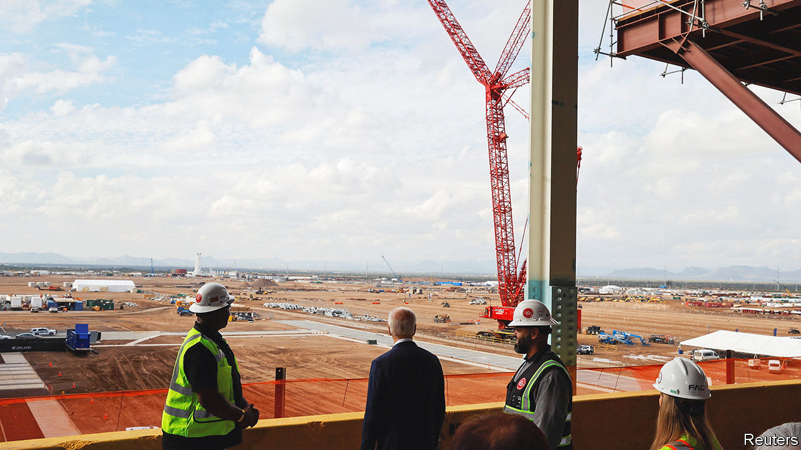
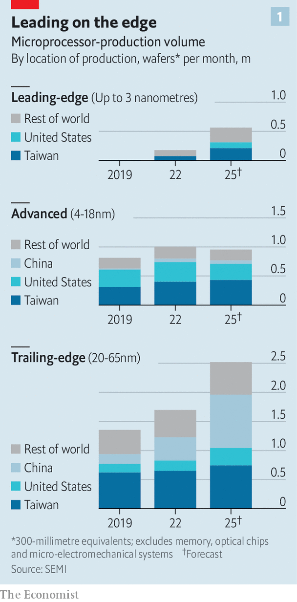
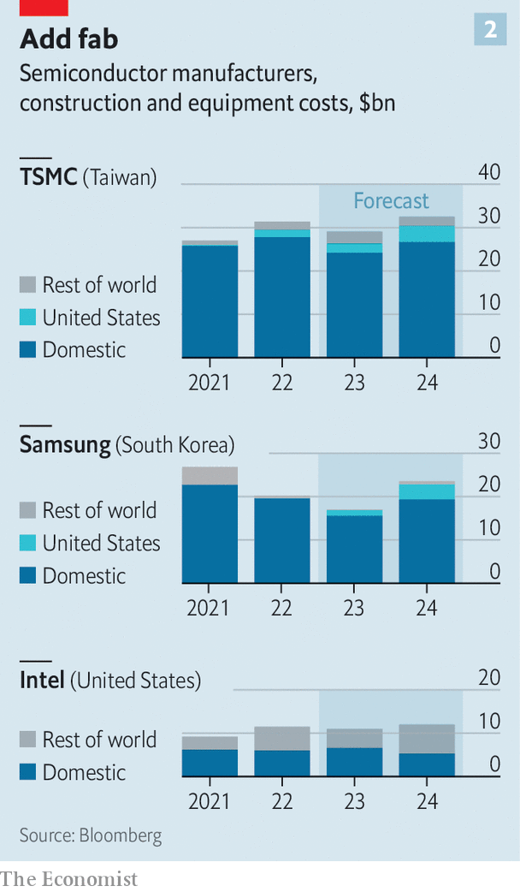

###### Let the chips rise where they may

# How real is America’s chipmaking renaissance? 

##### As the CHIPS Act turns one, semiconductor firms have mixed feelings 

 

> Aug 7th 2023 

AMERICAN CHIPMAKERS account for a third of global semiconductor sales. They design the world’s most sophisticated microprocessors, which power smartphones, data centres and, increasingly, artificial-intelligence (AI) models. But neither the American firms nor their Asian contract manufacturers make any such leading-edge chips in America. Given chips’ centrality to modern economies—and, in the age of AI, to war-fighting—that worries policymakers in Washington. Their answer was the CHIPS Act, a $50bn package of subsidies, tax credits and other sweeteners to bring advanced chipmaking back to America, which President Joe Biden signed into law on August 9th 2022. 

 


On the surface, the law appears to be having an impact. Since 2020, when it was first floated, chipmakers have announced more than $200bn-worth of investments in America. If all goes to plan, by 2025 American chip factories (fabs, in the lingo) will be churning out 18% of the world’s leading-edge chips (see chart 1). TSMC, a Taiwanese manufacturing behemoth, is splurging $40bn on two fabs in Arizona. Samsung of South Korea is investing $17bn in Texas. Intel, America’s chipmaking champion, will spend $40bn on four fabs in Arizona and Ohio. As the CHIPS Act celebrates its first birthday, and as the administration prepares to start doling out the money, both Democrats and Republicans, who agree on little else these days, regard it as a bipartisan triumph.

Any triumphalism may, however, be premature. Leading-edge fabs being built in America are slower to erect, costlier to run and smaller than those in Asia. Complicating matters further, the chipmakers’ American investment binge comes at a time when demand for their wares appears to be cooling, at least in the short term. That could have consequences for the industry’s long-term profitability.

The Centre for Security and Emerging Technology, a think-tank, estimates that in China and Taiwan companies put up a new plant in about 650 days. In America, manufacturers must navigate a thicket of federal, state and local-government regulations, stretching average construction time to 900 days. Construction, which makes up around half of the capital spending on a new fab, can cost 40% more in America than it does in Asia. 

Some of that extra cost can be defrayed by the CHIPS Act’s handouts. However, that still leaves annual operating expenses, which are 30% higher in America than in Asia, in part owing to higher wages for American workers. If those workers can be found at all: in July delayed the launch of its first fab in Arizona by a year, to 2025, because it could not find enough staff with semiconductor industry experience.

The planned American projects’ smallish size further undermines the economics. The more chips a fab makes, the lower the unit cost. In Arizona, TSMC plans to make 50,000 wafers a month—equivalent to two “mega-fabs”, as the company calls them. Back home in Taiwan, TSMC operates four “giga-fabs”, each producing at least 100,000 wafers a month (in addition to numerous mega-fabs). Morris Chang, TSMC’s founder, has warned that chips made in America will be more expensive. 

 


C.C. Wei, the current chief executive of TSMC, has hinted that the company will absorb these higher costs. He can afford to do this because TSMC will continue to make the lion’s share of its chips more cheaply at home, not in America. The same is true of Samsung, which will spend nearly 90% of its capital budget in South Korea. Even Intel is investing as much in foreign fabs as in American ones (see chart 2). As a result, if all the planned investments materialise, America will produce enough cutting-edge chips to meet only about a third of domestic demand. Apple will keep sourcing high-end processors for its iPhones from Taiwan. So, in all likelihood, will America’s nascent AI-industrial complex.

The law may have unintended consequences, too. Chip firms that accept state aid are barred from expanding fab capacity in China. This may put firms like TSmc and Samsung, which have plenty of Chinese customers, off investing more in American fabs. It is also leading Chinese chipmakers to invest in producing less fancy semiconductors. The hope is that lots of older-generation chips can do at least some of what fewer fancier ones are capable of.

According to SEMI, an industry group, in 2019 China made a fifth of “trailing-edge” chips, which go into everything from washing machines to cars and aircraft. By 2025 it will produce more than a third. In July NXP Semiconductor, a Dutch maker of trailing-edge chips, warned that excess supply from China is putting downward pressure on prices. In the long run, this could hurt high-cost Western producers—or even drive some of them out of business. In July Gina Raimondo, America’s commerce secretary, acknowledged that China’s focus on the trailing edge “is a problem that we need to be thinking about”.

Hardest to predict is the CHIPS Act’s effect on the semiconductor industry’s notorious boom-and-bust cycle. Usually chipmakers would be boosting capacity at a time of rising demand. Right now the opposite is true. Pandemic-era chip shortages have been replaced by a glut, now that consumers’ insatiable appetite for all things digital seems, after all, to be sated. TSMC’s sales declined by 10% in the second quarter, year on year, and the firm now expects a similar drop for the whole of 2023. Intel’s revenue was down by 15% in the same period. Samsung blamed a chips glut for its falling revenues and profits. 

Chip executives point out that prospects for their industry remain rosy. They are probably right that demand is bound to revive at some point. Yet “inventory adjustments” (reducing oversupply, in plain English) are taking longer than expected. And when inventories finally adjust, the business that emerges may be less lucrative. Since early 2021 Intel, Samsung and TSMC have lost a third of their combined market value, or nearly half a trillion dollars. A few more anniversaries may be needed before the CHIPS Act’s impact on American economic security can be properly evaluated. Investors are already making up their minds. ■


