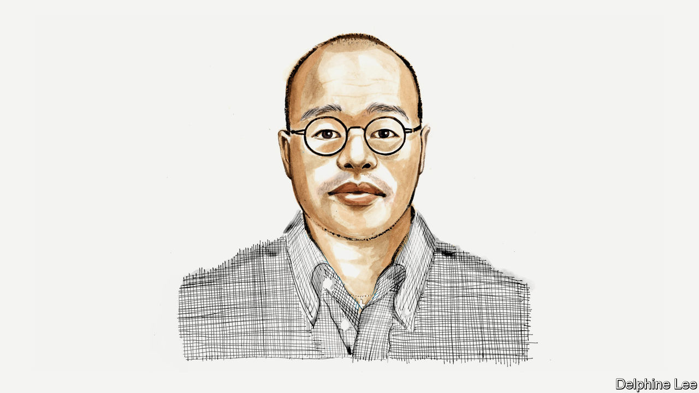

###### Hong Kong’s democratic deficit

# Sebastien Lai on the erosion of freedoms in Hong Kong 

##### Investors should be just as worried as democracy campaigners, says the son of a jailed newspaper owner 

 

> Aug 7th 2023 

HONG KONG’S authorities would have the world believe that the city, after three years of crippling covid restrictions, is open for business. Their ongoing  on the rights and  that made Hong Kong a global centre for trade and finance tells a different story.

In a speech aimed at bolstering investor confidence in Saudi Arabia last October, the territory’s financial secretary, Paul Chan, spoke of its “very promising” prospects. Hong Kong will continue to develop as an international financial centre, Mr Chan said, citing among other things a commitment to “maintaining the common-law system and independently exercising judicial power”.

On the very same day, a Hong Kong court convicted my father, Jimmy Lai, of two counts of fraud stemming from a commercial-lease violation. For this, he was given five years and nine months in prison—a sentence previously unheard of for a lease violation. As concerning as the other political charges in his upcoming national-security trial in September are, global investors should be most alarmed by the conviction and sentencing on such thin commercial grounds, and the fact that my father is a British citizen.

My father, the founder and publisher of , Hong Kong’s largest pro-democracy newspaper, has been behind bars since December 2020. On top of his fraud charges, he has been convicted of four counts of unauthorised assembly, one of which was for lighting a candle at a vigil for the victims of the Tiananmen Square massacre. In an interview before his arrest he told the BBC that the draconian national-security law which took effect in mid-2020 was the death knell for Hong Kong. The territory’s government has, it would seem, been eager to prove him right.

The city’s efforts to lure back businesses with the “Hello Hong Kong” campaign launched in February include promising international visitors “new opportunities” in “Asia’s World City”. Glaringly absent from these advertisements is the very reason they are needed in the first place: the ongoing exodus of Hong Kongers spooked by the erosion of social and political freedoms. More than 144,000 have moved to Britain alone since the national-security law took effect.

Ironically, assurances from the administration of John Lee, the territory’s chief executive, about the rule of law and an independent judiciary reveal its insecurity: that these institutions are no longer the reliable bedrocks of the city they once were. This is an existential crisis for Hong Kong as a financial centre. The rule of law and the reliability of its institutions were key to its prowess in financial services, a major source of its prosperity. 

Hong Kong authorities’ repressive behaviour at home should make businesses and their employees think twice about operating in the city. They should not be fooled by the international charm offensive. A month after the campaign’s launch, authorities arrested Elizabeth Tang, a union leader, after she returned to the city to visit her husband, who is one of the scores of politicians Hong Kong continues to keep in jail. The following month they arrested a student who had returned home from studying in Japan for her social-media posts while abroad.

Another cause for caution is the wide powers the law grants the police in relation to businesses. Security forces can now conduct searches of any premises or devices, demand information, freeze assets, confiscate passports, intercept communications and conduct covert surveillance to investigate anything perceived to be a threat to vaguely defined national-security violations. All this they can do without a court order. 

The law also does away with basic common-law principles such as the presumption in favour of granting bail. Trials are held without juries by a panel of government-appointed judges. The city’s security secretary has boasted of a 100% conviction rate under the new national-security law—hardly a sign of a healthy, independent justice system. With each day Hong Kong’s laws and courts look more and more like China’s.

Already these powers have been invoked to close down my father’s newspaper. In mid-2021 the law was used to send 500 police officers to raid its newsrooms, arrest its leadership and freeze its assets. These are not the actions of a government that tolerates transparency and openness. Nothing prevents the government from behaving in the same way against any business operating in Hong Kong.

Then there is the law’s extraterritorial claim. Hong Kong reserves the right to prosecute anybody who has breached the law anywhere in the world. In July the authorities announced HK$1m ($130,000) bounties on eight self-exiled dissidents, signalling that they are willing to further jeopardise Hong Kong’s international standing to stage a grand performative gesture of loyalty to Beijing. 

Those who believe businesses will be immune to the consequences of a compromised legal system do so at their peril. The judge who convicted my father insisted in his judgment that the sentence was a commercial one, free of political considerations. This sets a dangerous precedent. The government is now free to pursue politically motivated prosecutions under the guise of purely commercial transgressions without even having to invoke the national-security law.

The authorities pay lip service to the rule of law and due process while weaponising the courts to quell dissent. Actions speak louder than words. Hong Kong’s authorities have consistently shown they hold pleasing Beijing above all else, including guaranteeing a safe business environment and safeguarding the integrity of courts. 

My father now sits behind bars, approaching his 76th birthday and facing the possibility of spending the rest of his life in jail, for running a business that refused to be cowed by Beijing. His incarceration spells danger for every free-thinking person in the city. 

So the next time you hear one of Hong Kong’s smartly produced ads touting its business-friendly credentials, remember Jimmy Lai. ■


