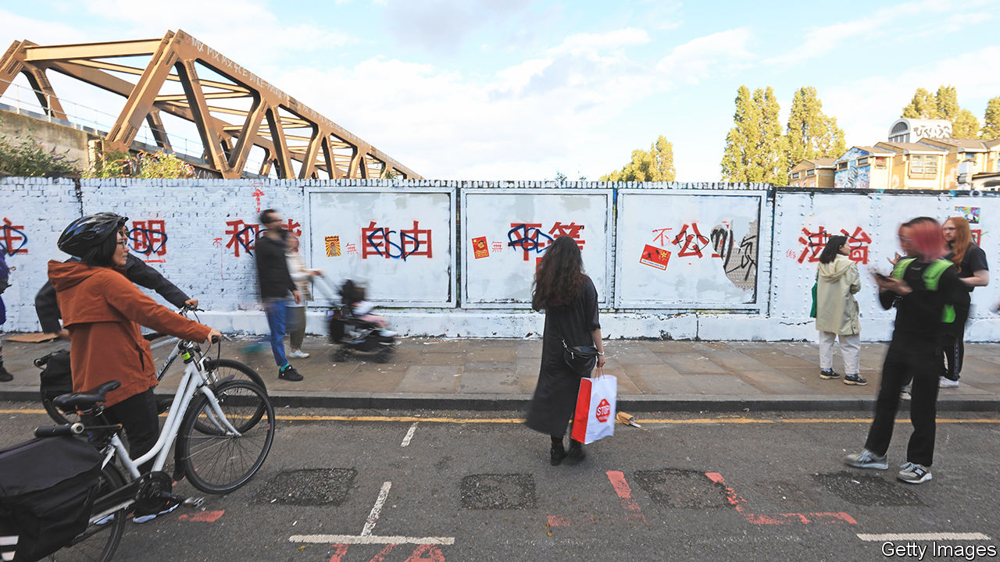

###### Party wall

# Chinese art students scrawled Communist graffiti in London’s Brick Lane 

##### Was it protest or propaganda? 

 

> Aug 10th 2023 

IN THE WINTER of 1978, two years after the death of the Communist leader Mao Zedong, Chinese intellectuals began pasting political posters on a wall near Beijing’s Forbidden City. Chinese authorities tolerated this “Democracy Wall” at first. But they soon clamped down. A curious inversion of this episode unfolded in London around August 6th when Chinese art students daubed Communist Party slogans on a wall in Brick Lane, a street famed for its curry houses and arts scene. Spray-painted in bright red paint against a white background were 24 large Chinese characters outlining the party’s 12 “core socialist values”. They included “harmony”, “patriotism” and “rule of law”.

The slogans are widely displayed across China as part of a campaign launched by its supreme leader, Xi Jinping, to popularise party ideals. But they are rarely seen abroad. Their sudden appearance in Brick Lane sparked an immediate backlash–including from many Chinese. Within hours, the slogans were covered in more graffiti. The word “no” was added before the Chinese characters for “democracy” and “freedom”. Above the word “equality”, someone wrote “But some are more equal than others.” Others decried the Chinese government’s recent crackdowns in Hong Kong, Tibet and Xinjiang.

Images of the wall soon spread on Chinese social media, triggering debate. Some nationalists hailed the artists as patriots while others suggested they had conceived an indirect form of protest, knowing the slogans would be defaced. The artists themselves added to the confusion. In a printed statement on the wall, they said their work was “a silent reminder” of the lack of free speech in China. But on Instagram, one suggested the aim was “to decolonize the false freedom of the West”. He later denied any political intent and expressed concern for his family’s safety.

Tower Hamlets, the London council that oversees Brick Lane, said it removed the graffiti after being alerted by security-camera operators. It warned that graffiti were punishable with fines starting from £80 ($102). The Democracy Wall protesters did not get off so lightly. Their figurehead, Wei Jingsheng, was jailed for almost 15 years.■


