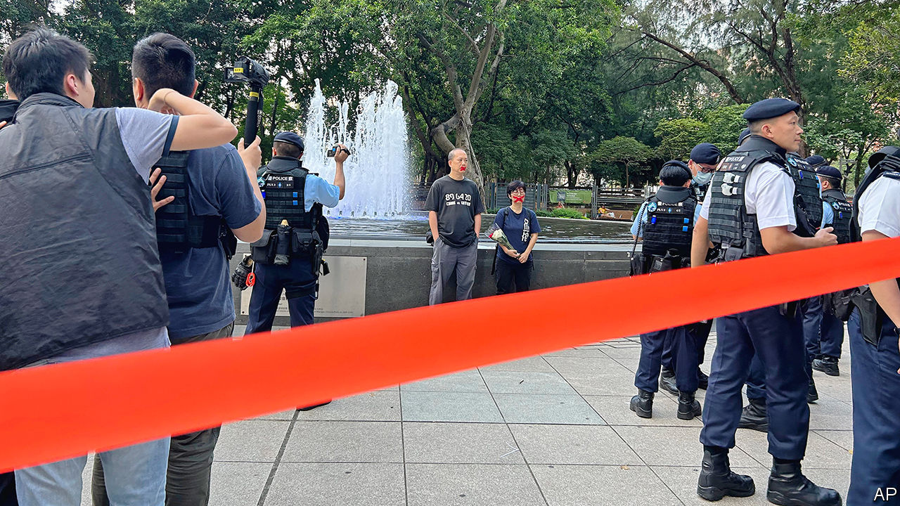
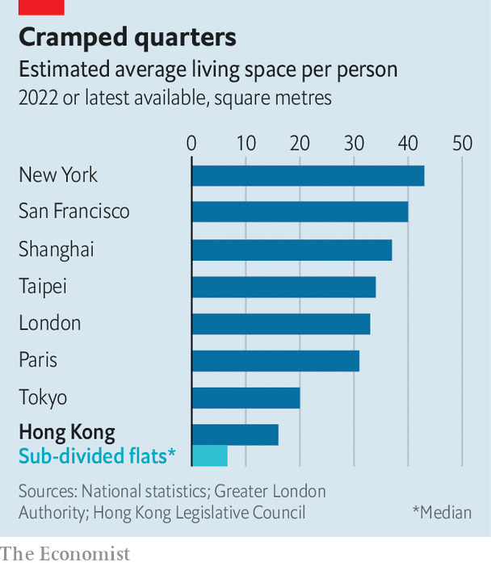

###### Widening the net

# Hong Kongers are bracing for an even wider clampdown on dissent 

##### Officials are sowing fear with vaguely worded warnings against “soft resistance” 

 

> Aug 7th 2023 

AN EXPLOSION OF anti-government discontent in Hong Kong in 2019 prompted China to impose a  on the territory to prevent further protests. Officials say this has helped: Hong Kong has achieved a “major transition from chaos to order”, they insist. But even after thousands of arrests and numerous trials, both under the new law and dredged-up statutes from the colonial era, the authorities are twitchy. Increasingly, they warn of “soft resistance” that could trigger fresh unrest. A new phase may be unfolding in Hong Kong’s war on dissent. 

For more than three years, fear instilled by the national-security law and other signs of China’s tightening grip on the territory has deterred most people with political grievances from attempting to stage demonstrations. Until they were scrapped in December, covid-related restrictions on public gatherings may also have helped to keep protesters off the streets. Some of those who were at the forefront of the months-long upheaval in 2019 have fled. Since then, Hong Kong has seen its biggest wave of emigration in decades and the labour force has shrunk by over 5%. 

Though cowed, Hong Kong still feels different from cities on the Chinese mainland. Controls on speech, news media, books and culture are less sweeping. China’s “great firewall” does not surround its internet: sites such as Facebook and Google are not blocked in Hong Kong. In the rest of China, the Communist Party is omnipresent. In Hong Kong it operates largely out of sight, its watchful eyes not so keenly sensed in people’s day-to-day lives. Opportunities for the government’s critics to express themselves have become scarcer (since 2019 pro-democracy types have been purged from Hong Kong’s political institutions). But they do, precariously, exist. 

On July 28th Hong Kong’s High Court rejected a government request to ban a favourite protest song that demonstrators sang in 2019, saying an injunction could undermine “freedom of expression”. (The government has filed an appeal.) Such a ruling would be unthinkable on the mainland. Equally unimaginable would be the kind of access given to the public (including foreign visitors—no ID required) to observe Hong Kong’s national-security trials. These are grim, juryless spectacles, but local media give accounts of proceedings. Citizen journalists help provide extra detail of defendants’ feisty testimony. 

But many Hong Kongers wonder how much longer the territory can retain these shreds of distinctiveness. Their fears have been stoked by officials’ remarks about soft resistance. No authoritative definition has been given of the term, but it appears to refer to a broader range of activity than the crimes of subversion, secession and the like that are covered by the national-security act and the territory’s anti-sedition law (a long-disused relic of British rule that is enjoying a new lease of life). The way the term is often used by party-controlled media suggests it could apply to any political activity that the government dislikes. 

It was a mainland official, Luo Huining, who raised the idea that Hong Kongers were putting up soft resistance. In 2021 Mr Luo, who was then the central government’s most senior emissary in Hong Kong, called for such behaviour to be “regulated by law”. He did not elaborate. 

In recent months officials in Hong Kong have picked up on the theme. Their strident tones on the subject suggest a push from Beijing. “Various acts of soft resistance continue to occur and spread through online media, cultural and artistic channels,” said John Lee, the territory’s chief executive, in June. “These latent forces could erupt at any time, endangering national security and disrupting social peace.” Later that month he told state television that such acts required Hong Kong to be “especially vigilant”. On July 24th, in response to a local newspaper, Hong Kong’s security chief, Chris Tang, said there must be “absolutely no compromise” on the matter. “It is imperative that we fight soft resistance with all our strength.”

The court’s decision not to outlaw the protest song, “Glory to Hong Kong”, is a hiccup. The anthem’s circulation online has been cited by pro-government media as an example of soft resistance (as has the alleged leniency of some judges when sentencing protesters). But the impact will be minor. Two of the song’s lines echo the words of a protest slogan—“Liberate Hong Kong, revolution of our times”—which the government has declared subversive. Police have swooped on the handful of individuals who have dared to play the tune in public since the imposition of the national-security law. The court’s ruling is unlikely to encourage more to try. 

Blurred red lines

Officials’ talk of soft resistance replicates a tactic often used by their counterparts on the mainland: that of sowing fear with vaguely worded warnings rather than explicit reference to laws. Mr Lee, the chief executive, said “destructive forces” in Hong Kong were often engaging in soft resistance “below the red line of lawbreaking”. The idea, it appears, is to keep people well clear of that line by blurring it. Hong Kong’s two main party-controlled newspapers, and, attack those who stray too close. Their commentaries are widely assumed to reflect the views of mainland officials who pull the strings of Hong Kong’s government from behind the scenes. 

Leticia Wong is someone in their sights. She runs a small bookshop called Hunter in Sham Shui Po, one of the city’s poorer neighbourhoods and a magnet for young, upwardly mobile people in search of cheap accommodation. Ms Wong, who is 30, resigned from her elected post on a local council in 2021 after the government required every public-office holder to swear an oath of loyalty to the People’s Republic. She believed she would be disqualified for being insincere. Ms Wong opened Hunter last year, offering books related to the protests of 2019 and other sensitive topics.

Even under the national-security law, specific books are rarely banned in Hong Kong. Last year, however, five speech therapists were jailed for sedition. Their crime was to publish a children’s book that seemed to portray Hong Kongers as sheep fending off wolves (apparently representing China). And self-censorship abounds. Libraries have removed works they believe may fall foul of the new law: books about the pro-democracy upheaval that engulfed mainland China in 1989, for example, or those written by Hong Kong’s jailed activists. In May Mr Lee said public libraries should ensure they do not “spread any kind of messages that are not in the interests of Hong Kong”. He also noted that books about the Tiananmen Square protests could be found in private shops. If people “want to buy, they can buy”, he said. That is true, but the campaign against soft resistance may change that. 

In May an article in  featured Ms Wong and her bookshop. “Her anti-China, chaos-inducing evildoing in Hong Kong has long been known to everyone,” it said. “After the implementation of Hong Kong’s national-security law, she still did not repent…She continued engaging in soft resistance by selling books that are anti-government or confrontational.” Ms Wong laughs at this—such accusations drive up footfall, she says. “More people come to buy books and see if I’m still alive.” Nearly a third of her customers are from the mainland, she reckons.

Ms Wong still pushes the envelope. In July she organised a book fair in a room above a nearby clothing shop. It provided a handful of independent publishers with space to display works of a kind unlikely to be seen in the territory’s official book fair that was being held in a convention centre. A popular offering at Ms Wong’s event was “Deaf Voice in Court”, a book about the travails of defendants with hearing difficulties, including someone charged with assaulting a policeman during the protests in 2019.  said that among the “main attractions” of the official event was an updated edition of “An Outline for the Study of Xi Jinping Thought on Socialism with Chinese Characteristics for a New Era”. Mr Xi is China’s leader. 

But Ms Wong is pessimistic. “I don’t think they are smart enough to leave some room for Hong Kong people like me,” she says. On Facebook, she hinted at the political pressures facing her. She said she thought her bookshop would not survive to put on another fair next year. 

 


The soft-resistance label is being attached even to people who are far removed from the front lines of dissent. In May a full-page article in  attacked activists who have been campaigning on behalf of residents of Hong Kong’s notorious “subdivided flats”: small apartments that have been converted into multiple dwellings, often with only just enough room to fit in two bunk beds (see chart). Such accommodation has been multiplying in recent years to satisfy demand from people who are on years-long waiting lists for public housing, or unable to afford the sky-high prices of property. 

Chinese officials say grievances over Hong Kong’s acute shortage of affordable housing were a leading cause of the unrest in 2019. The city’s government has vowed to speed up construction of subsidised flats. Yet  suggested that complaining about these efforts could spark renewed unrest. It said vigilance was needed against people who use the housing issue as a form of soft resistance by arousing “negative emotions among citizens”. A sinister-looking graphic showed recent tiny housing-related protests morphing into tear-gas filled scenes from 2019. 

Soft resistance may get harder

Eyes are now turning to new security-related legislation that the government says it will enact this year or next. Doing so is mandated by Article 23 of Hong Kong’s constitution, the Basic Law, but public misgivings—highlighted by a massive protest in 2003—have delayed the task until now. Ominously, Mr Tang, the security chief, told  in July that drafters of the bill were “paying attention to soft resistance” as well as “loopholes” in existing law involving the internet. 

Kiwi Chow, a film-maker, is feeling the chill in his business. Two years ago his documentary about the unrest of 2019, “Revolution of Our Times”, became a hit among Hong Kongers abroad (cinemas in the territory will not show it). His most recent movie, a romantic comedy, has nothing to do with politics. Yet his mere association with a protest-related film sent investors and actors scurrying. To complete it, he had to raise money from friends. His family fears he may be arrested at any time, he says. But he brushes off the government’s warnings about soft resistance. “I won’t try to guess what they want, because that would keep haunting me.” ■


