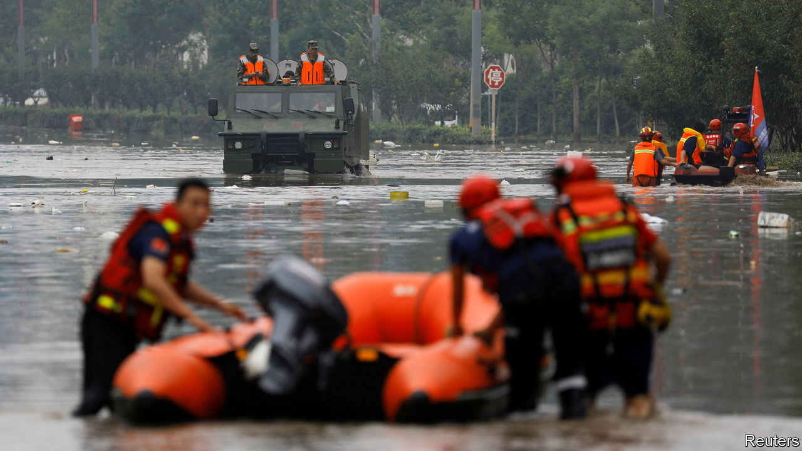

###### When it rains

# Northern China has been hit by devastating floods 

##### The official response gives a glimpse of the Beijing government’s priorities 

 

> Aug 10th 2023 

ON THE ARID north China plain around Beijing, people usually complain there is too little water, rather than too much. But in recent weeks a typhoon named Doksuri made its way unusually far inland. On July 28th the storm made landfall on China’s eastern coast. Its remnants arrived in northern China the next day, bringing rains heavier than any recorded since China’s last imperial dynasty.

Beijing and the surrounding province of Hebei were hardest hit. In just four days 331mm of rain fell on the capital, as much as it usually sees in six months. The capital’s centre escaped the worst of the flooding, but suburbs and towns to its south and west suffered. Over 1.6m people were evacuated. Tens of thousands of homes were destroyed. Bridges and roads were damaged. Power outages and mountainous terrain hampered relief efforts. 

The rains then moved to the broad plains of north-eastern China, where much of the country’s rice and maize is grown. Rivers overflowed, drowning crops and flattening greenhouses. Locals are bracing for another typhoon that is expected to hit north-eastern China on August 11th, after passing through North Korea. At least 61 people are known to have died; the toll will rise as others are still missing. 

China’s state-run media are full of stories of heroic rescues. The People’s Liberation Army and thousands of firefighters were mobilised for evacuation efforts, in which several local officials died. Li Qiang, China’s prime minister, has promised to rebuild people’s homes in time for winter. About $160m of government funds have been released from ministries so far to help farmers. Regulators are pushing insurance companies to pay out for damage done to property. 

But not all are happy with how authorities have dealt with the floods. Some online criticise the apparent uselessness of the government’s “sponge cities”, which use greenery and storage tanks in a bid to soak up and collect stormwaters. Such cities appear to have been inundated despite such protective measures. Others complain that Beijing was prioritised at the expense of lesser places. Some residents in Zhuozhou, a small city in Hebei, have claimed online that floodwaters were diverted towards them to ease pressure elsewhere. Hebei’s Communist Party boss had called for the province to “act as a protective moat for the capital”.

The authorities have defended themselves. State-run media have pointed out that although sponge cities can be overwhelmed in extreme circumstances, they can still help reduce the impact of floods. Officials have also denied that Zhuozhou was sacrificed for Beijing. They have, though, acknowledged that flood water is released into less densely populated areas in extreme circumstances. 

This tactic is in fact written into flood-control laws—although many of those who live in such areas did not appear to know about them. The Ministry of Water Resources says that some people “have given up their homes to protect everyone”, and will be compensated. Beijingers, no doubt, will appreciate this cold logic. But it may sting those in small towns nearby.■


