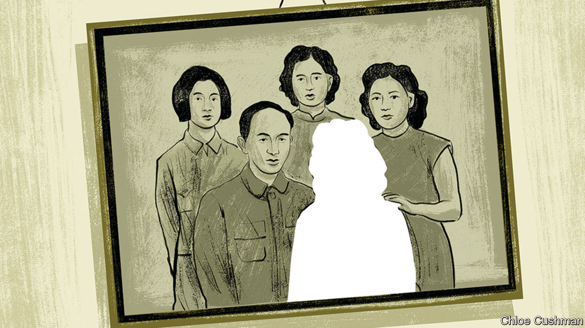

###### Chaguan

# Why Chinese women are denied legal land rights 

##### In the interests of order, the party sides with a reactionary majority 

 

> Aug 10th 2023 

In the tea-growing hills of southern China, bonds of blood make villages strong. Most residents of Lüchuwu, a village in the pine-clad highlands of Fujian province, share just two surnames between them. The clout of the Su family, in particular, is shown by a white-walled, red-pillared shrine bearing the inscription: “Su Clan Ancestral Hall”. Yet if family ties bind places like Lüchuwu, those bonds are also conditional. A woman may be born and brought up in a village that her ancestors built. But if she marries a man from elsewhere, custom deems her lost to her birth family and home village, as a , or “married-out daughter”. 

That harsh tradition has caused individual tales of heartache for centuries. To cite a cruel old saying, a married-out daughter was deemed as worthless as “thrown-away water”. But today, the collective financial losses suffered by China’s married-out women are growing. More rural land is rented out to agricultural companies or other businesses. Other land attracts compensation payments when local officials build on it. Since the 1990s China has encouraged the creation of local shareholding co-operatives to manage village assets and to distribute dividends.

Individual villages and co-operatives can and do take collective rights away from women who marry outsiders. Many such women lose their rights, though their household registration, or , remains lodged with their birth village. Some women are disowned even after returning to the house where they were born, perhaps coming home to care for ageing parents, or after being widowed or divorced. In contrast, lots of men spend years in another province and marry a bride from far away. As long as their is with their home village, they keep land rights.

This would seem to clash with national law, for gender equality is enshrined in China’s constitution. A growing number of village women agree. They have filed petitions, staged peaceful demonstrations and gone to court to defend land rights. Lüchuwu village is made up of five sections, or hamlets. Different groups of women have filed lawsuits in all five sections. 

Impressed, Chaguan headed to Fujian to meet some of them. He found a plaintiff surnamed Su—naturally—in her cement-walled, tile-floored village home. Mrs Su’s remains in Lüchuwu, where she was born and raised. She returned home after the birth of her youngest child, having spent some years in a coastal province running a small shop. Her young children study in a nearby school. Until her father’s death this year, both her parents lived in the village. She gave a donation when the Su clan hall needed repairs. Still, because she bore children to a man from another province (who still works as a migrant in a coastal city) she is deemed an outsider. A member of a group of 29 litigants, Mrs Su won her lawsuit. She has a county-court judgment upholding her membership of the village collective and awarding her over 50,000 yuan (almost $7,000). That was her share of compensation after village land was taken by the government. 

After Mrs Su’s legal victory, she says neighbours turned “vicious”. A local official told her she was a thief who should be arrested, and called court judgments good only “for wiping your arse”. Surprisingly often, villages reject a court’s jurisdiction over land rules that they set, and in truth the law is fuzzy. Defying the ruling, Lüchuwu officials have offered Mrs Su ever-larger sums to settle the case, though always less than 50,000 yuan. She wants her land rights acknowledged, though, and village bosses are not budging. She shares a name and ancestors with neighbours, she sighs. “But now nobody talks to me. It’s all about money, right?”

Mrs Su is surely correct. A neighbour, asked about the recent lawsuits, snaps that she lost out on land revenues from her own home village after she married a man from Lüchuwu. That being so, she does not see why any other married-out woman should fare better. Over tiny cups of tea in his office, the village party secretary, Su Qiang, describes long months of negotiations between women plaintiffs and village section chiefs, haggling over possible cash settlements. Puffing his way through a chain of Zhonghua cigarettes, Mr Su agrees that the sticking point is rights to land. 

The village has made concessions. Mr Su is proud of persuading locals to amend rules that stripped land rights from youngsters at university or in the army. Unlike some places, Lüchuwu offers a single share of land to families with two daughters and no sons (a family with two sons would get a share for each of them). But the party secretary growls that if today’s plaintiffs secure their demands, perhaps 70 more women would qualify for the same rights, and most locals oppose giving “a single cent”. 

Avoiding the wrath of a sexist majority

In truth, appeals to tradition are only half the story. Two of the oldest plaintiffs from Lüchuwu remember the Mao era, when a village and membership of an agricultural collective were a burden, not a potential source of dividends. Both old women are “married-out daughters”. When fees were needed to build a school, half a century ago, they were deemed collective members. Now that village land generates money, they are outsiders. Nationwide, conflicts about village membership exploded after the 1990s, as land near towns soared in value. In 2016 Central Party School researchers surveyed over 1,300 villages in three provinces: 84% of women and their families had lost membership rights.

The National People’s Congress is pondering changes to the law to improve the definition of village land rights and membership of rural collectives. Reformers see a chance to advance gender equality. Alas, appeasing majority opinion weighs heavily on officials whose greatest duty, arguably, is , or stability maintenance. The Communist Party came to power promising to emancipate women from feudalism. Now it co-opts ancestral clans and their patriarchal values. China’s rulers are obsessed with order, as an adjunct to power. And power is in the party’s blood. ■


