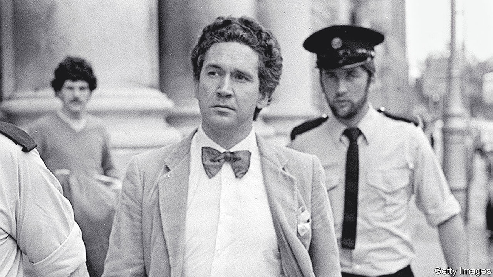

###### Back Story

# An infamous murderer and the truth about true crime 

##### “A Thread of Violence” is a scrupulous book in a compromised genre 

 

> Aug 8th 2023 

At the age of five, Malcolm Macarthur was kicked in the head by a horse. At least that is how his neglectful mother and a farmhand on his parents’ Irish estate recalled it. Wrong, insists Mr Macarthur: he tripped and fell on a rock. Likewise he denies suggestions that he suffered or witnessed regular abuse by his father—experiences that might be linked by “a thread of violence” to the murders he went on to commit.

“A Thread of Violence” is the title of Mark O’Connell’s new book about the Macarthur case. As the disputed horse-kick shows, he is careful to separate fact from rumour or surmise. His is a scrupulous, thoughtful work in the ubiquitous, often ghoulish genre of . Yet despite his exacting standards, or because of them, readers may reach a harsher verdict on the genre itself.

The modern true-crime fad is generally traced to “In Cold Blood”, Truman Capote’s landmark, fabrication-riddled book of 1966; but the idea can be tracked through Victorian “penny dreadfuls” to early-modern murder ballads and beyond. In the 21st century it has been supercharged by cable television, streaming and podcasts, the bingeable formats fitting the suspenseful narratives like a felon’s glove. As in the most successful, much-imitated examples—, “Making a Murderer”, “The Staircase”—Mr O’Connell tells what he justifiably calls “a terrific yarn”.

By 1982, when he was 37, Mr Macarthur (pictured) had squandered his inheritance. A bow-tied dilettante with academic airs, he resolved to rob a bank and so preserve his “languid liberty”. While stealing a getaway car and a gun, he needlessly killed Bridie Gargan, a nurse, and Donal Dunne, a farmer. He was caught in the home of a pal—Patrick Connolly, Ireland’s attorney-general. Charles Haughey, the country’s premier, called the affair “grotesque”, “unbelievable”, “bizarre” and “unprecedented”, adjectives soon combined into what, in Ireland, is an enduring acronym: GUBU.

Mr Macarthur was released in 2012. Mr O’Connell tracked him down on the streets of Dublin and weaves together an account of the murders, a chronicle of his talks with the killer and his own reflections. It is not only factual rigour that distinguishes his book from many true-crime tales on page and screen. He is respectful of the horror at its heart, eschewing cliffhangers and gore, and is straight with Mr Macarthur about his plans—rebutting  famous claim in “The Journalist and the Murderer” that, because they deceive their subjects, the work of reporters like him is “morally indefensible”. 

Intellectually, he aims high. Like , whom he cites, Mr O’Connell hopes to extrapolate essential verities of human nature from a single, extreme case: “to understand the darkness and violence that run beneath the surface of so many lives”. He wonders how Mr Macarthur copes with his guilt. His ultimate quarry is “for want of a better term, evil”.

These are grand ambitions. They have to be if they are to offset the genre’s costs, which Mr O’Connell acknowledges and many true-crime fans sense queasily beneath the thrills. 

Occasionally true crime exposes police misconduct and helps finger culprits or rectify miscarriages of justice. More commonly it risks distressing victims’ relatives (who, as here, often decline to speak to writers or producers). It blurs reality with fiction, not least among the amateur sleuths and vigilantes who obstruct some police inquiries. It services, but never satiates, grisly instincts of  and prurience. Bending the mess of life to fit the arc of a character or an episode, it mines suffering for entertainment.

For all the author’s tact, Mr Macarthur does not give him what he wants, at vital moments retreating into creepily impersonal evasions (he refers to his murders as “the criminal episode”). The inner truth remains obscured by a “giant redaction mark”; like “a startled animal”, it vanishes into shadow if you reach for it.

Guilty people lie to themselves. Rough childhoods can be damaging. Privilege can nurture a warped sense of entitlement. Such are the truisms that Mr O’Connell comes away with. The criminal keeps his secrets. Evil slinks away.

Mr O’Connell is a supple writer and penetrating thinker who secured extraordinary access to a notorious killer. Yet in its frankness and frustrations, his exemplary book may make you wonder how many more books or shows about monsters you should consume. The truth about true crime may be that it is hard to pull off with a conscience.■


