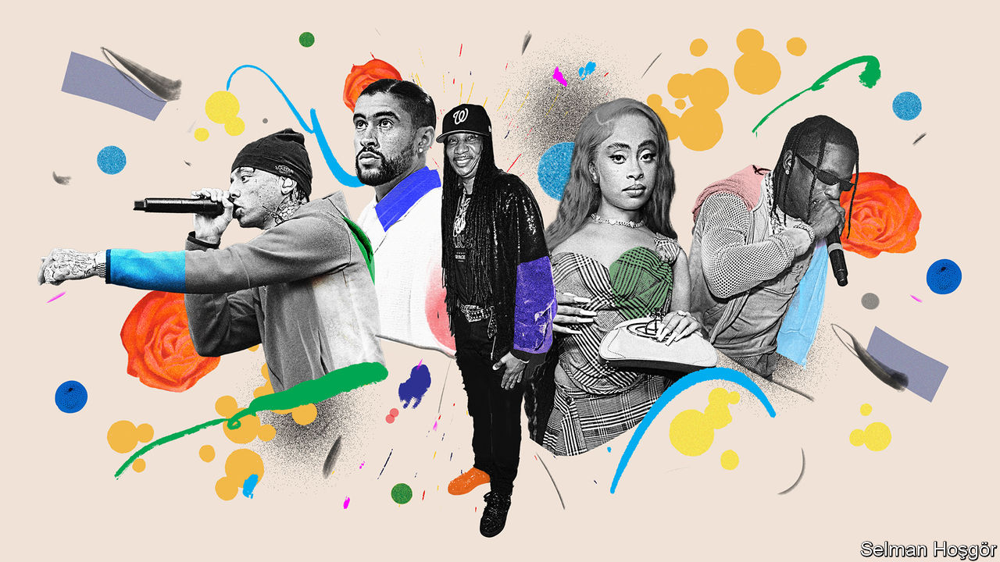

###### Middle age and beyond

# Hip-hop’s future will be less American and more global 

##### Fifty years on, the musical genre’s centre of gravity is shifting 

 

> Aug 10th 2023 

TO UNDERSTAND HIP-HOP’S future, look no further than the lead single on the album “Utopia”, by Travis Scott. Mr Scott is American, but the song’s beat is part-Brazilian, inspired by , a cousin of hip-hop born in the . Featured on the track is the Weeknd, a Canadian sensation, and , a Puerto Rican who raps in Spanish and has been the world’s most-streamed artist for three years on Spotify. The song’s title is “K-Pop”, perhaps referring to the drug ketamine (but also generating interest from fans of ). One critic has called it a “diabolically stupid plan to create the most popular song in the world”, by bringing stars and elements of global hip-hop into a single tune. It worked: the song recently climbed American charts.

Since its supposed origin at a block party in New York on August 11th 1973, hip-hop has become the most popular musical genre in America, together with R&amp;B. (Hip-hop is technically a larger lifestyle category but is often used interchangeably with rap.) It has shaped culture in black America’s image and has become so much a part of America’s identity that the State Department even runs a “hip-hop diplomacy” scheme, which sends rappers, DJs and breakdancers abroad. Next year breakdancing, which emerged at early hip-hop parties, will officially become a new Olympic sport. 

Hip-hop’s past 50 years have been heavily American, with many stars and songs emerging there. But America’s hip-hop dominance in the next half-century will not be as great. That is for two reasons. 

First, the  of hip-hop is shifting: first from New York City and Los Angeles, then to southern cities like Atlanta in the 2000s, and now to everywhere. Many of the most influential new hip-hop stars are no longer African-American. Take the very good Bad Bunny, whose song, “Me Porto Bonito”, has been streamed 1.5bn times on Spotify since its release last year. (That is around 38% more than the Beatles’ most-streamed song, “Here Comes the Sun”, released in 1969 and added to Spotify in 2015.) Central Cee, one of Britain’s most popular rappers, took , a subgenre of rap born in Chicago, repackaged it in London and exported it back to America. Americans learn British slang from him on TikTok and at shows: “In London I’m verified; in New York I’m valid.” 

Far from tightening the West’s grip on cool, the internet has dropped rap’s already low barriers to entry: anyone with a voice, microphone and internet connection can release a verse. A greater pool of talent is one reason that people in many countries increasingly listen to local rap rather than American hip-hop artists. “People want to see themselves represented,” says Aori Sauthon, a rapper and Brazilian hip-hop music executive. 

In turn, American artists are taking more cultural cues from global hip-hop. Ice Spice, one of America’s brightest new rap talents, uses the British drill sound popularised by artists like Central Cee. Burna Boy, a Nigerian artist, is helping popularise afrobeats, a genre from west Africa and its diaspora, among American rappers. Some think that afrobeats could become as influential as the South has been in shaping hip-hop’s sound. (The South spawned trap, a subgenre of rap music characterised by booming drums with melodic, auto-tuned vocals.) American hip-hop has always been inspired by other, global music: early records sampled Ethiopian jazz. But this is the first time that artists in other countries are taking on Americans’ dominance in hip-hop so directly.

The rise of global stars dovetails with a second trend, which is hip-hop’s surprising wobbles at home. In 2023 a hip-hop album did not top the American charts until July, the longest wait in 30 years. Hip-hop made up 42% of the top 50 most-streamed songs on Spotify in America in 2020 but accounts for just 16% so far this year, according to Chartmetric, a data firm. Country and Latin music have been gaining share. 

The charts do not fully illustrate any genre’s broader cultural influence, but they have still prompted some soul-searching. Some are concerned that hip-hop is experiencing a “mid-life slump” in America. The easiest explanation is that hip-hop’s biggest American stars, such as  and Post Malone, are more established and are less focused on churning out hit releases than they used to be. Some emerging stars, such as Juice WRLD, have died young, and with them the potential for new albums, even if they remain among the most-streamed rappers.

It may also be that listeners feel hip-hop has strayed too far from where it started. What began as an anti-establishment movement in the Bronx has now become the “cultural arm of capitalism”, says Tricia Rose, a professor at Brown University who was among the first people to study hip-hop. Materialism is rampant in lyrics and lifestyles. “Rappers from the  now go to Prada to buy socks,” laments Mr Sauthon, the Brazilian hip-hop executive. Many criticise the rise of trap and “mumble rap” (a term for rap songs whose lyrics are hard to decipher) for a perceived lack of lyrical depth. 

But defenders point out how hip-hop has retained its anti-establishment roots, being invoked by young people and political activists globally, from Pretoria to Palestine. And despite all the talk of a hip-hop downturn in America, its influence remains indisputable. Morgan Wallen, today’s most popular country singer, uses trap-inspired beats and sings with a rap-like cadence. Recent albums from Taylor Swift are replete with swear words. “I’m not sure that would’ve happened before hip-hop,” says Adam Bradley, a professor at the University of California, Los Angeles. 

Far from being ready for a mic-drop, hip-hop is just starting a new sort of tour: with more artists from more countries embracing the genre than ever. Middle age has never looked so good. ■


