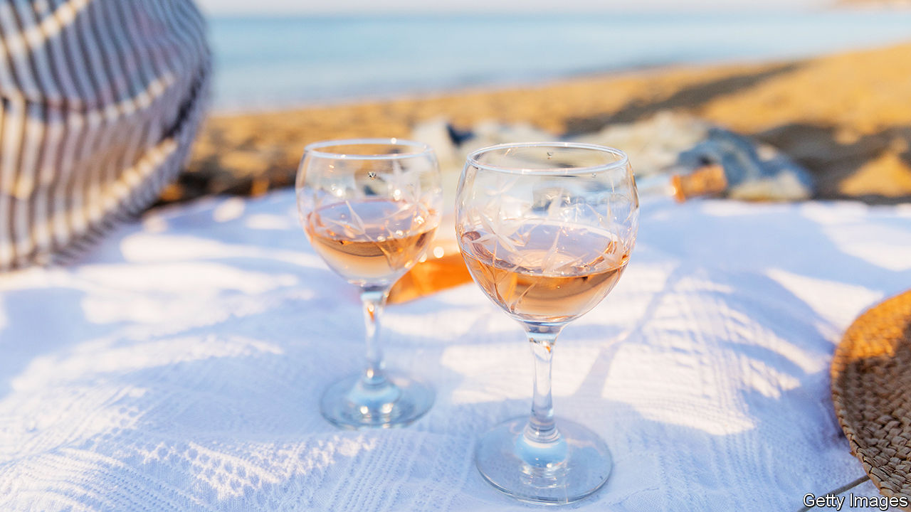

###### World in a dish

# How Provençal rosé became the summer tipple par excellence 

##### When temperatures rise, wine-drinkers think pink 

 

> Aug 4th 2023 

WHEN temperatures reach 26°C (78.8°F) in Britain, a few things happen. People strip off their clothes and flock to parks and swimming pools. And they buy rosé. According to Majestic, Britain’s largest  retailer, 26°C is the exact point at which sales of the pink stuff outpace those of red and white. During a heatwave last year, the company sold one bottle every 12 seconds.

Rosé is the ultimate summer tipple. Like a strong, zesty margarita, a chilled glass of pale rosé makes a perfect aperitif. (Unlike a margarita, you can probably enjoy more than two without disgracing yourself.) People have been drinking versions of rosé wine for millennia, starting with the ancient Greeks. More than 2,000 years ago the ancient Romans started cultivating vineyards in Provence, in south-eastern France. 

Provence remains rosé’s heartland. With 35% of the output, France is the world’s leading producer of rosé. It is also its leading consumer: a third of the bottles of wine drunk there are pink in colour. In the past 15 years, exports of Provençal rosé have increased by around 500%. Château d’Esclans sells an eye- and mouth-watering 10m bottles every year. LVMH, a  that owns a number of revered champagne houses and wineries, has in recent years bought Château Galoupet and acquired stakes in Château d’Esclans and Château Minuty, rosé juggernauts. In America, Whispering Angel, a pink wine produced by Château d’Esclans, sells the most bottles of any French wine of any hue. 

Travel and social media help explain the wine’s global spread. Before the pandemic, France was the world’s leading tourist destination. The pale wine came to be seen as sophisticated thanks to glitzy events such as the Cannes Film Festival. Social-media tributes like #roséallday (a celebration of day drinking) and #brosé (a hashtag used by men who enjoy the wine) have brought attention to the drink. Consumers have also realised the wine’s versatility, agreeing with Julia Child, a popular television cook, that “rosé can be served with anything.” Dry rosés, pleasantly acidic and refreshing (unlike the cloying notes rosé is infamous for, which are common in cheaper varieties), can accompany many cuisines well.

Rosé still remains a target of derision among oenophiles. It has earned the offensive moniker “bitch diesel” (so named because it is pink and has been marketed to women). According to Sacha Lichine, the president of Château d’Esclans, when he first approached potential distributors he would get the door slammed in his face: traditional folk “think that it’s not a real wine. They think that it’s a Coca-Cola wine,” he explains. 

Barbara Drew, a master of wine at Berry Bros &amp; Rudd, Britain’s oldest wine merchant, suggests that the dismissal of rosé as “not a serious wine” is partly because it generally does not age as well as red, so is not of interest to some collectors and . But such squabbles over value ignore rosé’s central role in summer culture. Enjoying it is nothing to blush at. ■


