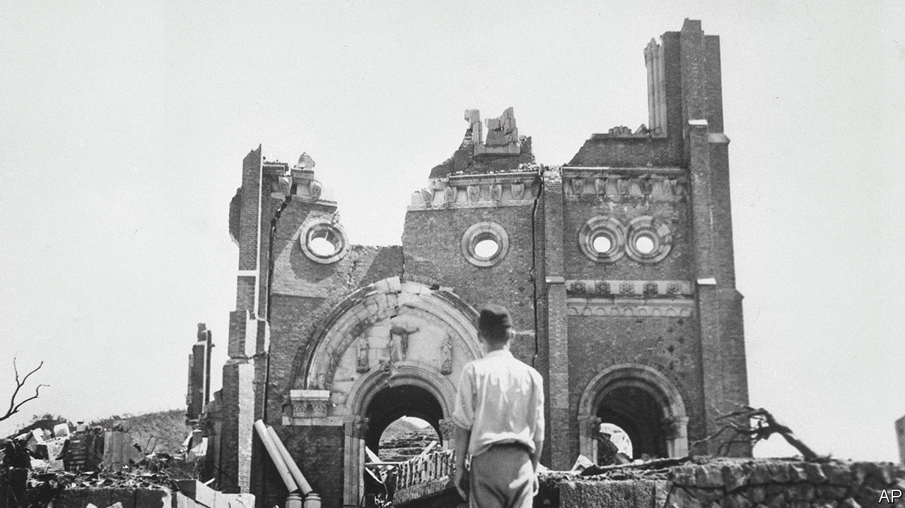

###### War wounds

# In Japan “Oppenheimer” is causing consternation 

##### The blockbuster may never be released in the world’s third-largest film market 

 

> Aug 10th 2023 

THE ATOMIC bomb has been dropped, and the mood at the  Laboratory is jubilant. J. Robert Oppenheimer (Cillian Murphy), the American physicist responsible for the weapon’s creation, appears in front of his cheering colleagues. “It’s too soon to tell what the results of this bombing are,” he declares, before making a ghastly taunt: “But I’ll bet the Japanese didn’t like it.” 

Japan recently observed the 78th anniversary of the . At the same time “Oppenheimer” surpassed $550m at the box office, becoming the highest-grossing second-world-war film ever (not accounting for inflation). It has not been released in Japan, the third-largest film market after America and China. Some have speculated that the film may never make it to the big screen there. 

“Oppenheimer” is causing a furore nonetheless. An estimated 210,000 people died in Hiroshima and Nagasaki; around 113,000 who were exposed to radiation from the bombings are still alive. “Oppenheimer”, however, focuses on the scientist’s perspective and not the destruction wrought by the bombs. 

Many Japanese are appalled by the “” memes on social media which put carefree characters from the “Barbie” film, released on the same day as “Oppenheimer”, alongside mushroom clouds. (Warner Bros, the studio behind “Barbie”, apologised for sending a kiss-blowing emoji at the meme.) Users coined the hashtag #NoBarbenheimer to criticise these posts and argued they make light of the country’s suffering. 

Some in Japan want “Oppenheimer” to be released, despite its flaws. Tanaka Miho, an anti-nuclear activist, says the film offers “an opportunity for people all over the world to think about the legacy of the bombings”. The subject of nuclear disarmament is pressing as war rages . In a statement read at the Hiroshima Peace Memorial, António Guterres, the UN secretary-general, lamented that “the drums of nuclear war are beating once again”. The Japanese know how awful that sound truly is. ■


