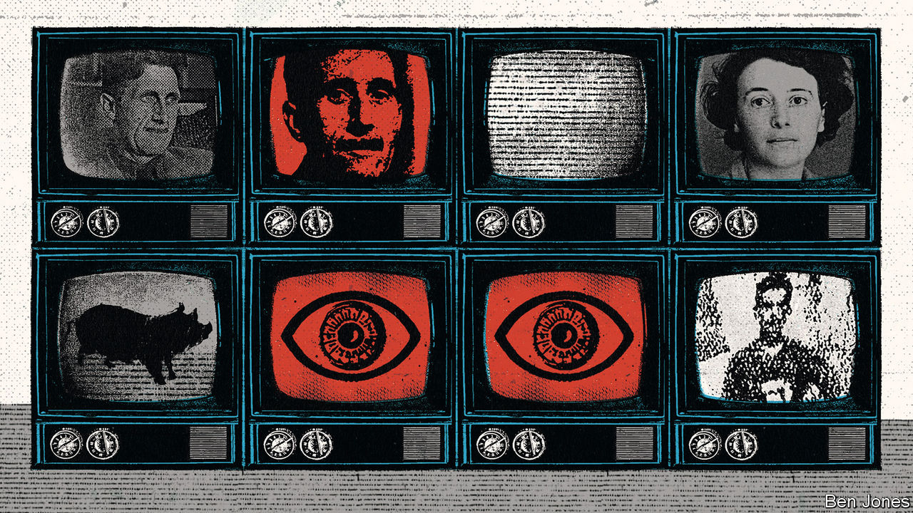

###### Orwell mania

# Interest in George Orwell and his dystopian fiction is high 

##### But while warning of one kind of “doublethink”, was he blind to another? 

 

> Aug 4th 2023 

By Anna Funder. 

 By Sandra Newman.

FEW WRITERS have achieved the cult status of George Orwell. He is so much a part of the  that John Rodden, an Orwell scholar, goes so far as to call him “the most important writer who ever lived”. He was not the best writer of his time, explains Mr Rodden, author of several books on the writer’s “afterlife”, but his universal recognition, continuous publication and repeated spikes in popularity are “an unprecedented phenomenon rivalled only by  himself”. 

Orwell’s most celebrated novel, , tells the story of Winston Smith, an everyman who embarks on a love affair in defiance of the surveillance state led by Big Brother, the supreme leader, whom some believe Orwell modelled after Josef Stalin. With “telescreens” that snoop on citizens, “thought police” enforcers and a system called “doublethink” in which both everything and the opposite are equally true, Orwell’s fiction has been prescient, invoked to describe the ills of nearly every age. “1984” has repeatedly topped English-language bestseller lists, including in 1954 (the year the BBC did a television adaptation), 1984 and 2003 (the centenary of Orwell’s birth). Political events bring Orwell new readers, including Donald Trump’s inauguration in 2017 and fomenting of the riot at America’s Capitol in 2021. After Russia’s invasion of Ukraine, “1984” became the most-downloaded electronic fiction book in Russia last year. 

Angst over totalitarianism, the manipulation of truth and the spread of surveillance technologies has hardly abated. Today’s world is increasingly Orwellian, argues Jean Seaton, director of the Orwell Foundation: consider social-media pile-ons, analogous to the “Two Minutes Hate” the novel’s characters spew at enemies of the state. The dangers Orwell flagged are as easily used by the left to bludgeon autocrats as by the right to denounce the left’s punishment of “wrongthink”.

It is thus no surprise that in 2023, with fears of autocracy and culture wars at fever pitch, the man who wrote so deftly about dark subjects is back in the spotlight. Films in production include a new documentary on Orwell’s life and an animated “Animal Farm”; a Russian-language “1984” was recently released. At least three Orwell books have been published in the past year, grappling with subjects including Orwell’s relationship with Russia.

Two more books are forthcoming, which look more closely at the women in Orwell’s life and work. For all his prescience and scrutiny of tyranny, Orwell was blind to another sort of repression: towards women. Along with a new biography by D.J. Taylor, a British historian, the books draw on letters discovered in the past 20 years between the writer and various paramours, as well as some written by Orwell’s first wife, Eileen, to her best friend. The picture that emerges is disheartening—but hardly unusual for a man of Orwell’s time. 

Eileen O’Shaughnessy was married to Orwell from 1936 until her death in 1945. One of the first women to attend Oxford University, she was brilliant and witty but abandoned a master’s degree in psychology to wed Orwell. Their life was one of hardship. Eileen struggled to make a remote, unheated  a home, nursing the tubercular Orwell back to health while typing up and advising him on his work. She was often the main breadwinner. 

Anna Funder’s “Wifedom” offers bleak details, including the day Eileen cleaned a blocked toilet, standing knee-deep in excrement, when Orwell appeared at a window to ask, “Teatime, don’t you think?” His wife dedicated her life to helping Orwell “fulfil his destiny”, one friend wrote, to the point of fatally ignoring her own health. Meanwhile Orwell was conducting numerous affairs. Before and after they married, her husband was a “sexual opportunist” who pounced on women who came his way, Mr Taylor writes.

This philandering had long been known to scholars, less so to the public. In the wake of #MeToo and numerous feminist reassessments of badly behaved male artists, he is “due for a bit of reappraisal from that perspective”, says Stefan Collini, an emeritus professor at the University of Cambridge who recently edited a collection of Orwell’s essays. “Wifedom” depicts a man who relied extensively on women while erasing them from his own writings. How could it be, Ms Funder asks, that she read “Homage to Catalonia” twice and never realised that Eileen was also in Barcelona, working for a socialist group against Franco’s fascists?

Invisible woman

As the author of “Stasiland”, a prizewinning book on the East German security state, Ms Funder is well-versed in totalitarianism. Her aim is not to “cancel” a thinker she deeply admires. Her inquiry is instead a reaction to realising that she too has vanished into the invisible role of wife, doing the lion’s share of parenting and household management to the detriment of her career. Elegantly and imaginatively resurrecting Eileen, Ms Funder comes to see patriarchy as another form of “doublethink”, which Orwell defined as “a vast system of mental cheating”. Men “imagine themselves innocent in a system that benefits them, at others’ cost”, Ms Funder writes.

Yet some women take part in their own erasure, a point Ms Funder does not probe deeply enough. Orwell and early biographers wrote Eileen out of history; she colluded by minimising her own suffering. Severely anaemic on the eve of an expensive—and fatal—operation, she wrote to Orwell that “What worries me is that I really don’t think I’m worth the money.” All this makes it doubly refreshing to see Julia, the heroine of “1984”, emerge with full agency in Sandra Newman’s eponymous novel. Such feminist retellings are a booming genre today, with the , Shakespeare’s wife and mythological goddesses narrating their lives as the protagonists in new books.

For decades feminists have called out the sexism of Orwell’s depiction of Winston Smith’s lover, Julia, who is presented as a nymphomaniac and honeypot trap, leading to their crushing by the state. “With Julia, everything came back to her own sexuality,” Orwell wrote. Whether the writer was himself a misogynist or simply satirising a group of sexist men, the author’s estate had long felt there was something missing in the story. They sought a writer who might give a new dimension to the tale, writing a spin-off of “1984” for the 21st century. “The only way to approach it was from a feminist perspective, because the whole regime was so horrifyingly misogynist,” says Bill Hamilton, Orwell’s literary executor.

Ms Newman’s “Julia” offers a female character with a rich inner life. Her Julia is a survivor, more subversive than Winston, adroit at evading control, finding a kind of liberty in “sexcrime”. “She imagined freedom as exuberance, a clumsy romping,” Ms Newman writes. If Julia entraps Winston, it is because she too has been coerced and victimised. A twisty ending in keeping with the original makes this an enjoyable read even to those unfamiliar with “1984”. 

Neither Orwell’s “troubling” behaviour towards women nor the #MeToo movement inspired the estate’s decision to give the new novel its full backing, says Mr Hamilton. Yet this “Julia” cannot help but balance out his blind spots and bring his opus up to date. After all, he is the perennial man of the hour—not only yesterday but today, and almost certainly tomorrow. ■


